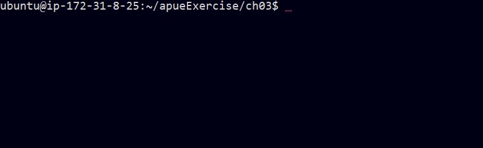
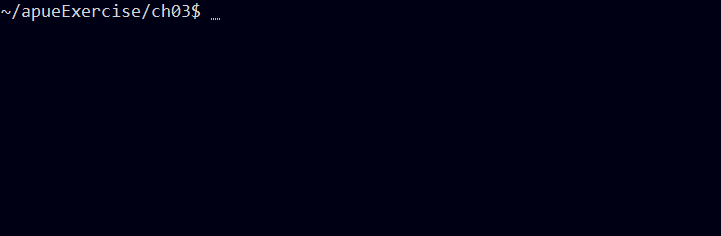
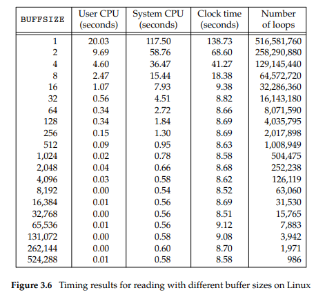

# FILE I/O in UNIX environment

이번 포스트 시리즈에서는 UNIX 파일 입출력에 대해 설명합니다.

UNIX 시스템에서는 대부분의 파일 입출력을 `open`, `read`, `write`, `lseek`, `close` 5개의 함수로 할 수 있습니다.
이 함수들은 [이 포스트]()에서 설명할 **표준 입출력 함수**와 반대되는 개념으로 **버퍼링없는 입출력(unbuffered I/O)** 라고 부르기도 합니다.
"버퍼링 없는"이라는 용어는 `read` 나 `write` 를 호출할 때마다 매번 커널의 시스템 호출을 실행한다는 의미입니다.

> 이번 포스트에서는 파일 서술자와 `open`, `read`, `write`, `lseek`, `close` 함수를 간략히 다루겠습니다.

## File Descriptors

커널에서는 프로세스에 열린 파일들을 파일 서술자로 식별합니다.
파일 서술자는 음이 아닌 정수로, 기존 파일을 열거나 새 파일을 생성할 때 커널은 프로세스에게 파일 디스크립터를 리턴합니다.
프로세스가 파일을 읽거나 쓸 때는 `open` 이나 `creat` 가 리턴한 파일 디스크립터를 `read` 나 `write` 함수의 인수로 넘겨주어서 처리합니다.

### STDIN, STDOUT, STDERR
보통 UNIX 시스템 셸은 파일 디스크립터 0을 표준 입력, 1을 표준 출력, 2를 표준 에러에 연결합니다.
이 관례는 다른 많은 셸과 여러 응용 프로그램에서도 쓰입니다.

**0**, **1**, **2**라는 뭔 뜻인지 모를 값보다는 기호 상수인 `STDIN_FILENO`, `STDOUT_FILENO`, `STDERR_FILENO`를 써서 가독성을 좋게 하는 것이 좋습니다.
이 상수들은 `<unistd.h>` 헤더에 정의되어 있습니다.

### Limit of value

파일 서술자의 범위는 `0` **~** `OPEN_MAX-1` 입니다.
OPEN_MAX는 유닉스의 구현마다 다르며, 대부분의 시스템은 63개 이상의 파일을 동시에 열 수 있게 구현되어 있습니다.

## `open` and `openat` Functions

파일을 열거나 생성할 때에는 `open` 함수나 `openat` 함수를 사용합니다.


```C
#include <fcntl.h>
int open(const char *path, int oflag, ... /* mode_t mode */ );
int openat(int fd, const char *path, int oflag, ... /* mode_t mode */ );
// Both return: file descriptor if OK, −1 on error
```

위는 함수 원형이고, [open](https://man7.org/linux/man-pages/man3/open.3p.html)과 [openat](https://man7.org/linux/man-pages/man3/openat.3p.html) 명세입니다.

`fd` 파라미터는 `openat` 함수가 `open` 함수와 차별화되는 특징입니다.
이 파라미터는 상황에 따라 다음 세 가지 용도로 쓰입니다.

1. `path` 인수에 절대 경로이름을 지정한 경우 `fd`는 무시되고, `openat`는 `open`과 동일하게 동작합니다.

2. `path` 인수에 상대 경로이름을 지정한 경우 `fd`는 파일 시스템에서 그 상대 경로이름을 평가하는 시작 위치가 됩니다. 따라서 상대 경로이름을 평가할 기준 디렉터리를 열어서 얻은 파일 서술자 값을 `fd` 인수로 지정해야 합니다.

3. `path` 인수에 상대 경로이름을 지정하고 `fd` 는 `AT_FDCWD` 라는 특별한 상수 값을 지정하면, 상대 경로이름은 현재 작업디렉터리를 기준으로 평가되며, `openat` 는 `open` 과 동일하게 동작합니다.


`openat` 함수는 두 가지 문제를 해결하기 위해 추가되었습니다.
1. 이 함수는 스레드들이 현재 작업 디렉터리 이외의 디렉터리를 기준으로 상대 경로이름을 지정해서 파일을 열 수 있게 해줍니다.
    + 한 프로세스의 모든 스레드는 동일한 현재 작업 디렉터리를 공유하므로, `open` 함수만으로는 스레드들이 동시에 다른 디렉터리에서 작업하게 하기 힘듭니다.
2. 이 함수는 점검 시간 대 사용 시간(time-of-check-to-time-of-use, TOCTTOU) 오류를 피하는 용도로 사용됩니다.
    + [TOCTTOU ATTACK](https://en.wikipedia.org/wiki/Time-of-check_to_time-of-use)에 대해선 위키를 참조해주세요.

## `creat` Function

`open` 계열 함수를 사용해서 파일을 생성할 수도 있지만, `creat` 함수를 호출해서 생성할 수도 있습니다.

```C
#include <fcntl.h>
int creat(const char *path, mode_t mode);
// Returns: file descriptor opened for write-only if OK, −1 on error
```

위는 함수 원형이고, [명세](https://man7.org/linux/man-pages/man3/creat.3p.html)입니다.


`creat` 함수는 다음 호출과 동일합니다.
```C
open(path, O_WRONLY | O_CREAT | O_TRUNC, mode)
```
> 역사적으로 UNIX 시스템의 초기 버전에서는 새로운 파일을 생성하려면 `open`으로는 안되고 별개의 시스템 호출인 `creat` 가 필요했습니다. 
> 현재는 `O_CREAT` 와 `O_TRUNC` 를 제공하므로 `creat`가 더이상 필요하지 않습니다.

`creat` 함수의 단점은 파일을 오직 쓰기 전용으로만 열 수 있다는 점인데, 따라서 임시 파일을 생성해서 뭔가를 기록하고 다시 읽으려면 `creat` -> `close` -> `open` 순서로 호출해야 합니다. 더 나은 방법은 다음과 같이 `open` 을 써서 호출하는 것입니다.

```C
open(path, O_RDWR | O_CREAT | O_TRUNC, mode)
```

## `close` Function

열린 파일을 닫을 때 `close` 함수를 호출합니다.
```C
#include <unistd.h>
int close(int fd);
// Returns: 0 if OK, −1 on error
```

위는 함수 원형이고, [명세](https://man7.org/linux/man-pages/man3/close.3p.html)입니다.

파일을 닫으면, 프로세스가 그 파일에 대해 가지고 있었던 레코드 락을 다 풀게 되는데, 이는 [이 포스트]()에서 더 확인하겠습니다.
프로세스가 종료되면 프로세스에 대해 열려 있던 모든 파일을 커널이 닫아줍니다.
그래서 열린 파일을 명시적으로 닫지 않는 프로그램들도 많습니다.

## `lseek` Function

모든 열린 파일에는 "현재 파일 오프셋"이 있습니다.
보통의 경우엔 파일 오프셋은 파일 시작에서부터 센 바이트 수를 의미하는 음이 아닌 정수입니다.
일반적으로 읽기나 쓰기 연산은 현재 파일 오프셋에서 시작하며, 읽거나 기록한 바이트 수만큼 파일 오프셋이 증가합니다.
이 오프셋은 `O_APPEND`가 아닌 경우에, 파일을 열었을때 **0**으로 초기화됩니다.

`lseek` 함수는 열린 파일의 오프셋을 명시적으로 설정합니다.
```C
#include <unistd.h>
off_t lseek(int fd, off_t offset, int whence);
// Returns: new file offset if OK, −1 on error
```

위는 함수 원형이고, [명세](https://man7.org/linux/man-pages/man3/lseek.3p.html)입니다.

세번째 인수인 `whence` 파라미터의 값에 따라 오프셋을 더하는 위치가 달라집니다.

1. *whence*가 `SEEK_SET`이면 파일의 오프셋은 파일 시작부터 바이트 **offset** 개만큼 나아간 위치로 설정됩니다.
2. *whence*가 `SEEK_CUR`이면 파일의 오프셋은 현재 오프셋 위치에서 **offset** 만큼 나아간 위치로 설정됩니다.
3. *whence*가 `SEEK_END`이면 파일의 오프셋은 파일 맨 끝(파일 크기)에 **offset**을 더한 값으로 설정됩니다.


### Example: Seeking File 
`lseek` 호출이 성공하면 새로운 파일 오프셋이 반환되므로, offset 파라미터를 0으로 설정하고 기준 위치를 현재 위치로(SEEK_CUR) 설정하면 현재 오프셋을 알아낼 수 있습니다.
```C
off_t currpos;
currpos = lseek(fd, 0, SEEK_CUR);
```
위와 같이 실행했을때 off_t에 현재 파일 오프셋이 담기는데, 탐색을 지원하지 않는 파일(파이프, FIFO, 소켓 등등) 서술자에 대해서는 `lseek`는 **errno**를 `ESPIPE`로 설정하고 -1을 리턴합니다.

보통 파일의 오프셋은 음이 아닌 정수이지만, 특정 장치에서는 현재 오프셋이 음의 정수일 수도 있습니다.
즉 오류를 처리할 때는 `lseek` 함수의 반환값을 점검할 때 0보다 작은지 비교하지 말고, -1과 같은지 비교해야 합니다.

<details>
<summary>코드 예시</summary>

```C
#include "apue.h"
int main(void)
{
    if (lseek(STDIN_FILENO, 0, SEEK_CUR) == -1)
        printf("cannot seek\n");
    else
        printf("seek OK\n");
    exit(0);
}
```

<p style="text-align: center">실행 결과 </p>

</details>

### Example: Hole in the file

파일의 오프셋은 파일의 현재 크기보다 클 수 있습니다.
그런 파일에 대해 write 를 호출하면 파일이 적절히 확장되는데, 그러면 파일에 "구멍"이 생기게 됩니다.
UNIX 파일 시스템은 이런 구멍을 허용하며, 구멍의 바이트들은 명시적으로 기록되지 않았으므로 모두 **0**으로 읽힙니다.

<details>
<summary>코드 예시</summary>

```C
#include "apue.h"
#include <fcntl.h>
char buf1[] = "abcdefghij";
char buf2[] = "ABCDEFGHIJ";
char buf3[] = "1234";

int main(void)
{
    int fd, i;
    if ((fd = creat("file.hole", FILE_MODE)) < 0)
        err_sys("creat error");
    if (write(fd, buf1, 10) != 10)
        err_sys("buf1 write error");
        /* offset now = 10 */
    if (lseek(fd, 16384, SEEK_SET) == -1)
        err_sys("lseek error");
        /* offset now = 16384 */
    if (write(fd, buf2, 10) != 10)
        err_sys("buf2 write error");
        /* offset now = 16394 */


    if ((fd = creat("file.nohole", FILE_MODE)) < 0)
        err_sys("creat error");

    for(i = 0; i < 1639; i++) {
        if (write(fd, buf1, 10) != 10)
            err_sys("buf1 write error");
    }
    /* offset now = 16390 */
    if(write(fd, buf3, 4) != 4)
        err_sys("buf3 write error");
    /* offset now = 16394 */

    exit(0);
}

```

<p style="text-align: center">실행 결과 </p>

`od` 커맨드는 파일을 바이트 단위로 읽고, `-c` 옵션을 주어서 문자로 표시하였습니다.
위 실행 결과에서 파일 중간의 기록되지 않은 바이트들이 `/0`으로 읽혔음을 확인할 수 있습니다.


<p style="text-align: center">실행 결과 </p>

파일에 실제로 구멍이 있는지 확인하기 위해 구멍이 없는 file.nohole 파일과 비교해봅시다.
두 파일은 파일 크기는 같지만, 구멍이 없는 파일은 디스크 블록을 20개 차지하는 반면 구멍 있는 파일은 8개만 차지합니다.

</details>

## `read` Function

열린 파일로부터 자료를 읽을 때는 `read` 함수를 사용합니다.

```C
#include <unistd.h>
ssize_t read(int fd, void *buf, size_t nbytes);
// Returns: number of bytes read, 0 if end of file, −1 on error
```

위는 함수 원형이고, [명세](https://man7.org/linux/man-pages/man3/read.3p.html)입니다.

다음과 같은 경우 실제로 읽어들인 바이트 수가 셋째 인수로 요청한 바이트 수보다 적을 수 있습니다.
1. 정규 파일을 읽는데 요청된 바이트를 모두 읽기 전에 파일의 끝에 도착한 경우.
    + 예를 들어 파일 끝까지 30바이트가 남았는데, 100바이트를 요청하면 `read`는 30을 리턴할 것입니다.
2. 터미널 장치를 읽는 경우.
    + 보통은 한번에 한 줄의 끝까지 읽게 됩니다.
3. 네트워크에서 자료를 읽을 때.
    + 네트워크 안의 버퍼링 때문에 요청된 개수보다 적은 값이 반환될 수 있습니다.
4. 파이프나 FIFO를 읽을 때.
    + 파이프에 담긴 바이트가 요청된 것보다 적으면 파이프에 담긴 바이트들만 읽습니다.
5. 레코드 지향적 장치(record-oriented device)를 읽을 때.
    + 자기 테이프 같은 일부 레코드 지향적 장치에서는 읽기 연산이 한번에 한 레코드만큼만 이루어집니다.
6. 읽기 연산 와중에 시그널에 의해 방해되었을때.

읽기 연산은 파일의 현재 오프셋부터 시작하고, 읽기가 성공한 경우 실제로 읽은 바이트 수만큼 오프셋 값이 증가합니다.


## `write` 함수

열린 파일에 자료를 기록할 때에는 `write`함수를 사용합니다.
```C
#include <unistd.h>
ssize_t write(int fd, const void *buf, size_t nbytes);
// Returns: number of bytes written if OK, −1 on error
```

위는 함수 원형이고, [명세](https://man7.org/linux/man-pages/man3/write.3p.html)입니다.

보통의 경우 리턴값은 nbytes 인수의 값을 반환합니다.
그렇지 않다면 오류가 발생한 것인데, 흔히 발생하는 상황은 디스크 용량이 부족하거나 주어진 프로세스에 대한 파일 크기 한계를 넘었을 때입니다.

파일에 대한 쓰기 연산은 현재 오프셋에서 시작합니다.
단, 파일을 열 때 `O_APPEND` 옵션을 지정했다면 각 `write` 호출마다 먼저 파일 오프셋의 파일의 현재 끝으로 설정된 후 쓰기 연산을 합니다.
쓰기 연산이 끝나면 기록된 바이트 수만큼 파일의 오프셋이 증가합니다.


## I/O Efficiency

입출력 효율성을 측정하는 프로그램 예시를 보겠습니다.

<details>
<summary>코드 예시</summary>

```C
#include "apue.h"
#define BUFFSIZE 4096
int main(void)
{
    int n;
    char buf[BUFFSIZE];

    while ((n = read(STDIN_FILENO, buf, BUFFSIZE)) > 0)
        if (write(STDOUT_FILENO, buf, n) != n)
            err_sys("write error");

    if (n < 0)
        err_sys("read error");

    exit(0);
}

```

이 프로그램은 셸에서 사용자가 표준 입력과 표준 출력을 할 파일을 지정했다는 가정하에 쓰여졌습니다. 따라서 프로그램 내에서 입/출력 파일을 지정해주지 않아도 되며, 프로그램을 실행할 때 리다이렉트 기능을 활용하면 됩니다.

</details>

위 프로그램을 활용해 I/O 효율성 실험을 할 때, 핵심적인 요인이 무엇일까요?

**Unbuffered I/O**의 경우엔 `BUFFSIZE`가 될 것입니다.

다음은 버퍼 사이즈를 달리 하여 여러가지 파일을 실험해본 결과입니다.


<p style="text-align: center">버퍼사이즈에 대한 실험 결과 </p>

버퍼사이즈가 큰 경우 한번에 많이 읽으므로, 더 시간이 짧은 것을 확인할 수 있습니다. 근데 **32**바이트 버퍼사이즈부터는 Clock time 성능이 거의 비슷합니다. 왜 그럴까요?

대부분의 파일 시스템은 성능 향상을 위해 **"read-ahead"** 기법을 지원합니다.
순차적인 읽기 연산을 감지하면, 시스템은 응용 프로그램이 곧 더 요청할 것이라고 예상하고 요청하는 것보다 더 많은 데이터를 읽어들입니다.
이러한 미리 읽기 기법 덕분에, 32바이트처럼 작은 버퍼사이즈도 더 큰 버퍼사이즈의 경우 만큼이나 빠르게 읽습니다.


## Finish

[다음 포스트](https://keisluvlog.netlify.app/UNIX_file_IO_2/)에서 파일의 공유와 원자적 연산, `dup`, `sync`, `fsync`, `fdatasync`, `fcntl`, `ioctl` 함수를 살펴보겠습니다.

### References

1. [Advanced Programming in the UNIX environment. 3ed](https://www.amazon.com/Advanced-Programming-UNIX-Environment-3rd/dp/0321637739)