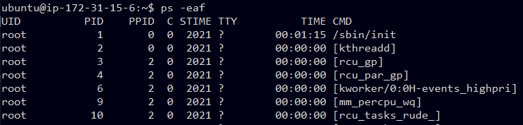
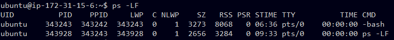
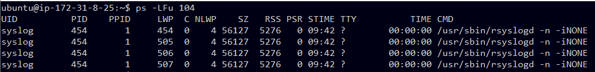
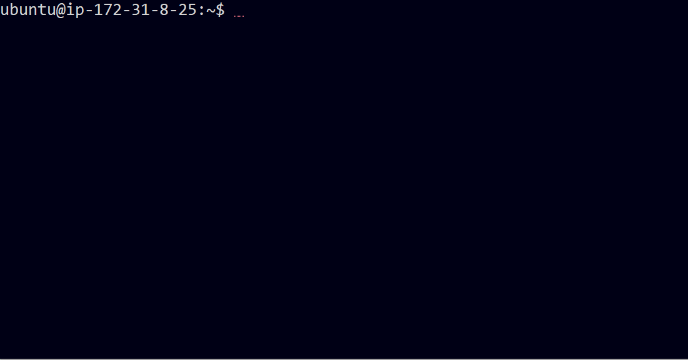
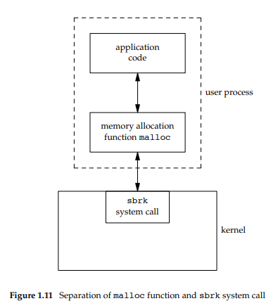
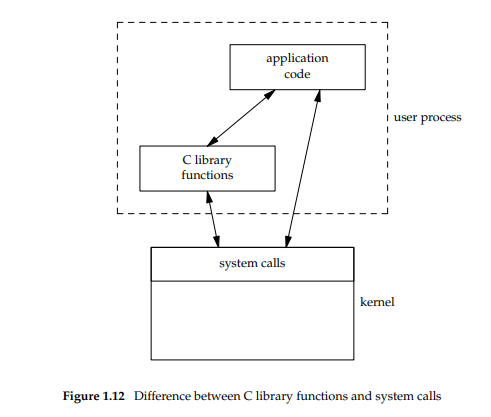

# Programming in UNIX Environment

[지난 포스트](https://keisluvlog.netlify.app/UNIX_system_outline_first/)에 이어서 시작하겠습니다.

이번 포스트에서는 프로세스 제어와 에러 처리, 시그널, 시스템 호출과 라이브러리 함수들에 대해 간략하게 훑어보겠습니다.


## Programs and Processes

### Program

프로그램이 뭔가요?

프로그램이란 디스크에 있는 실행가능한 파일입니다.
프로그램은 메모리에 읽혀진 후 일곱가지 `exec`함수 바리에이션에 의해 커널에서 실행됩니다.

### Processes & Process ID

실행되고 있는 프로그램은 `process`라고 부르는데, 이 다음부터 프로세스라는 말을 자주 쓸 겁니다.
UNIX 시스템은 모든 프로세스가 `process ID`라고 부르는 고유한 숫자 식별자를 가지도록 합니다. 
프로세스 ID는 항상 양의 정수 or 0 입니다.


<p style="text-align: center">ps -eaf 커맨드 실행결과</p>

```bash
UID          PID    PPID  C STIME TTY          TIME CMD
root           1       0  0  2021 ?        00:01:15 /sbin/init
```
위에서 `PID`라고 적힌 컬럼의 숫자가 process ID입니다.
1번 프로세스는 가장 처음 시작되고 모든 프로세스의 조상 프로세스 쯤이 되는 `init` 프로세스인데, 나중에 살펴보겠습니다.

### Process Control

프로세스를 제어하기 위해 세 가지 주요한 함수가 있는데, `fork`, `exec`(사실 7가지가 있지만 퉁쳐서 쓰겠습니다), `waitpid`입니다.
1. `fork`
    + 이 함수는 새로운 프로세스를 생성하는 역할입니다. 
    + 이 함수를 호출한 프로세스가 그대로 복사되어, 원래 프로세스는 부모, 복사된 프로세스는 자식 프로세스로 부릅니다.
2. `exec`
    + 이 함수는 호출되면 호출된 프로세스가 `exec`함수의 인자로 전달된 프로그램을 실행하도록 교체됩니다. 
    + `fork`함수와 콤비를 이뤄서 새로운 프로그램을 실행하는데 쓰입니다.
    + 7가지 바리에이션이 있습니다.
3. `waitpid`
    + 새로운 프로그램을 시작할 때, 일반적으로 `fork`와 `exec`를 조합하여 자식 프로세스가 새로운 프로그램을 실행하게 합니다.
    + 이때 부모 프로세스는 자식 프로세스가 종료하기를 기다릴 수 있는데, 이때 `waitpid`함수를 씁니다.

> 이 포스팅에선 코드 예시를 들지는 않지만, **이 포스트**에서 코드와 함께 프로세스 제어 과정을 살펴보겠습니다.


### Thread & Tread ID

일반적으로, 프로세스에는 제어의 흐름이 하나만 존재합니다.
즉 실행 중에는 기계 명령들이 하나씩 실행됩니다.
이런 제어의 흐름을 **스레드**(thread)라고 부릅니다.

근데, 세상에는 문제를 여러 부분으로 나눈 후 여러 제어 흐름이 각 부분 문제들을 동시에 풀 때 더 쉽고 빠르게 푸는 문제도 있습니다.
이럴 땐 한 프로세스에서 여러 개의 제어 흐름(thread)를 가지는 것이 좋습니다.

한 프로세스의 모든 스레드는 동일한 메모리, 파일 서술자, 스택 등등의 프로세스 관련 특징을 공유합니다.
각 스레드는 자신만의 콜 스택에서 실행되지만, 서로의 스레드의 스택에 간섭할 수 있습니다.
이렇게 서로 메모리를 공유하고 스택에 접근할 수 있기 때문에, **일관성**을 깨지 않으려면 여러 스레드의 접근을 동기화 및 관리해주어야 합니다.

프로세스처럼 스레드도 ID(숫자)로 식별하는데, **스레드ID**는 그 프로세스 안에서만 유효합니다.
즉, 한 프로세스의 스레드ID는 다른 프로세스에선 의미가 없습니다.
스레드ID는 프로세스 안에서 스레드를 다룰 때 특정 프로세스를 가리키는 용도로 사용됩니다.


<p style="text-align: center">ps -LF 커맨드 실행결과 </p>


위의 결과에서 보면 `LWP`가 **스레드ID**를, `NLWP`가 해당 프로세스에서 동작하는 스레드의 갯수를 가리킵니다.
`NLWP`가 모두 **1**인 것을 보면, `ubuntu` 사용자의 각 프로세스마다 스레드를 한 개씩 쓰고 있는 것으로 보입니다.


<p style="text-align: center">ps -LFu 104 커맨드 실행결과 </p>

위의 결과에서는 `syslog` 사용자(UID: **104**)의 프로세스와 스레드 정보인데, `454`번 프로세스는 `NLWP`가 **4**이므로 총 4개(`454`, `505`, `506`, `507`)의 스레드를 사용하고 있습니다.

> 스레드와 프로세스의 상호작용, 스레드에 대한 더 깊은 이야기는 **이 포스트**에서 다루겠습니다.


## Signal

신호(signal, 이하 시그널로 칭함)라는 것은 프로세스에게 어떤 상황(condition)이 발생했음을 알리는 방법입니다.
예를 들어서, 프로세스가 0으로 나누는 계산을 했다면 `SIGFPE`(floating-point exception)라는 시그널이 프로세스에게 보내집니다.
프로세스는 시그널을 받았을 때 3가지 선택지가 있습니다.

1. 시그널을 무시하기.
    + 시그널 중에는 0으로 나누기나 프로세스에 할당된 메모리 주소를 벗어난 메모리 접근 등을 가리키는 하드웨어 예외를 뜻하는 시그널이 있습니다.
    + 이런 시그널은 프로세스 계산 결과가 정의되지 않게 되므로 무시하지 않는게 좋습니다.
2. 기본 동작 수행하기.
    + 모든 시그널은 각 시그널마다 정의된 기본 동작이 있습니다.
    + 예를 들어, 0으로 나누는 상황의 시그널은 기본 동작이 프로세스를 종료하는 것입니다.
3. 시그널을 처리할 함수를 호출하기.
    + 이 함수를 시그널 핸들러(signal handler)라고 부르고, "시그널을 잡는다(catching the signal)"라고 표현합니다.
    + 사용자 정의 함수를 호출하여 시그널이 언제 발생되는지 알고 그것을 원하는 방식으로 처리할 수 있게 됩니다.

시그널을 발생시키는 조건은 많습니다.
Interrupt key(ex. `Ctrl+C`)와 Quit key(ex. `Ctrl+\`)라고 부르는 두 종료 키를 누르면 현재 실행중인 프로세스에 시그널(`SIGINT`)이 보내집니다.


<p style="text-align: center">Ctrl+C(^C)를 눌러서 SIGINT 시그널을 보내 무한 루프 프로세스를 종료하기</p>

시그널을 발생시키는 다른 방법은 `kill` 함수를 호출하는 것입니다.
이 함수를 호출하여 한 프로세스에서 다른 프로세스로 시그널을 보낼 수 있습니다.
하지만 `kill`함수를 사용하여 다른 프로세스에 시그널을 보내려면 사용자가 시그널 수신 프로세스의 소유자(혹은 슈퍼유저)이어야 합니다.

> **이 포스트**에서 시그널에 대해 더 자세히 보겠습니다.

## Error Handling

UNIX 시스템에서는 대체로 오류가 발생하면 음의 값을 리턴합니다.
그리고 `errno`라는 정수 값이 설정되어 오류 원인을 알려줍니다.

예를 들어, `open` 함수가 성공적으로 호출되면 양수 값의 파일 서술자를 리턴하고, 오류가 있었으면 **-1**을 리턴합니다.
`open`함수에서 가능한 오류에 해당하는 `errno` 값은 15가지입니다. 

어떤 함수들은 음수 값을 리턴하기 보다는 다른 관례가 있는 함수도 있습니다.
예를 들면, 어떤 객체를 향하는 포인터를 반환하는 대부분의 함수는 오류 시에 null 포인터를 리턴합니다.

### errno

`<errno.h>` 헤더 파일에는 `errno` 심볼과 errno에 설정될 수 있는 각 값에 대한 상수들이 정의되어 있습니다.
이 상수들은 문자 **E**로 시작하는 이름을 가지고 있습니다.
예를 들어서, `errno`가 상수 `EACCES`와 같은 값을 가지고 있다면, 이것은 요청된 파일에 대해 권한이 없는 등의 권한 에러가 발생한 것을 뜻합니다.

**POSIX**와 **ISO C** 표준은 errno를 정수 타입의 수정가능한 **lvalue** 심볼로 정의합니다.
이 정의에 따르면 errno는 에러 번호를 담은 정수가 될 수도 있고, 오류 번호를 가리키는 포인터를 리턴하는 함수가 될 수도 있습니다. 

일반적으로 `errno`를 에러 번호를 담은 정수로 정의한다면, 다음과 같을 겁니다.
```C
extern int errno;
```

하지만, 다중 스레드를 지원하는 환경에서는 프로세스의 메모리/주소 공간을 여러 스레드가 공유합니다.
따라서 스레드 사이에서 오류 번호가 섞이지 않으려면 각 스레드마다 개별적으로 `errno`의 복사본을 가져야 합니다. 
이런 상황에선 `errno`를 다음과 같이 오류 번호를 가리키는 포인터를 리턴하는 함수로 정의하여 다중 스레드 접근을 지원할 수 있습니다.

```C
extern int *_ _errno_location(void);
#define errno (*_ _errno_location())
```

`errno`와 관련해서 중요한 규칙이 두 가지 있습니다.
1. 어떤 루틴에서 오류가 발생하지 않는다 해도, `errno` 값은 비워지지 않습니다.
    + 따라서 에러를 처리할 때는 함수의 리턴값을 통해 에러가 발생한 것을 먼저 알아내고, 그 원인을 `errno` 값에서 분석해야 합니다.
2. 어떤 함수도 `errno` 값을 **0**으로 설정할 수 없으며, `<errno.h>` 파일에 정의된 모든 상수는 **0**의 값을 가지지 않습니다.

### Error Recovery

`<errno.h>`파일에 정의된 에러들은 두 가지 분류로 나눌 수 있습니다.

1. **치명적 오류(fatal error)**
    + 치명적 오류는 복구 동작이 없고, 그저 로그 파일이나 스크린에 에러 메시지를 출력한 후 프로세스를 종료해야 합니다.
2. **비치명적 오류(nonfatal error)**
    + 비치명적 오류는 더 안정적으로 처리할 수 있습니다.
    + 대부분의 비치명적 오류는 리소스가 부족한 경우처럼 일시적이며, 시스템이 널널하면 발생하지 않을 수도 있습니다.

리소스 관련 비치명적 오류의 전형적인 복구 동작은 잠시 기다렸다가 다시 시도하는 것입니다.
이 기술은 다른 다양한 상황에서도 적용할 수 있습니다.
예를 들어, 응용 프로그램에서 네트워크 연결이 더이상 작동하지 않는다는 오류가 발생하면, 프로그램은 잠시 기다렸다가 재연결을 시도할 수 있습니다.

응용 프로그램이 오류를 복구할 수 있는 경우를 결정하는 것은 결국 응용 프로그램 개발자의 과업입니다.
합리적인 복구 전략을 사용한다면 프로그램이 비정상 종료를 회피하고 더욱 견고하게 만들 수 있습니다.


## System Calls & Library Functions

### System Call
모든 운영체제는 프로그램이 커널에게 서비스를 요청할 수 있는 서비스 지점(service point)를 제공합니다.
UNIX 시스템에서 커널에 대한 서비스 포인트를 시스템 호출이라고 부릅니다.
UNIX 시스템은 각 시스템 콜마다 똑같은 이름의 함수를 C 표준 라이브러리에 정의하였습니다.
사용자 프로세스는 표준 C 호출 시퀀스를 이용해서 이 함수들을 호출합니다.
그럼 이 함수들은 해당 커널 서비스를 실행합니다.

### Library Function

시스템 콜 말고도, 프로그래머들은 프로그래밍을 쉽게 해주는 범용 라이브러리 함수를 사용할 수 있습니다. 
이 함수들은 커널의 시스템 콜을 호출할 수 있긴 하지만, 커널에 대한 진입점은 아닙니다.
예를 들면 `printf`함수는 문자열을 출력하기 위해 `write` 시스템 콜을 활용할 수 있지만, `strcpy`(문자열을 복사)나 `atoi`(아스키 코드를 정수로 변환)은 커널과 관련이 없습니다.

### Diffrence between system call & library function

구현자의 입장에서는 시스템 콜과 라이브러리 함수를 구분하는 것이 중요합니다.
하지만 사용자의 입장에서는, 차이가 별로 없습니다.
특히 UNIX 시스템에서는 라이브러리 함수와 시스템 콜이 둘 다 일반적인 C 함수의 형태를 하고 있고, 둘 다 응용 프로그램에게 서비스를 제공합니다.

유의해야 할 점은 라이브러리 함수는 다른 라이브러리 함수로 대체할 수 있어도, 시스템 콜은 대체할 수 없다는 점입니다.



메모리를 할당하는 라이브러리 함수 `malloc`의 경우를 살펴보겠습니다.
`malloc` 함수는 커널의 영역인 메모리 관리를 하기 위해 `sbrk` 시스템 콜을 호출하여 처리합니다.
이때 `sbrk` 시스템 콜은 단순히 프로세서의 주소 공간을 지정된 바이트 개수만큼 늘리거나 줄이기만 합니다.
주소 공간의 구체적인 관리와 그 공간을 어떠한 처리를 하는 것은 응용 프로그램과 `malloc` 함수가 하게 됩니다.
이때 나만의 `malloc` 함수를 정의하여 쓸 수 있겠지만, 그 함수에서도 `sbrk` 시스템 콜은 항상 사용해야 합니다. 

또 다른 차이로는 시스템 콜은 최소한의 인터페이스를 제공하지만, 라이브러리 함수는 더 정교한 기능성을 제공한다는 것입니다.
이것은 이미 위의 `malloc` 예시에서 보았습니다.
이후에 [non-buffered I/O](https://keisluvlog.netlify.app/UNIX_file_IO_basic/)와 **standard I/O**를 비교해보아도 차이가 느껴질 겁니다.



응용 프로그램은 그 기능을 구현하기 위해 라이브러리 함수와 시스템 콜 모두 활용할 수 있습니다.
특히 프로세스 제어를 위한 시스템 호출(`fork`, `exec`, `waitpid`)은 주로 응용 프로그램이 직접 호출합니다.
하지만 이런 보편적인 사용법을 단순화하기 위해 `system`이나 `popen`같은 라이브러리 함수도 존재합니다.

## Finish

이번 포스트에서는 [저번 포스트](https://keisluvlog.netlify.app/UNIX_system_outline_first/)에 이어서 유닉스 시스템 개요에 대해 살펴보았습니다.
다음 포스트부터는 차근차근 여러 유닉스 시스템의 구성요소에 대해 살펴보도록 하겠습니다.

### References

1. [Advanced Programming in the UNIX environment. 3ed](https://www.amazon.com/Advanced-Programming-UNIX-Environment-3rd/dp/0321637739)


