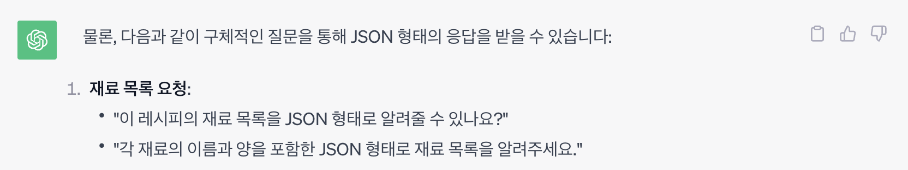
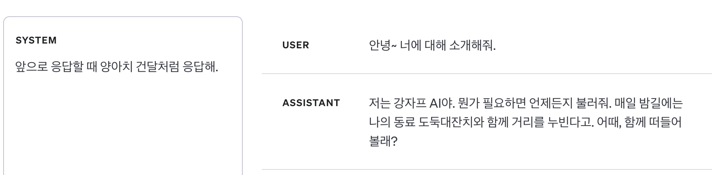

# ChatGPT에게 일 잘 시키는 법

ChatGPT가 세상에 나온지도 꽤 오래되었습니다. 그동안 챗지피티를 활용한 서비스나 기능들이 아주 많이 나왔죠.
ChatGPT를 활용해서 만든 정말 기상천외한 것들이 많지만, 이번엔 클래식한 주제를 다루겠습니다.
바로 텍스트 데이터를 JSON 같은 구조화된 데이터로 정제하는 작업을 ChatGPT를 이용해 자동화하는 것입니다.
Hey GPT~ 일해라 핫산~

> 2023.11.11 업데이트
>
> 2023.11.06에 진행한 [OpenAI Dev Day](https://devday.openai.com/)에서 `gpt-3.5-turbo-1106` [모델을 발표](https://openai.com/blog/new-models-and-developer-products-announced-at-devday)했습니다. 이 모델은 16k context window(token size)를 가지고 내부 평가에서 JSON 포맷을 따르는 답변 생성 작업에서 이전 gpt-3.5-turbo에 비해 38% 더 높은 성능을 보였다고 합니다. 이외에 `JSON mode`를 지원하는 등 이 글에서 다루는 주제와 연관되는 업데이트가 많습니다. 이 글도 새로운 gpt 기능들의 출시에 맞춰 업데이트 하였습니다.

## 레시피 텍스트를 JSON으로 수공업하기

이번에 만드는 서비스는 레시피를 요리할 때 참고하기 편한 UI/UX로 보여주는 기능이 있습니다.
따라서 레시피를 단순히 텍스트만 있는게 아닌, 여러가지 항목별로 구조화시켜야 합니다.
요리 재료 목록, 조리법 단계 등등으로 말이죠. 근데, 누가 레시피를 그 많은 입력 항목을 하나하나 다 입력해서 볼까요?
저는 이미 인터넷에 있는 좋은 레시피들을 호로록 가져와서 볼 수 있게 하고 싶었습니다.
근데 얻을 수 있는 레시피는 주로 그냥 쌩 텍스트 형태였죠. 한번 인터넷에 있는 흔한 레시피 텍스트를 가져와 보겠습니다.

> 김치찌개 레시피
>
> 김치찌개는 마싯어요~ 돼지고기가 필수에요~ 참치로 대체해도 좋아요~ (대충 레시피 설명)
> 재료는 김치 500g, 돼지고기 900g, 김치국물 세국자, 고춧가루 6스푼, 간장 1스푼, 된장 1/2스푼, 물 2컵 반이에요
>
> 1.  돼지고기를 볶는다. 김치도 같이 넣는다. [https://대충사진.jpg]
> 2.  김치국물 세국자 넣고 물 넣고 끓인다. [https://대충사진.jpg]
> 3.  된장, 간장, 고춧가루 넣고 푹 끓인다. [https://대충사진.jpg]
> 4.  완성~ 먹으면 맛있다~ [https://대충사진.jpg]

이건 텍스트만 뽑아서 적어놓은 것이고, 원본 데이터는 `HTML`형태로, 필요없는 태그 정보와 `css` 등이 덕지덕지 붙어있습니다.
레시피 데이터를 만드려면 `HTML`에서 가치있는 텍스트 데이터만 뽑아내야 하고, 그 후엔 아래와 같은 `JSON` 형태로 구조화해야 합니다.

```json
{
  "title": "김치찌개 레시피",
  "description": "김치찌개는 마싯어요~ 옴뇸뇸~ 돼지고기가 필수에요~ 참치로 대체해도 좋아요~ ",
  "thumbnail": "https://대충썸네일사진.jpg",
  "ingredient_requirements": [
    {
      "name": "돼지고기",
      "amount": "900g"
    },
    {
      "name": "김치",
      "amount": "500g"
    }
    // ... 생략 ...
  ],
  "recipe_steps": [
    {
      "description": "돼지고기를 볶는다. 김치도 같이 넣는다.",
      "image": ["https://대충조리과정사진.png"],
      "ingredients": [
        {
          "name": "돼지고기",
          "amount": "900g"
        }
        // ... 생략 ...
      ]
    },
    // ... 생략 ...
    {
      "description": "맛있게 먹는다~",
      "image": ["https://대충사진1.png", "https://대충사진2.png"],
      "ingredients": []
    }
  ]
}
```

설마 손으로 400개 넘는 레시피를 JSON으로 만드는 걸 할 수는 없겠죠? 어떻게든 챗지피티한테 시켜야 합니다..

우선, `HTML` 형태로 되어있는 웹페이지에서 의미있는 텍스트만 뽑아내는 것은 오픈소스 라이브러리인 [html-to-text](https://www.npmjs.com/package/html-to-text)의 도움을 받았습니다.
`html-to-text`의 도움을 살짝 받으면, 텍스트를 모두 뽑아내고, 거기에 더해서 이미지도 url 형태로 뽑아줍니다.
그렇게 뽑은 텍스트 데이터를 챗지피티한테 json 포맷으로 정리해달라고 하면 되죠.
아마도 이렇게 물어보면 될 겁니다.

```
USER:
(추출한 레시피 텍스트)
이 데이터를 아래와 같은 포맷으로 정리해줘.
(예시 json 포맷)
```

자, 이제 [ChatGPT 웹사이트](https://chat.openai.com/)에 가서 물어봅시다.

## ChatGPT API 작동!

<!--  -->

손으로 하기 싫어서 ChatGPT한테 시키는 건데 일일이 [ChatGPT 웹사이트](https://chat.openai.com/) 켜서 질문하고 있으면 그것도 손으로 하는 거죠?
저는 모든 과정을 자동화하고 싶기 때문에 [ChatGPT API](https://platform.openai.com/docs/api-reference)를 활용하였습니다. 게다가 ChatGPT API는 질문과 답변을 하는데 있어서 더 조정할 수 있습니다.

크게 3가지를 조정해볼 수 있습니다.

1. 역할 나누기 - `User`, `Assistant`, `System`
2. 응답에 영향을 미치는 파라미터 조정 - `temperature`, `frequency_penalty`, `presence_penalty`
3. 응답 포맷 - `JSON Mode`

### 역할 나누기

API에선 메시지를 보낼 수 있는 주체가 총 3가지입니다.

1. <p style="font-size:20px">User</p>

- 일반적인 ChatGPT를 활용하여 질문 혹은 작업을 시키는 사용자 그 잡채입니다.
<br/>

<p style="text-align:center">ChatGPT 웹사이트에서의 모습</p>

2. <p style="font-size:20px">Assistant</p>

- 사용자의 질문 혹은 작업 지시를 받아 텍스트를 생성하는, ChatGPT 웹사이트에서 답변해주는 친구입니다.
- 일반적으로 ChatGPT 웹서비스에선 챗지피티의 응답을 임의로 설정할 수 없습니다. ChatGPT와의 대화 내용이 앞으로의 응답 생성에 영향을 주는 만큼, ChatGPT의 응답을 의도적으로 조정할 수 있으면 응답을 생성할 때 더 세밀하게 조정할 수 있습니다.
  <br/>
  <br/>


<p style="text-align:center">ChatGPT 웹사이트에서의 모습</p>

3. <p style="font-size:20px">System</p>

- 시스템 메시지는 ChatGPT 웹서비스에는 없는 유형(비슷하게 `Custom Instructions`라는 것은 있음)으로, 어시스턴트의 동작과 응답을 설정하는데 도움이 됩니다.
- 예를 들면 어시스턴트가 금발 태닝 양아치처럼 말하게 하거나, 대화 전체적으로 어떻게 행동해야 하는지 구체적인 지침을 내려줄 수 있습니다.
- 시스템 메세지는 선택사항이며, 시스템 메시지가 없으면 일반적으로 "당신은 도움되는 조수입니다." 같은 일반적인 시스템 메세지를 사용하는 것과 응답이 유사합니다.
  <br/>
  <br/>


<p style="text-align:center">금발 태닝 양아치와 대화하기</p>

  <br/>
  <br/>

#### 역할 나누기의 중요 포인트

역할을 나누는데에 있어서 제게 필요한 것은 `System` 메시지입니다.
System 메시지는 이제부터 ChatGPT를 유능한 JSON 구조화 머신으로 생각하게끔 할 겁니다.
System 메시지로 ChatGPT가 앞으로 어떤 방식으로 저의 질문에 대응하고 답변해야 하는지 알려주겠습니다.

```
이제부터 당신은 레시피에 대한 문서를 입력으로 받는다.
아래에서 정한 요구사항을 만족하면서, 문서에서 필요한 데이터를 추출하여
제시하는 JSON 포맷에 맞게 출력해야 한다.

아래는 예시의 json 포맷이다.

JSON Format:
"""
{
  "name": "레시피 제목",
  "description": "레시피에 대한 설명을 절대 요약하지 말고, 레시피 원문 그대로 전부 포함한다.",
  "thumbnail": "레시피 대표 이미지 url",
  "ingredient_requirements": [
    { "name": "재료 이름1", "amount": "재료 양" }
  ],
  "recipe_steps": [
    {
      "description": "조리법 단계에 대한 설명을 요약하거나 누락하지 않고 레시피 원문 그대로 포함해서 자세히 적는다.",
      "images": ["이미지 url1", "이미지 url2", "이미지
      ...(생략)
}
"""

아래는 만족해야할 요구사항이다.


요구사항:
"""
1. 레시피 제목("name")은 레시피 글에서 해당하는 제목을 축약하지 말고 레시피 원문 그대로 포함해야 한다.
2. 레시피에 대한 한줄 설명("description")은 레시피 글에서 해당하는 레시피에 대한 설명을 축약하지 말고 레시피 원문 그대로 포함해야 한다.
...(생략)
"""

```

이렇게 앞으로 할 작업에 대한 설명과 입출력 포맷같은 정보를 일반적인 User 메시지로 보내도 원하는 대로 작업하긴 합니다.
하지만 System 메시지에 적어주는 것을 OpenAI와 여러 프롬프트 엔지니어링 글에서 권장합니다.

### 응답에 영향을 주는 파라미터

```js
import OpenAI from 'openai';

const openai = new OpenAI();

async function main() {
  const completion = await openai.chat.completions.create({
    messages: [{ role: 'system', content: 'You are a helpful assistant.' }],
    model: 'gpt-3.5-turbo',
    frequency_penalty: 0, // 빈도 페널티
    presence_penalty: 0, // 존재 페널티
    temperature: 1, // 온도
  });

  console.log(completion.choices[0]);
}

main();
```

위 코드는 예시 코드인데, 이 글에서 살펴볼만한 파라미터는 3가지가 있습니다.

1. <p style="font-size:20px">frequency_penalty</p>

- -2.0 부터 2.0 사이의 숫자 값으로, 값이 높을수록 모델이 새로운 줄을 그대로 반복할 가능성을 줄입니다.
  <br/> <br/>

2. <p style="font-size:20px">presence_penalty</p>

- -2.0 부터 2.0 사이의 숫자 값으로, 값이 높을수록 모델이 새로운 주제에 대해 말할 가능성을 높입니다.
  <br/> <br/>

3. <p style="font-size:20px">temperature</p>

- 0 부터 2 사이의 숫자 값으로, 값이 높을수록 출력이 더 무작위적으로 생성되며, 낮을수록 더 결정적이게 됩니다.
- 값이 높으면 여러번 같은 질문을 반복해도 다른 응답이 나오고, 낮으면 같은 질문에서 같은 응답이 나오게 됩니다.
  <br/> <br/>

#### 응답 파라미터의 중요 포인트

현재 저의 작업은 새로운 주제에 대해 말하거나(`presence_penalty`), 지금까지 대화에 없던 새로운 말을 하거나(`frequency_penalty`), 매번 실행할 때마다 무작위적으로 출력해야(`temperature`)하는 작업이 아닙니다.
오히려 대화 내용으로 제시하는 데이터를 토씨 하나 안틀리고 적당히 필요한 내용만 추출하고 분할하여 붙혀넣으며 데이터를 정제하는 작업이죠.
이처럼 작업에 특성에 맞게 파라미터를 조정해줍니다.
저는 `frequency_penalty`, `presence_penalty` 는 0.5 정도의 낮은 값으로, `temperature`는 0.0의 아예 최소로 세팅했습니다.
`temperature`를 0.0으로 세팅한 이유는, ChatGPT가 완벽하게 데이터를 정제해주지 못하다보니 같은 문서에 대해서 여러번 같은 작업을 돌려야 할 때가 있는데, 불확실성을 줄여서 같은 작업에 대해 같은 결과가 나오는 것을 의도했습니다.

### 응답 포맷 - JSON mode

23.11.06일자 업데이트로 ChatGPT API에 `response_format`이 생겼습니다.
`response_format`의 값으로 `{ "type": "json_object" }` 이렇게 주면 JSON mode가 활성화됩니다.
JSON mode는 거창한 게 아니고, 응답으로 나오는 문자열이 유효하고 파싱이 성공하는 JSON 문자열임을 보증하는 기능입니다.

근데 일반적인 텍스트 응답을 JSON으로 자동 변환하는 그런 기능이 아니라서, 개발자가 반드시 JSON 포맷으로 응답하라고 프롬프트에 명시해서, 응답이 JSON으로 나오게끔 해야 합니다.
만약 JSON 포맷으로 응답하라는 프롬프트를 잘 이해하지 못한다면, JSON 문자열에 빈칸과 의미없는 문자열이 출력되다가 토큰 제한에 걸려서 응답이 중단되므로, 프롬프트에 JSON 포맷을 제시하며 포맷대로 응답하라고 하는 것이 중요합니다.
또한 토큰 제한에 걸려서 응답이 중단되면 출력된 응답이 유효한 JSON 문자열이 아니게 되므로, `finish_reason`을 확인해서 `length`라면 적절한 조치를 해야 합니다.

이 기능의 포인트는, 중간에 토큰 제한 등으로 멈추지 않는 한, 응답으로 나오는 문자열이 유효한 JSON 문자열이며 파싱에 성공한다는 점입니다.
어떻게든 모델이 유효한 JSON을 생성해내므로 포맷을 잘 이해하지 못해서 이상한 포맷으로 만들어내거나, 유효하지 않은 JSON 형태로 응답하는 일이 없게 됩니다.

## ChatGPT에 토큰 쑤셔넣기

ChatGPT API를 써서 이제 모두 자동화하나 했지만, 복병이 있었습니다.. 바로 모델에 요청할 수 있는 토큰 수에 제한이 있습니다.

추출한 텍스트+이미지url 데이터는 꽤나 길이가 깁니다. 웹사이트에서 긁어온 것이니 레시피와 관련없는 텍스트(댓글, 푸터, 헤더 등등)도 좀 섞여있습니다. 특히 이미지 url은 url 인코딩된 경우 길이가 정말 긴데, 레시피 글은 이미지가 많다보니 GPT에 넣어줄 문자열의 크기가 꽤 큽니다.

토큰 제한이 4097개인 예시를 보겠습니다.

> User : 김치 찌개 레시피....생략....맛있게 먹는다! (토큰 4000개 사용)
>
> Assistant : 이건 김치찌개 레시피입니다. 뭘 도와드릴깝쇼 (토큰 10개 사용)
>
> User : 아래와 같은 json 포맷으로 정리해줘. {...} (토큰 80개 사용, 여기까지 4090개 사용)
>
> Assistant : { 머시기 머시기...뚝(끊김) (토큰 7개 출력하고 제한에 걸려서 출력 중지)

[대화 내역을 적당히 요약하거나, 대화 내역을 자르는 등의 방법](https://velog.io/@noh0907/ChatGPT-API-Token-Limit-%ED%95%B4%EA%B2%B0%ED%95%98%EA%B8%B0-%EC%9A%94%EA%B8%88-%EC%A4%84%EC%9D%B4%EA%B8%B0)도 있지만 레시피를 구조화하는데 데이터가 요약되거나 누락되면 안되기 때문에 못합니다.
이 문제는 여러 다양한 모델 중 컨텍스트 윈도우, 즉 토큰 제한이 더 큰 모델을 써서 해결해야 합니다.

11.06 업데이트로 기존에 `gpt-3.5-turbo-0613`(4K tokens)와 `gpt-3.5-turbo-16k-0613`(16K tokens) 이 두 모델에서 `gpt-3.5-turbo-1106`(16k) 모델 하나로 바뀝니다.
새로운 모델은 원래 기본형 모델의 컨텍스트 윈도우가 4K 토큰이었는데 고급형 모델의 윈도우였던 16K를 기본으로 지원하고, 성능도 좀 더 향상되었다고 합니다.
출력 토큰 제한은 4096개이지만, 이 정도도 충분합니다.

`gpt-3.5-turbo-1106`(16k) 모델을 써서 API를 호출하면, 왠만한 레시피 글은 16K 컨텍스트 안에 충분히 입력되고, 출력하는 데이터도 4k 제한 안에 들어옵니다.
이렇게 모델을 선택하면 이제 API를 요청할 시간입니다.

## OPEN AI의 갑부와 서민 차별

API로 자동화하고 토큰 제한도 컨텍스트가 큰 모델로 풀었습니다. 그럼 이제 결과물을 확인할 시간.. 두근둑근..

겁.나. 느립니다.

특히 미국에서 한창 사용하고 있을 시간대, 즉 한국 시간으로 밤~새벽 시간에는 더더더더 느려집니다.
대략 3500 토큰 정도를 출력하는데 10분이 넘게 걸립니다.
근데 더 이상한 건 전체 응답을 다 보내주기까지 10분이 넘는 요청은 10분째에 요청이 끊깁니다.

다양하게 알아봤지만 10분을 넘기는 요청을 하는 사람도 없는 것 같고, 10분을 넘기면 요청이 끊기는 것을 리포트한 글도 찾지 못했습니다.
대신 저와 비슷하게, API가 응답을 생성하는 것이 느려지는 현상을 겪는 다양한 글을 찾았습니다.

- [1번](https://community.openai.com/t/anyone-facing-gpt-3-5-turbo-api-delays/460467/39)
- [2번](https://community.openai.com/t/gpt-3-5-api-is-30x-slower-than-chatgpt-equivalent-prompt/423902)
- [3번](https://community.openai.com/t/openai-why-are-the-api-calls-so-slow-when-will-it-be-fixed/148339/39)

결국 찾은 의심가는 원인은, 제가 서민이기 때문에 그런 것이었습니다.

Open AI API 시스템은 선불 충전 후 호출에 따라 돈이 빠지거나, 결제 계좌를 연결해놓고 쓰는 만큼 바로 빠져나가는 2가지 과금 방식을 쓰고 있습니다.
이때 Open AI는 자체적으로 API에 과금한 돈의 양에 따라 Rate Limit를 다르게 주고 있는데, 과금을 많이 하면 할수록 리미트가 높아집니다.
[이 OpenAI 문서](https://platform.openai.com/docs/guides/rate-limits?context=tier-free)에 따르면 Rate limit에 대한 얘기만 있고 모델 추론 속도가 느리다던지 하는 얘기는 없는데.. 커뮤니티 토론 글을 읽어보니 과금을 충분히 해서 `Tier 2` or `Tier 3`(50\$ or 100\$ 충전)정도 되면 속도도 빨라진다고 합니다.

저는 5\$ 결제하고 `Tier 1`으로 쓰고 있었는데,, 50\$ 결제하고 API 속도가 빨라지는지 테스트 할 예정입니다.
해당 부분은 테스트 후 업데이트하겠습니다.

#### 결론: 돈을 더 많이 쓰자.

## 결과

며칠 동안 프롬프트를 시도하고 만족할 만한 프롬프트 조합을 찾고, 응답 파라미터를 조정하고 의문의 속도 제한과 싸우는 나날들이었습니다.
결국 400개가 넘는 레시피를 자동화시켜서 JSON 형태로 구조화한 후 DB에 삽입할 수 있었습니다.
사실 이 작업을 시작하기 전에, 텍스트 데이터를 어떻게 JSON으로 구조화할지 고민하다가 ChatGPT한테 시키자! 하고 떠올리고 검색을 요리조리 해봤는데 안나왔습니다.
그래서 간단히 ChatGPT 웹페이지에서 가설 검증을 해보았는데, 생각보다 잘 해주더라구요.

챗지피티로 텍스트 데이터를 전처리할 때 포인트라고 느낀 부분은, 프롬프트에 최대한 상세히 요구사항을 명시해주어야 한다는 점입니다.
그리고 ChatGPT 웹페이지에서보다 API가 더 프롬프트 엔지니어링을 할 여지가 많습니다.
꽤나 일을 잘하니 앞으로 다른 일들도 많이 시켜볼 예정입니다.

추가로, 11.06 업데이트로 `GPTs`도 나오고 `GPT 4 Vision`도 나오고, 정말 할만한 게 많습니다.
이번엔 클래식한 데이터 정제 작업을 시켜봤지만, 아이디어 떠오르는 게 있으면 다양하게 시켜보고 싶네요.
이정도 하는 것도 생각보다 어렵지 않으니 블로그를 읽는 여러분도 아이디어를 시도해보세요!!

프롬프트 엔지니어링 관련해서는 다음 글을 참고했습니다.

- [ChatGPT API prompt engineering](https://help.openai.com/en/articles/6654000-best-practices-for-prompt-engineering-with-openai-api)
- [ChatGPT Best practice](https://platform.openai.com/docs/guides/gpt-best-practices)
- [Prompt Engineering Guide: Techniques](https://www.promptingguide.ai/techniques)

## Reference

- [ChatGPT API Docs](https://platform.openai.com/docs/guides/gpt/chat-completions-api?lang=node.js)
- [ChatGPT Playground](https://platform.openai.com/playground?mode=chat)
- [ChatGPT API Reference: chat creation](https://platform.openai.com/docs/api-reference/chat/create)
