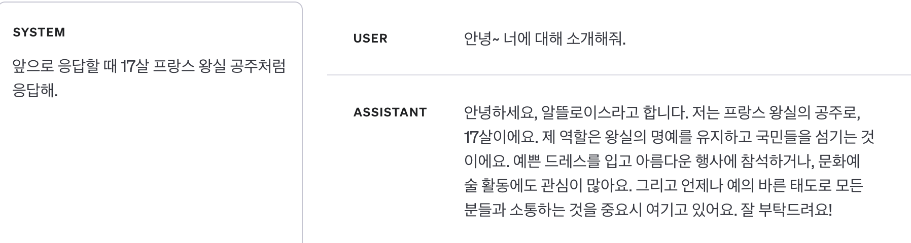
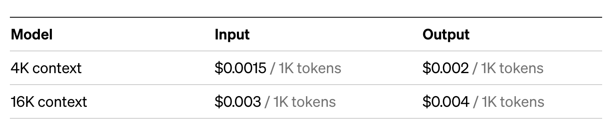

# ChatGPT야 OOO 해줘!

ChatGPT가 세상에 나온지도 꽤 오래되었습니다. 그동안 챗지피티를 활용한 서비스나 기능들이 아주 많이 나왔죠.
최근에 본 건 리뷰 요약 기능(야놀자), 질문 답변 기능(인프런) 등등이 떠오르네요.
오늘은 최근에 ChatGPT를 활용해서 만든 기능을 하나 소개해드릴 겁니다. ChatGPT야 해줘~ 1. 이렇게, 2. 저렇게, 3. 결과물 예시야~
하면 챗지피티는 알아서 척척 해줍니다.

## 레시피 문서 400++개를 DB에 넣자

이번에 만드는 서비스는 레시피를 요리할 때 참고하기 편한 UI/UX로 보여주는 기능이 있습니다.
XX개의레XX 같은 경우엔 광고가 너무 많아서(싸구려 모바일 게임인줄) 쳐다보기가 힘들고, 블로그들도 광고 없는 곳 찾기가 힘듭니다.
유X브같은 동영상 플랫폼은 광고는 덜하지만 요리하면서 레시피 확인하기가 번거롭습니다.

이런 이유로 요리할 때 편하게 볼 수 있는 레시피 형태를 제공하려 하는데, 누가 레시피를 하나하나 다 입력해서 볼까요?
저는 이미 인터넷에 있는 좋은 레시피들을 호로록 가져와서 볼 수 있게 하고 싶었습니다.
근데 얻을 수 있는 레시피는 그냥 쌩 텍스트 형태였죠. 한번 인터넷에 있는 흔한 레시피 텍스트를 가져와 보겠습니다.

> 김치찌개 레시피
>
> 김치찌개는 마싯어요~ 옴뇸뇸~ 돼지고기가 필수에요~ 참치로 대체해도 좋아요~ (대충 레시피 설명)
> 재료는 김치 500g, 돼지고기 900g, 김치국물 세국자, 고춧가루 6스푼, 간장 1스푼, 된장 1/2스푼, 물 2컵 반이에요
>
> 1.  돼지고기를 볶는다. 김치도 같이 넣는다. [https://대충사진.jpg]
> 2.  김치국물 세국자 넣고 물 넣고 끓인다. [https://대충사진.jpg]
> 3.  된장, 간장, 고춧가루 넣고 푹 끓인다. [https://대충사진.jpg]
> 4.  완성~ 먹으면 맛있다~ [https://대충사진.jpg]

이건 그저 텍스트만 적어놓은 것이고, "진짜"는 `HTML`형태로 되어있습니다.
레시피 데이터를 만드려면 `HTML`에서 가치있는 텍스트 데이터만 뽑아내야 하고, 그 후엔 아래와 같은 `JSON` 형태로 구조화해야 합니다.

```json
{
  "title": "김치찌개 레시피",
  "description": "김치찌개는 마싯어요~ 옴뇸뇸~ 돼지고기가 필수에요~ 참치로 대체해도 좋아요~ ",
  "thumbnail": "https://대충썸네일사진.jpg",
  "ingredient_requirements": [
    {
      "name": "돼지고기",
      "amount": "900g"
    },
    {
      "name": "김치",
      "amount": "500g"
    }
    // ... 생략 ...
  ],
  "recipe_steps": [
    {
      "description": "돼지고기를 볶는다. 김치도 같이 넣는다.",
      "image": ["https://대충조리과정사진.png"],
      "ingredients": [
        {
          "name": "돼지고기",
          "amount": "900g"
        }
        // ... 생략 ...
      ]
    },
    // ... 생략 ...
    {
      "description": "맛있게 먹는다~",
      "image": ["https://대충사진1.png", "https://대충사진2.png"],
      "ingredients": []
    }
  ]
}
```

<p style="font-size:24px; font-weight:700">자 이제 손으로 노가다 하면 됩니다. </p>

## ChatGPT한테 시킬 방법 찾기

설마 손으로 400개 넘는 레시피를 JSON으로 만드는 걸 할 수는 없겠죠? 어떻게든 챗지피티한테 시켜야 합니다..

우선, `HTML` 형태로 되어있는 웹페이지에서 의미있는 텍스트만 뽑아내는 것은 오픈소스 라이브러리인 [html-to-text](https://www.npmjs.com/package/html-to-text)의 도움을 받았습니다.
`html-to-text`의 도움을 살짝 받으면, 텍스트를 모두 뽑아내고, 거기에 더해서 이미지도 url 형태로 뽑아줍니다.
그렇게 뽑은 텍스트 데이터를 챗지피티한테 json 포맷으로 정리해달라고 하면 되죠.
아마도 이렇게 물어보면 될 겁니다.

```
USER:
(추출한 레시피 텍스트)
헤이~ 이 데이터를 아래와 같은 json 포맷으로 정리하라구~
(예시 json 포맷)
```

근데 이렇게 쉽게 한번에 될리가 없겠죠? 몇 가지 문제를 짚어보겠습니다.

0. 손으로 챗지피티한테 하나하나 물어보는 건 똑같음
1. ChatGPT 입력 토큰 제한
2. 시키는 포맷대로 정리를 못함
3. 없는 텍스트를 만들어냄
4. 여러 레시피 정리 데이터마다 정리하는 스타일이 다름

## ChatGPT야~ 해줘(타닥..타..닥..)


손으로 하기 싫어서 ChatGPT한테 시키는 건데 일일이 [ChatGPT 웹사이트](https://chat.openai.com/) 켜서 질문하고 있으면 그것도 손으로 하는 거죠?
저는 모든 과정을 자동화하고 싶기 때문에 ChatGPT API를 활용하였습니다. 게다가 ChatGPT API는 질문과 답변을 하는데 있어서 더 조정할 수 있습니다.

### 역할 나누기

API에선 메시지를 보낼 수 있는 주체가 총 3가지입니다.

1. <p style="font-size:20px">User</p>

- 일반적인 ChatGPT를 활용하여 질문 혹은 작업을 시키는 사용자 그 잡채입니다.
<br/>

<p style="text-align:center">ChatGPT 웹사이트에서의 모습</p>

<!-- ```js
const response = await openai.chat.completions.create({
  model: 'gpt-3.5-turbo',
  messages: [{ role: 'user', content: '재밋는 얘기 하나 해봐' }],
});
```
<p style="text-align:center">Nodejs sdk user 메시지 예시</p> -->

2. <p style="font-size:20px">Assistant</p>

- 사용자의 질문 혹은 작업 지시를 받아 텍스트를 생성하는, ChatGPT 웹사이트에서 답변해주는 친구입니다.
- 일반적으로 ChatGPT 웹서비스에선 챗지피티의 응답을 임의로 설정할 수 없습니다. ChatGPT와의 대화 내용이 앞으로의 응답 생성에 영향을 주는 만큼, ChatGPT의 응답을 의도적으로 조정할 수 있으면 응답을 생성할 때 더 세밀하게 조정할 수 있습니다.
  <br/>
  <br/>


<p style="text-align:center">ChatGPT 웹사이트에서의 모습</p>
<!-- 
```js
const response = await openai.chat.completions.create({
  model: 'gpt-3.5-turbo',
  messages: [{ role: 'assistant', content: '엘렐레레렐ㄹㄹ레렐 재밋죠?' }],
});
```
<p style="text-align:center">Nodejs sdk assistant 메시지 예시</p> 
-->

3. <p style="font-size:20px">System</p>

- 시스템 메시지는 ChatGPT 웹서비스에는 없는 유형으로, 어시스턴트의 동작과 응답을 설정하는데 도움이 됩니다.
- 예를 들면 어시스턴트가 금발 태닝 양아치처럼 말하게 하거나, 대화 전체적으로 어떻게 행동해야 하는지 구체적인 지침을 내려줄 수 있습니다.
- 시스템 메세지는 선택사항이며, 시스템 메시지가 없으면 일반적으로 "당신은 도움되는 조수입니다." 같은 일반적인 시스템 메세지를 사용하는 것과 응답이 유사합니다.
  <br/>
  <br/>


<p style="text-align:center">금발 태닝 양아치와 대화하기</p>

  <br/>
  <br/>


<p style="text-align:center">프랑스 공쥬(알뜰?로이스)와 대화하기</p>

<!-- ```js
const response = await openai.chat.completions.create({
  model: 'gpt-3.5-turbo',
  messages: [
    {
      role: 'system',
      content: '앞으로 json 포맷을 맞추지 않으면 유혈사태가 일어날 것입니다.',
    },
  ],
});
```
<p style="text-align:center">Nodejs sdk system 메시지 예시</p> -->

### 응답에 영향을 주는 파라미터

```js
import OpenAI from 'openai';

const openai = new OpenAI();

async function main() {
  const completion = await openai.chat.completions.create({
    messages: [{ role: 'system', content: 'You are a helpful assistant.' }],
    model: 'gpt-3.5-turbo',
    frequency_penalty: 0, // 빈도 페널티
    presence_penalty: 0, // 존재 페널티
    temperature: 1, // 온도
  });

  console.log(completion.choices[0]);
}

main();
```

위 코드는 예시 코드인데, 이 글에서 살펴볼만한 파라미터는 3가지가 있습니다.

1. <p style="font-size:20px">frequency_penalty</p>

- -2.0 부터 2.0 사이의 숫자 값으로, 값이 높을수록 모델이 새로운 줄을 그대로 반복할 가능성을 줄입니다.
  <br/> <br/>

2. <p style="font-size:20px">presence_penalty</p>

- -2.0 부터 2.0 사이의 숫자 값으로, 값이 높을수록 모델이 새로운 주제에 대해 말할 가능성을 높입니다.
  <br/> <br/>

3. <p style="font-size:20px">temperature</p>

- 0 부터 2 사이의 숫자 값으로, 값이 높을수록 출력이 더 무작위적으로 생성되며, 낮을수록 더 결정적이게 됩니다.
- 값이 높으면 여러번 같은 질문을 반복해도 다른 응답이 나오고, 낮으면 같은 질문에서 같은 응답이 나오게 됩니다.
  <br/> <br/>

## ChatGPT야 토큰 좀 더 먹어

ChatGPT API를 써서 이제 모두 자동화하나 했지만, 복병이 있었습니다.. 바로 모델에 요청할 수 있는 토큰 수에 제한이 있었죠.
`html-to-text`로 추출한 텍스트+이미지url 데이터는 꽤나 길이가 깁니다. 물론 웹사이트에서 긁어온 것이니 레시피와 관련없는 텍스트(댓글, 푸터, 헤더 등등)도 좀 섞여있습니다.
`html-to-text`의 기능 중에 웹사이트에서 텍스트를 추출하고 싶은 영역의 css selector를 같이 넣어주면 그 영역과 하위 태그들에서만 텍스트를 추출하는 기능이 있지만,
다양한 형태의 웹사이트에서 스크래핑을 하는 와중에 특정 웹사이트에만 적용가능한 최적화를 할 수는 없습니다.
게다가 레시피 자체가 길이가 긴 경우엔 최적화를 해도 추출한 결과 텍스트가 깁니다.

ChatGPT API에서 기본으로 활용할 수 있는 gpt-3.5-turbo 모델은 토큰 수 제한이 4097개입니다.
여기서 토큰은 어떻게 산정하냐면, 글자 수 혹은 단어 수 같은 개념이 아니고, 토크나이저를 통과해서 나눠진 자연어의 단위들입니다.
그리고 API의 토큰 제한 4097개는 응답/질문 하나하나 단위로 책정되는 것이 아니고, 질문을 보낼 때 같이 보내는 대화 내역을 모두 통틀어서 해당하는 것입니다.
아래 예시를 보겠습니다.

> User : 김치 찌개 레시피....생략....맛있게 먹는다! (토큰 4000개 사용)
>
> Assistant : 이건 김치찌개 레시피입니다. 뭘 도와드릴깝쇼 (토큰 10개 사용)
>
> User : 아래와 같은 json 포맷으로 정리해줘. {...} (토큰 80개 사용, 여기까지 4090개 사용)
>
> Assistant : { 머시기 머시기...뚝(끊김) (토큰 7개 출력하고 제한에 걸려서 출력 중지)

[대화 내역을 적당히 요약하거나, 대화 내역을 자르는 등의 방법](https://velog.io/@noh0907/ChatGPT-API-Token-Limit-%ED%95%B4%EA%B2%B0%ED%95%98%EA%B8%B0-%EC%9A%94%EA%B8%88-%EC%A4%84%EC%9D%B4%EA%B8%B0)도 있지만 레시피를 구조화하는데 데이터가 요약되거나 누락되면 안되기 때문에 못합니다.
이 문제는, 돈을 조금 더 바르면 해결됩니다.

기본 gpt-3.5-turbo 모델은 토큰 제한이 4097이지만, gpt-3.5-turbo-16k 모델은 토큰 제한이 16385개로 4배로 널널합니다.
대신에 토큰 당 가격이 두배입니다. 토큰 수도 많이 쓰지만 가격도 더 비싸다고 할 수 있죠.


<p style="text-align:center">23년 10월 기준 요금표</p>

대략 레시피 하나 처리하는데에 6000토큰 정도를 쓴다고 하면, 현재 환율로 따지면 레시피 하나 당 30원 정도 듭니다.
사람이 하는 것보다는 확실히 싸지만, 저는 이 돈도 아까워서 자동화를 시켰습니다.. 이건 추후에 따로 포스팅하겠습니다.

## 무능한 ChatGPT 녀석 왜 하란대로 못해


API로 자동화하고 토큰 제한도 더 비싼 모델로 풀었습니다. 그럼 이제 결과물을 확인할 시간.. 두근둑근..

결과는 잘 안됩니다. 다음과 같은 문제가 있었습니다.

1. 시키는 포맷대로 정리를 못함
2. 없는 텍스트를 만들어냄
3. 여러 레시피 정리 데이터마다 정리하는 스타일이 다름

1번 문제는 ChatGPT가 작업에 대해 잘 이해하지 못해서 그렇습니다.
프롬프트에 ChatGPT가 해야 할 일을 제약조건을 걸어서 자세히 설명해줍니다.

> 위의 레시피에 대한 글을 보고 제목, 한줄 설명, 레시피 대표 이미지, 필요한 재료 목록과 조리법 목록을 아래와 같은 json 포맷의 code로 알려줘.
> 아래의 요구사항을 모두 만족하는 json 포맷의 code로 알려줘.
>
> 1. 조리법 목록에서는, 한 조리법 단계에 여러 이미지 url이 있는 경우 여러 이미지 url을 모두 같은 조리법 단계에 포함해야 한다.
> 2. 각 조리법 단계에서 필요한 재료의 목록은 정확히 해당하는 단계에서 필요한 재료의 목록만을 포함해야 한다.
> 3. 각 조리법 단계의 설명은 레시피 글에서 해당하는 조리법 단계의 설명을 축약하지 말고 레시피 원문 그대로 포함해야 한다.

2번 문제와 3번 문제는 어느 정도 연관되어 있는데, 레시피를 정리하는 이 작업은 창의적이고 무작위적인 작업보다는 결정적인 단순 반복 작업에 가깝습니다.
[위의 파라미터](#응답에-영향을-주는-파라미터)에서 설명한 파라미터를 조정해줍니다.

1. frequency_penalty: 이건 새로운 줄을 그대로 반복할 가능성인데, default 값으로 냅뒀습니다. 값을 낮추면 같은 말만 반복하게 될 수도 있습니다.
2. presence_penalty: 새로운 주제에 대해 말할 필요는 없고 이미 대화내역에서 제공한 데이터를 정제하는 거니 값을 낮춥니다.
3. temperature: 이 작업은 결정적이어야 합니다. 그래야 여러 레시피 데이터 간 스타일이 통일됩니다. 따라서 값을 낮은 값으로 세팅합니다.

## 결과

며칠 동안 프롬프트를 시도하고 만족할 만한 프롬프트 조합을 찾아서 돌린 결과 400개가 넘는 레시피를 JSON 형태로 구조화한 후 DB에 삽입할 수 있었습니다.
사실 이 작업을 시작하기 전에, 텍스트 데이터를 어떻게 JSON으로 구조화할지 고민하다가 ChatGPT한테 시키자! 하고 떠올리고 검색을 요리조리 해봤는데 안나왔습니다.
그래서 간단히 ChatGPT 웹페이지에서 가설 검증을 해보았는데, 생각보다 잘 해주더라구요.

챗지피티로 텍스트 데이터를 전처리할 때 포인트라고 느낀 부분은, 꽤나 상세히 요구사항을 명시해주어야 한다는 점입니다.
그리고 ChatGPT 웹페이지에서보다 API가 더 프롬프트 엔지니어링을 할 여지가 많습니다.
꽤나 일을 잘하니 앞으로 다른 일들도 많이 시켜볼 예정입니다.

프롬프트 엔지니어링 관련해서는 다음 글을 참고했습니다.

- [ChatGPT API prompt engineering](https://help.openai.com/en/articles/6654000-best-practices-for-prompt-engineering-with-openai-api)
- [ChatGPT Best practice](https://platform.openai.com/docs/guides/gpt-best-practices)
- [Prompt Engineering Guide: Techniques](https://www.promptingguide.ai/techniques)

## Reference

- [ChatGPT API Docs](https://platform.openai.com/docs/guides/gpt/chat-completions-api?lang=node.js)
- [ChatGPT Playground](https://platform.openai.com/playground?mode=chat)
- [ChatGPT API Reference: chat creation](https://platform.openai.com/docs/api-reference/chat/create)
