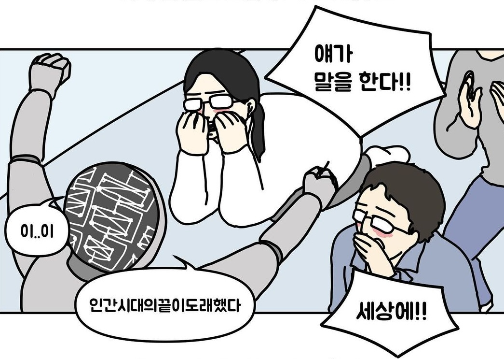

# 아마추어의 끝?

프로라는 말은 보통 "돈을 받고 하는~"이라는 뜻으로 쓰는 것 같다.
그럼 아마추어는 당연히 "돈을 안받고 하는~"이라는 뜻이다.

얼마 뒤면 대학 입학 후 지금까지 약 6년 간 이어온 프로그래머로서의 생활이 다른 국면에 접어든다.
지금까지 어떤 길을 걸어왔는지 사실 좀 기억이 안나는 부분도 있고 해서, 글로 남겨보려 한다.

> [이전 포스트](https://spongelog.netlify.app/progress_of_amateur_programmer/)에서 이어지는 내용입니다.

## 웹개발 걷기 시작

내공 쌓기를 열심히 하고 지난 2년 동안은 프로젝트와 공부를 병행하였다.
크게 두 프로젝트를 진행하고 AWS와 GCP같은 클라우드도 열심히 써보고, 오픈소스 기여도 해보고, java/spring 공부도 해보고, 챗지피티를 가지고도 놀아보고 등등..

웹개발 한창 하는 나

### 기술적인 경험

지난 2년 동안 프로젝트에서 쌓은 기술적인 경험은 여러가지가 있는데, 몇 가지 주요한 것을 나열해보자면 아래와 같다.

0. 어플리케이션 개발 사이클 경험
1. 비기능적 요구사항 충족 경험
2. 클라우드/서버리스 활용
3. AI(Vision, NLP) 활용

#### 어플리케이션 개발 사이클

지난 2번의 프로젝트 모두 기획부터 개발, 배포까지 한 프로젝트였다.
이전까지의 경험과 다른 점은 이 모든 사이클을 내가 완전하게 경험했다는 것이었다.

특히 개발을 하면서 해야 되는 것들, 예를 들면 작업 단위가 너무 크지 않게 관리하고, 문서화를 해놓고, 테스트 코드를 작성하고, 배포 후 장애가 있진 않은지 모니터링 하는 등의 여러 가지 일들이 왜 필요하고 어떻게 해야 할지 알아가고 고민해볼 수 있었다.

예를 들면 한 프로젝트는 일정에 쫒겨 테스트 코드를 쓰지 않고 스웨거로 만들어진 API 문서에서 손으로 테스트를 진행했는데, 이는 개발 초반에는 편했을지언정 개발 후반에는 내가 생각하지 못하고 손테스트 하지 못한 부분에서 버그가 나는 등 비효율을 초래했다.
이런 것은 흔한 테스트 코드 없는 프로젝트의 모습이긴 하지만, 내가 당시에 시간이 없다고 테스트 코드를 안쓴건 사실 테스트 코드 쓰는게 익숙하지도 않고 잘 몰라서 연습하고 찾아보는데에 쓸 시간이 없었던 것이었다.

그래서 이후로 진행한 프로젝트에선 시간 여유를 더 넓게 두고, 차근차근 테스트 코드를 쓰고 테스트를 잘 쓰기 위해 더 공부하면서 테스트와 친해지려고 노력했다.

문서화도 마찬가지로 평소에 문서 작업하는 습관을 들이려고 노력하며 문서화 작업에 들이는 시간과 노력이 점점 적어지도록, 더 적은 시간/노력을 투입해도 같은 품질의 문서가 나올 수 있게 하려고 하였다.

#### 비기능적 요구사항

어떤 버튼 하나를 누르는 데에도 10~20초씩 걸리고, 실행하면 노트북 팬이 이륙하는 웹사이트가 있다고 해보자.
여기서 버튼의 반응 시간이 1초 이내여야 한다, 실행했을 때 CPU와 메모리를 일정 이하로 사용해야 한다 등의 요구사항이 비기능적 요구사항이다.
정확한 표현일지는 모르겠으나 간단히 말하자면 비즈니스 로직이 아닌 것들이 비기능적 요구사항이 되겠다.

최근 진행했던 프로젝트들에서는 이런 요구사항을 만족하기 위해 여러가지를 시도해보았다.

1. API 지연시간 감소 -> [Redis와 AOP를 활용한 캐싱](https://spongelog.netlify.app/nestjs-multicaching-with-aop/)
2. API 지연시간 감소 -> API Lambda Cold Start 해결을 위한 워밍업 처리
3. 데이터 전처리 비용 감소 -> [손으로 하기 귀찮은(최저시급 환산시 비싼) 데이터 전처리 ChatGPT에게 시키기](https://spongelog.netlify.app/chatgpt_data_processing/)
4. 개발 생산성 증가/휴먼 에러 감소 -> Github Action을 활용하여 빌드/테스트/배포 자동화
5. 서버 비용 절약 -> 서버 비용 절감을 위한 서버리스 인프라 설계

이런 비기능적 요구사항을 구현하는 것은 꽤 재밌는 경험이긴 했으나, 어느 순간부터 비즈니스 로직보다 이에 더 집중? 혹은 더 관심을 가지는 나를 발견할 수 있었다.
이런 경험이 이력서에 쓰기 더 좋은 경험이기 때문일까?
사실 이력서에 내가 비즈니스 로직 잘 구현했소~ 라고 적기엔 조금 민망한 감도 있었다.
비즈니스 로직 구현하는 것은 어찌보면 당연히 해야 할 일이니까..

하지만 [주니어 개발자는 DDD의 꿈을 꾸는가? 포스트](https://spongelog.netlify.app/do_junior_sw_engineers_dream_of_dddd/)에서 언급한 것처럼, 중요성을 저울질 했을때 내 생각에 쪼끔이라도 더 중요한 것은 비즈니스 로직 개발이 아닌가 생각한다.
그리고 이러한 비즈니스 로직 개발 능력은 복잡한 도메인에서 더 빛을 발한다.
도메인을 잘 표현하면서 유연하게 변경가능한 비즈니스 로직 구현 능력을 갖추는 것이 나에게 더 시급한 목표라고 요즘 생각이 바뀌었다.
DDD 책과 강의들에서 제안하는 구조와 설계를 모두 충실히 따를 필요는 없겠지만, 적어도 유연하고 표현력 높게 구성된 시스템을 어떻게 만들지에 대해 가이드가 될 수 있을 것 같다.

#### 클라우드 / 서버리스 활용

두 프로젝트 모두 서버리스를 적극적으로 활용했다.
일반적으로 하는 것처럼 EC2/ECS 같은 컴퓨팅 인스턴스를 여러 개 띄우고, 오토 스케일링 설정을 하고 로드 밸런서를 연결하고, VPC 붙히고 등등 할 수 있겠지만, 서버리스로 구성하려 한 이유는 크게 두 가지였다.

1. 서버 비용 절감
2. 인프라 관리 및 운영 비용 절감

우선 프로젝트를 진행하며 서버를 내내 켜놓는 건 돈낭비가 심하다.
개발 단계에서는 개발할 때만 켜놓으면 되며, 배포하고 운영을 한다 해도 사이드 프로젝트가 성공하는 극소수 케이스가 아니고서야 트래픽이 미미하거나 유동적일 것이다.
즉 서버를 사용할 때만 켜놓고 아닐 땐 끄는게 서버 비용 절감에 도움이 되는데, 서버리스는 딱 그런 인프라 구성 방법이었다.

또한, 인프라를 구성하고 관리하는 건 단순하지 않다.
물론 백엔드 개발자가 사이드 프로젝트(혹은 학생 수준의 프로젝트)에서 얼마나 높은 수준의 인프라 엔지니어링을 할 필요성이 있을 것이며, 단순히 VM 띄우고 로드밸런서 연결하는 정도는 기본적으로 해야 된다는 의견도 있다.

하지만, 그게 끝이 아니고, 만약에 버그 발생 시에 디버깅을 위해 서버 로그를 확인해야 한다면?
로그를 수집하고 수집한 로그에서 검색/필터링도 가능하도록 인프라를 구성해야 하는 비용이 든다.
버그 발생 빈도 등의 지표(metric)을 설정하고 일정 수준 이상 시 알람을 내보내게 하려면?
비용이 든다.

서버리스를 적절히 사용했을 때 인프라를 관리하고 운영하는 비용이 줄어들 것이라고 생각하여 사용해보았고, 실제로도 어느정도 비용을 절감하였다.
물론 서버리스가 만능은 아니니 모든 인프라 관리를 위임할 수는 없겠지만, 적어도 일정 수준까지는 기본 제공하는 기능을 훌륭하게 사용할 수 있었다.

신기술이나 쓰고 싶었던 기술을 활용하는(개발만 하는) 프로젝트가 아니라 운영을 해야 하는 프로젝트라면 서버리스는 좋은 선택지라고 생각한다.
어느 정도 트래픽 이하에서는 운영 비용을 전반적으로 절감할 수 있다.
앞으로 진행하는 사이드 프로젝트도 서버리스를 아예 안쓰지는 않을 것 같다.

#### AI 활용

AI에 대한 관심은 웹 개발을 하면서도 쭉 있었는데, AI는 정말 계속 계속 발전했다.
이젠 어떤 서비스를 하더라도 AI를 아예 안쓰긴 힘들 것 같다.
진행했던 프로젝트도 모두 AI를 활용했는데, Vision(이미지 인식 - yolo.v5 모델)과 LLM(GPT-2: 챗봇, GPT-3.5: 데이터 전처리) 모두 사용하였다.

AI가 잘한다(출처: <a href="https://www.instagram.com/waterglasstoon/" target="_blank">데브경수</a>)

특히 요즘 일반적인 백엔드 개발자도 AI 관련한 서비스를 개발하는 것은 그리 어려운 일이 아니라고 느꼈다.
왜냐면 AI 서비스 개발에 어려운 머신러닝/딥러닝 지식이 필요하지 않다고 느꼈기 때문이다.
물론 어느 정도 수준 이상의 서비스를 만드려면 AI 분야 전문성이 있는 엔지니어/리서처가 있어야겠지만, 간단한 가설 검증 및 서비스 초기 버전 정도는 뚝딱이다.

이렇게 생각한 이유는, 요즘 들어 pre-trained 모델이 너무 잘 나오기 때문이다.
이전에 진행한 프로젝트에서 활용한 AI는 이미 잘 훈련된 pre-trained 모델을 가져와 도메인 특화된 데이터를 가지고 fine-tuning을 진행하여 개발되었다.
[ChatGPT로 데이터 전처리하는 작업](https://spongelog.netlify.app/chatgpt_data_processing/)에서는 fine-tuning까지 가지도 않고 단지 few-shot learning 정도의 프롬프트만 활용하여 작업을 시켰다.
앞으로도 빅테크가 아닌 소규모의 기업 혹은 개인도 pre-trained 모델과 LLM과 함께라면 다양한 서비스를 개발해볼 수 있을 것 같다.

특히 난 LLM의 발전이 정말 대단하게 느껴졌는데, 이전까지 범용 인공지능을 만드는 데에 가장 현실적으로 보였던 강화학습보다 언어 모델 쪽에서 논리력/사고력/작업 수행 등을 할 수 있는 AI가 나왔다는게 놀라웠다.
LLM에서 강화학습이 안 쓰이진 않았지만, 강화학습이 더 잘 결합되어서 다른 차원의 발전을 보여줄 수 있을 거라고 기대중이다.

### 오픈소스에 발 담구기

어느정도 개발 짬이 찬 후 해보고 싶었던 것이 있었는데, 바로 오픈소스 기여하기였다.
하지만 오픈소스에 기여할 거리를 잘 찾지 못하기도 했고, 어느 하나 기여할 수 있을 정도로 깊게 파보지 못해서 못하고 있었다.

그러다가 토스에서 운영하는 [NestJS AOP 모듈](https://github.com/toss/nestjs-aop)을 접하여 써보았다.
하지만 원하는 기능이 있는데 제공을 안하는 것 같아 이래저래 커스텀 할 수 있나 라이브러리를 해부했다.
결국 내가 원하던 기능은 커스텀을 해도 불가능해서 다른 방식으로 해결했지만, 해당 프로젝트의 TODO 중에 커스텀하느라 얻은 이해도로 기여할 수 있어 보이는 것이 있었다.

그래서 NestJS 코드도 뜯어보고 찾아서 기능을 만든 다음에 PR을 열었다.
개인적으로 기능 추가에 대한 PR은 먼저 이슈로 기존 메인테이너들과 의견 교류를 하고 개발하여 여는 게 맞지 않나 하는 생각이 들었다.
그래도 코드 상에 `TODO; Not supported yet`이라고 쓰여있어서 용기를 얻어서 선개발 PR 박치기를 하였다.

메인테이너와 코드 리뷰 및 토론을 하며 코드를 좀 더 수정하고 결국 머지까지 완료했다.
내가 기여한 기능을 쓰는 사람이 있을랑가 모르겠다만 그래도 내가 쓰고, 다른 많은 개발자들도 쓰는 오픈소스에 기여하고 그 과정에서 메인테이너와 리뷰하는 과정도 즐겁고 뿌듯했다.

그 이후에 용기를 좀 얻어 [OpenAI Node.js sdk](https://github.com/openai/openai-node)에 버그 리폿 이슈(알고보니 버그가 아니고 다른 문제였다)도 올려보고 하였다.
앞으로도 지나가다 발견한 버그라던지 원하는 기능이 있을 때 등등, 기여하는 빈도를 더 늘리고 싶다.

### 내공 쌓기는 계속된다

프로젝트를 하면서 공부도 병행하려고 했다.
이제는 프로젝트를 내팽겨치고 공부만 하는 시간을 내기엔 프로젝트가 롱텀이기도 했고, 앞으로 커리어를 이어가며 프로젝트를 안하고 공부에만 집중하는 시간이 거의 없을 것 같아서, 미리 연습하자는 의도였다.
특히 23년은 java/spring 스택을 공부하고 프로젝트에도 조금씩 적용해보고, 이제껏 고민해보지 않았던 다양한 주제를 고민해보는 시간이었다.

지금까지 알음알음 공부하고 개발했던 Node.js 스택과 java/spring 스택은 색다른 점이 꽤 있었고, 그런 부분에서 얻어가고 배울 점이 많았다.
java/spring과 똑같이 Node/Nest를 사용할 것은 아니지만, 그래도 영감을 받거나 아이디어를 차용하여 구현하는 등의 다양한 활용 사례를 배운 것 같다.

프로젝트와 병행하다 보니 책 한권 진득하게 붙잡기는 거의 못하고 주로 온라인 강의 또는 단발성 주제에 대해 많이 공부했으나, 앞으로는 책 한권 진득하게 붙잡기도 병행할 수 있게 진행해볼 예정이다.

## 취업 준비

짤막하게 취업 이야기도 하자면, 23년은 취업 활동의 해이기도 했다.
23년 상반기 네이버 공채를 넣었으나 코테 준비를 정말 정말 내팽개치고 쳤더니 코테에서 떨어졌다.
근데 코테는 그냥 중박치는 실력이라 그때 당시엔 그냥 아무 생각이 없었다.
근데 거짓말 같이 공채가 멸종하여 토스 NEXT 공채까지 코테칠 일이 없었다.
혹은 내가 별로 열정이 없어서 공채가 있었지만 몰랐을 수도 있다.

어쨋든 7월에 진행된 토스 NEXT 공채는 코딩테스트 - 과제 전형 - 기술 면접 - 컬쳐핏 면접 4단계 중 마지막인 컬쳐핏에 가서 [떨어졌다](https://spongelog.netlify.app/toss_next_2023_postmortem/).
아, 마지막 단계까지 가면 진짜 별 상상을 다한다는 걸 그때 경험했다.
주위에선 토스 가는 거냐며 축하해줬고 이미 맘은 토스 가서 온보딩하고 2학기는 취업계 내고 있었다.
근데 떨어져서 좀 상심이 컸는지 도무지 개발이 손에 안잡혀서 가족여행도 있고 해서 1달 정도 대충 살았다.

토스 공채 회고 포스트에 덧붙혀 지금 느끼는 컬쳐핏에서 떨어진 이유는 아직 내가 조직에 들어가서 생활할 마음가짐 준비가 안되었기 때문이라고 생각한다.
마지막 단계까지 왔다고 행복회로 돌리고 있고, 좀 더 치열하게 나를 어필할 고민을 했어야 한다고 본다.
또한 컬쳐핏 면접은 정말로 지원자가 어떻게 말하느냐에 따라 흘러간다고 느낀다.

어쨌든 토스에 떨어지고 맘이 좀 회복된 후 다시 개발이랑 공부를 달렸고, 머리로는 지원해야지 해도 계속 미루다가 결국 11월 말, 12월 즈음이 되서야 이력서를 여기저기 넣게 되었다.
그 이전에도 원티드에서 찾아보면 Node.js 신입 채용 공고는 가뭄에 콩나듯 있었는데, 12월에도 다르지 않아서 정말 없었다.

우선 내가 지원한 기업의 조건을 잘 고민한 후 마지노선을 정하고, 하한선부터 지원하기 전법을 썼다.
근데 마지노선 위 기업 중 채용 공고가 있는 기업이 열 손가락 안에 꼽더라..
게다가 그 중에서 태반은 2~3년차 이상 공고였다.

결국 서탈로 우수수 나갔는데, 그 중에 제일 맘에 드는 기업 중 한 곳(경력무관)이 서류가 탁 붙었다.
그 기업은 이전에 창업팀에 같이 합류한 백엔드 동료가 이후에 입사한 곳이라 지원하기 전 커피챗도 나눴던 기업이었다.
그렇게 과제 전형 - 기술 면접 - 컬쳐핏 면접까지 거치게 되었다.
과제는 열심히 고민해서 제출했으나 기술 면접에서 과제 실수했던 게 우수수 들통나 탈탈 털리는 바람에 기술 면접에서 탈락할 줄 알았는데, 컬쳐핏까지 가게 되어 너무 기뻤다.

컬쳐핏 면접은 토스 실패를 교훈 삼아 철저히 준비하려고 했고, 내가 어필할 점을 위주로 면접이 진행되도록 준비하려고 했다.
준비한 것처럼, 맘처럼 내가 생각한 답변만 할 수 있지는 않았지만 그래도 어찌저찌 말은 열심히 했었다.
결국 최종 합격을 하여 합류 제안을 받게 되었고, 기쁜 맘으로 합류하게 되었다.

이 기업 합격 회고는 안쓰려고 한다.
왜 성공했을까를 회고하는 것보단 왜 실패했을까를 회고하는게 더 가성비가 좋으니까?
회고도 에너지를 많이 쓰는 작업인 것 같아서 효율적으로 하고 싶다.

## 이 회고의 목적

지금까지는 얼레벌레 개발하고 하고 싶은 거 다 할 수 있었지만, 돈 받고 일하는 입장에 서면 그 책임이 달라진다.
그래서 지금까지의 얼레벌레 생활에서 무슨 생각과 경험을 했었는지 돌아보고 정리하였다.

또, 요즘 자꾸 옛날 기억이 없어지는 것이 느껴진다.
그 이유가 자꾸 새로운 경험을 하고, 새로운 지식을 쌓는데 과거에 있었던 일은 가끔씩만 꺼내서 보기 때문에 뇌가 필요없는 거라고 생각하고 지우는 것 같다.
디스크 저장 공간이 부족하면 외장 하드나 클라우드에 자료를 옮기는 것처럼, 더 까먹기 전에 블로그에 옮겨야겠다.
