# MongoDB Multi-Document Transaction의 Write Conflict

MongoDB는 NoSQL DB 중 꽤 많은 사용자와 생태계를 갖춘 디비로, 몽고디비를 메인급 디비로 굴리는 회사도 많습니다.
국내에서도 테크 블로그들을 통해서 알음알음 몇몇 기업들이 쓰고 있는 것을 확인할 수 있죠.


NoSQL과 비교해서 전통적인 SQL DB들이 가지는 장점은 많은 것들이 있지만, 그 중 하나는 `ACID 트랜잭션`입니다.
그래서 데이터의 정합성과 일관성이 중요한 경우 대부분 SQL 디비를 사용하죠.
근데, 몽고디비도 `ACID 트랜잭션`을 지원합니다.
이는 몽고디비가 내부에서 사용하는 WiredTiger 스토리지 엔진의 MVCC(Multi Version Concurrency Control) 기능을 활용하여 가능합니다.

근데, 몽고디비의 ACID 트랜잭션은 다른 SQL 디비와 비교하면 다른 부분이 있습니다.
트랜잭션 격리 수준(Isolation level)과, Read Concern/Write Concern이 그 예시죠.
이 포스트의 주인공은 바로바로~ 몽고디비의 트랜잭션 에러 중 하나인 Write Conflict입니다.

## 서버 개발자의 흔한 트랜잭션 관리법

소프트웨어 개발에는 패턴이 있습니다.
그 중에 하나는 이것이죠.

> **서비스 클래스 메소드는 트랜잭션으로 관리하라**

그 이유는 간단합니다.
비즈니스 로직은 트랜잭션으로 관리되어야 하고, 비즈니스 로직을 담당하는 계층(or 모듈)이 서비스 클래스이기 때문이죠.
저도 그렇게.. 모두들 하는 것처럼.. 자연스럽게 서비스 클래스 메소드에 MongoDB 트랜잭션을 적용했습니다.

하지만 MongoDB의 다중 다큐먼트 트랜잭션은 자연스럽게 적용해서 아무 문제 없이 사용할 수 있는 것은 아닙니다.
흔한 사례 하나를 확인해 보겠습니다.

### `updateById(id, data)` with MongoDB 트랜잭션

특정한 ID의 다큐먼트를 수정하는 트랜잭션 A, B가 있습니다.
아래와 같은 형태라고 가정해보겠습니다.


트랜잭션 B는 시작한 후 `Document#1`을 업데이트합니다.
트랜잭션 A는 트랜잭션 B가 `Document#1`을 업데이트를 완료한 후 `Document#1`을 업데이트하려고 합니다.

이때 트랜잭션 A는 업데이트하려 할 때 `Write Conflict Error`를 만나서 업데이트를 하지 못하고,트랜잭션 A는 중단되고 롤백됩니다.
이는 [MongoDB Docs](https://www.mongodb.com/docs/manual/core/transactions-production-consideration/#in-progress-transactions-and-write-conflicts)에도 설명되어 있습니다.

> 트랜잭션이 진행 중이고 트랜잭션 외부의 쓰기가 나중에 트랜잭션의 작업에서 수정하려고 하는 문서를 수정하는 경우 Write Conflict로 인해 트랜잭션이 중단됩니다. - MongoDB Manual

근데 궁금증이 하나 생깁니다.

몽고디비는 어떻게 트랜잭션 A의 업데이트가 충돌을 일으킨다고 알 수 있을까요?
몽고디비 트랜잭션 내부에서 어떤 일이 일어나는 걸까요?

## 트랜잭션 스냅샷 격리 수준

트랜잭션 내부에서의 Write Conflict를 감지하는 원리에 대해 알려면, 먼저 몽고디비가 사용하는 내부 스토리지 엔진인 WiredTiger의 트랜잭션 스냅샷에 대해 알아야 합니다.
몽고디비는 [SQL 표준](https://en.wikipedia.org/wiki/SQL-92)에서 제시한 4가지 격리 수준과는 다른, 스냅샷 격리 수준(Snapshot isolation level)을 사용합니다.
WiredTiger 스토리지 엔진은 `Read Uncommitted`, `Read Committed`, `Snapshot` 격리 수준을 지원하고, 몽고디비는 트랜잭션 격리 수준을 스냅샷으로 고정하여 스냅샷 격리 수준만 지원합니다.

WiredTiger(와 몽고디비) 트랜잭션에서의 스냅샷이란, 스냅샷 생성 시점에서 트랜잭션들의 상태를 캡쳐한 것입니다.
즉, 스냅샷에는 어떤 트랜잭션이 완료(커밋)되었고, 어떤 트랜잭션이 진행중인지, 해당 스냅샷을 가진 트랜잭션이 뭔지에 대한 정보를 담고 있습니다.
WiredTiger는 트랜잭션이 시작할 때 스냅샷을 설정합니다.
이후에 모든 읽기 연산은 스냅샷에 있는 정보를 참고하여 문서의 어떤 버전이 읽을 수 있는 버전인지 확인하여 읽어옵니다.

### 스냅샷의 구성요소와 생성 방법

먼저 알아야 할 것은, 트랜잭션은 모두 번호가 붙혀집니다.
그 번호는 WiredTiger의 Global Transaction ID Counter를 이용하여 붙혀지는데, 트랜잭션 번호로 카운터 값이 할당되게 됩니다.
그리고 다큐먼트는 변경 이력을 업데이트 리스트로 관리하는데, 각각의 변경 이력은 그것을 변경한 트랜잭션 번호가 매겨집니다.
<br/><br/>


트랜잭션 스냅샷의 구성요소는 다음과 같습니다.

1. 최대 트랜잭션 ID
   - 스냅샷 생성 시 표시되는 최대 글로벌 트랜잭션 ID 값입니다.
   - 스냅샷의 동시 트랜잭션 ID들은 모두 최대 트랜잭션 ID보다 작습니다.
   - 스냅샷 생성 시 Global Transaction ID Counter를 읽어 최대 트랜잭션 ID 값을 할당합니다.
   - 최대 트랜잭션 ID보다 크거나 같은 ID를 가진 트랜잭션은 스냅샷에서 보이지 않습니다.
2. 동시 트랜잭션 ID
   - 스냅샷 생성 시 동시에 활성화된 트랜잭션 ID 목록입니다.
   - 이러한 트랜잭션은 스냅샷 생성 시 아직 커밋되지 않았으므로 이 목록에 저장된 트랜잭션은 가시성 검사를 수행할 때 보이지 않는 것으로 간주됩니다.
   - 동시 트랜잭션 목록을 작성할 때 WiredTiger는 실행 중인 트랜잭션의 전역 배열을 탐색하여 각 탐색된 트랜잭션 ID를 스냅샷에서 관리하는 목록에 저장합니다.
   - 실행 중인 트랜잭션의 전역 집합을 탐색할 때 WiredTiger는 다음과 같은 트랜잭션 ID를 무시합니다.
     - 자신의 ID. 주어진 스냅샷을 생성하는 트랜잭션의 ID입니다. 따라서 트랜잭션은 항상 자기 자신의 업데이트를 읽습니다.
     - 스냅샷의 최대 트랜잭션 ID보다 크거나 같은 ID입니다. WiredTiger는 전역 목록을 탐색하면서 스냅샷의 최대 ID 범위를 초과하는 새 트랜잭션 ID를 동시에 할당한 트랜잭션을 찾을 수 있습니다. 그러나 이는 스냅샷에서 보이지 않아야 합니다.
3. 최소 트랜잭션 ID

   - 스냅샷 생성 시 표시되는 최소 글로벌 트랜잭션 ID 값입니다.
   - 스냅샷의 동시 트랜잭션 ID는 모두 최소 트랜잭션 ID보다 크거나 같습니다.
   - 최소 트랜잭션 ID보다 작은 트랜잭션 ID는 스냅샷이 생성되기 전에 할당 및 커밋되었기 때문에 스냅샷에서 읽을 수 있습니다.
   - 최소 트랜잭션 ID 값은 일반적으로 동시 트랜잭션 목록에서 찾은 가장 작은 트랜잭션 ID 값입니다.

<br/>

<br/>
위와 같은 전역 트랜잭션 상태를 생각해봅시다.
현재 실행중인 트랜잭션은 3, 5, 7번이 있고 현재 트랜잭션 ID 카운터는 8입니다.

여기서 새로운 트랜잭션이 시작되고 스냅샷을 생성하면 아래와 같이 생성됩니다.
<br/><br/>

<br/>

새로운 트랜잭션의 ID엔 글로벌 트랜잭션 ID 카운터인 8이 들어가고, 동시 트랜잭션 ID엔 3, 5, 7이 할당되고, 최대 트랜잭션 ID엔 9가 들어가고, 최소 트랜잭션 ID엔 3이 들어가게 됩니다.

> 카운터에 대한 부분은 오류가 있을 수 있습니다. 정확한 정보는 WiredTiger 소스코드를 참고하세요.

### 쓰기 연산과 낙관적 동시성 제어

트랜잭션 내부의 쓰기 연산이 적용될 다큐먼트가 트랜잭션 시작 시 스냅샷이 설정된 후로 수정이 되어있다고 가정해봅시다.
이때 WiredTiger는 트랜잭션 **외부**의 쓰기 연산과 트랜잭션 **내부**의 쓰기 연산이 같은 다큐먼트를 수정하는 것을 확인하고, `Write Conflict Error`를 발생시킵니다.

이때, 쓰기 연산이 적용될 다큐먼트가 스냅샷이 설정된 후로 수정이 되었는지의 여부는 변경 이력과 스냅샷을 이용하여 판단합니다.
우선, 각 변경 이력이 현재 트랜잭션에서 읽을 수 있는지 여부, 다시말해 현재 트랜잭션에서의 visibility를 확인합니다.
이는 아래와 같은 의사코드로 확인할 수 있습니다.

```python
if Snapshot.MAX_TXN_ID <= Update_Log.TXN_ID:
    return not visible
if Snapshot.MIN_TXN_ID > Update_Log.TXN_ID:
    return visible
if Update_Log.TXN_ID is in Snapshot.CONCURRENT_TXN_IDS:
    return not visible
else:
    return visible
```

1. 스냅샷의 최대 트랜잭션 ID보다 변경 이력의 트랜잭션 ID가 크거나 같은 경우, 스냅샷이 생성된 시점 이후의 트랜잭션이 변경하였으므로, 현재 트랜잭션은 볼 수 없습니다.
2. 스냅샷의 최소 트랜잭션 ID보다 변경 이력의 트랜잭션 ID가 작은 경우, 스냅샷이 생성된 시점 이전에 커밋된 트랜잭션에서 변경되었으므로, 현재 트랜잭션은 볼 수 있습니다.
3. 변경 이력의 트랜잭션 ID가 스냅샷의 동시 트랜잭션 ID 목록에 있는 경우, 아직 커밋되지 않은 트랜잭션이 변경하였으므로 현재 트랜잭션은 볼 수 없습니다.
4. 다른 모든 경우 현재 트랜잭션은 볼 수 있습니다.

이제 쓰기 연산을 적용할 다큐먼트의 업데이트 리스트(최신순으로 정렬된 연결리스트)를 최근 변경 이력부터 순회하며 위 알고리즘대로 변경 이력의 visibility를 확인합니다.
만약 현재 트랜잭션에서 볼 수 없는 변경 이력이면서, 해당 변경 이력이 롤백될 예정이 아니라면, 현재 트랜잭션의 쓰기 연산은 다른 쓰기 연산과의 Write Conflict를 일으킵니다.
<br/><br/>

<br/>

위 그림을 보면, `TXID#8`은 `Doc#1`을 업데이트(쓰기) 연산을 실행할 때 `Doc#1`의 가장 최근 변경 이력을 확인합니다.
`Doc#1(Ver.2)`가 가장 최근 변경 이력이고, `TXID#7`에 의해 변경되었음을 확인할 수 있습니다.
`TXID#7`은 스냅샷의 동시 트랜잭션 ID 목록에 있으므로, non-visible한 변경 이력으로 판단합니다.

따라서 `TXID#8`은 Write Conflict Error를 감지하게 되고, 자동으로 롤백됩니다.
다큐먼트의 버전을 확인하여 이미 수정되지 않은 경우에만 수정하는 테크닉은 [낙관적 동시성 제어](https://en.wikipedia.org/wiki/Optimistic_concurrency_control)를 활용하는 것입니다.

### MongoDB Transaction/Operation의 충돌 차이

MongoDB에는 두 가지 종류의 연산이 있습니다.

1. Single Document Operation(Transaction)
2. Multi Document Transaction

전자는 멀티 다큐먼트 트랜잭션을 시작하면 항상 전달해야 하는 세션 객체 없이 수행하는 연산이고, 후자는 지금까지 포스트에서 다뤄온 트랜잭션입니다.
근데 몽고디비는 단일 다큐먼트 연산에서도 ACID 트랜잭션이 지원됩니다.
즉, 단일 다큐먼트 연산도 내부 스토리지 엔진인 WiredTiger에서 동일하게 트랜잭션으로 처리되고 있습니다.
대신, 세션이 명시적으로 전달되지 않으므로 단일 다큐먼트 트랜잭션은 암묵적으로 시작하고 끝납니다.

이제 3가지 상황을 살펴보겠습니다. 이름은 그냥 제 맘대로 지었습니다.

1. Transaction/Transaction Conflict
   - 지금까지 설명한 상황으로, 트랜잭션 A가 시작하고 트랜잭션 B가 업뎃한 다큐먼트를 트랜잭션 A가 나중에 업뎃하려 하는 상황입니다.
   - 나중에 일어나는 업데이트 시도는 Write Conflict 에러를 발생시키고 해당 트랜잭션은 즉시 롤백됩니다.
2. Transaction first/Operation Later Conflict
   - 한 트랜잭션이 업뎃한 다큐먼트를, 트랜잭션 외부의 단일 다큐먼트 operation이 업뎃하려 하는 상황입니다.
   - 나중의 Operation은 트랜잭션이 커밋할 때까지와 `MaxTimeMS`에 지정된 시간 중 먼저 만료되는 시간까지 기다립니다.
   - 트랜잭션이 성공적으로 커밋하면 Operation이 실행되고, 커밋하기 전에 타임아웃되면 Operation이 실패합니다.
3. Operation first/Transaction Later Conflict
   - 트랜잭션 A가 시작하고 트랜잭션 외부의 Operation이 업뎃한 다큐먼트를, 트랜잭션 A가 나중에 업뎃하려 하는 상황입니다.
   - 나중에 일어나는 업데이트 시도는 Write Conflict 에러를 발생시키고 해당 트랜잭션은 즉시 롤백됩니다.

## Write Conflict와 Retry

쓰기 충돌이 발생하면 트랜잭션이 롤백됩니다.
그러면 트랜잭션을 다시 시도해야겠죠?
아래 그림을 봅시다.
<br/><br/>

<br/>

`TX#2`는 쓰기 충돌 에러로 `Doc#1` 업데이트 연산을 한 즉시 트랜잭션이 Abort(Rollback)됩니다.
그 후 `TX#1`이 커밋을 한 후, `TX#2`를 재시도하여 `TX#3`가 새로 시작되었습니다.
이제 `TX#3`는 `Doc#1` 업데이트를 성공적으로 수행하고 커밋까지 완료할 수 있습니다.

만약, `TX#1`이 커밋하기 전에 `TX#3`가 시작되면 어떤 일이 벌어질까요?

`TX#3`는 트랜잭션 시작 시점에 스냅샷을 설정하며, 이때 동시 트랜잭션 ID에 `TX#1`이 등록되게 됩니다.
그리고 `Doc#1`을 업데이트 할 때, 바로 위 상황처럼 가장 최근 변경 이력의 visibility를 확인하고, 가장 최근 변경 이력의 트랜잭션 ID인 `TX#1`이 스냅샷의 동시 트랜잭션 ID에 있으므로 non-visible로 판단하고 다시 Write Conflict를 발생시키게 됩니다.

따라서 재시도를 하는 것은 해당 다큐먼트를 수정한 트랜잭션이 커밋되고 난 후 시도를 해야 다시 Write Conflict 에러가 나지 않습니다.

### MongoDB Callback/Core API

트랜잭션 내부의 개별 쓰기/읽기 연산은 재시도 가능하지는 않지만, 트랜잭션 전체적으로는 재시도가 가능합니다.
`Callback API`로 보내는 트랜잭션은 Write Conflict 에러가 발생하면 MongoDB Driver에서 자동으로 재시도됩니다.

반면에 `Core API`로 보내는 트랜잭션은 자동 재시도 로직이 들어가있지 않고, 어플리케이션에서 명시적으로 재시도 로직을 구현해야 합니다.
`Core API`는 `session.startTransaction()`, `session.commitTransaction()`, `session.abortTransaction()`를 쓰는 것인데, 재시도 로직을 따로 구현해야 하니 조금 귀찮은 부분이 있습니다.

## 감상

시작은 몽고디비 다중 다큐먼트 트랜잭션을 모~든 서비스 메소드에 적용했더니 터지는 에러에서 부터였습니다.
사실 위처럼 두 트랜잭션이 같은 다큐먼트를 동시에 수정하는 일이 사용자도 거의 없는 저의 서비스에서 일어나진 않습니다.
클라이언트가 서버 사이드 렌더링을 하면서 웹서버에서 한번, 브라우저에서 한번씩 동시에 두 번 API 요청을 보내는 상황이 있었고 이때 트랜잭션이 쓰기 충돌 에러로 롤백되며 에러가 발생했었습니다.
위에서 언급한 `Core API`를 썼기 때문에 자동 재시도 로직이 없었고, 명시적으로 재시도 로직을 넣어주지 않아 생긴 일이었죠.

우연에 우연이 겹쳐 발생한 일인데, 뭔가 알듯~말듯~ 이해도 잘 안되고.. 그래서 파봤습니다.
기존에 알고있던 RDBMS에서라면 안 일어날 Write Conflict 에러(사실 태어나서 첨 봄)와 어떻게 그것을 감지하는지 정말 궁금했습니다.

근데 MongoDB 공식문서는 내부 동작에 대해 속시원하게 알려주진 않아서 며칠 몇주 동안 인터넷을 탈탈 뒤졌습니다..
결국 시원한 답은 WiredTiger 스토리지 엔진 문서와 WiredTiger 소스 코드를 읽으며 찾을 수 있었습니다.
이번에 공부하며 동시성 제어와 격리 수준에 대해 많이 공부하는 계기가 되었습니다.

몽고디비를 지금까지 관계형 데이터 모델링과 함께 관계형 DB처럼 써왔는데, 얼마 전 이 일을 계기로 작별하고 싹 MySQL로 이전했습니다.
다중 다큐먼트 트랜잭션이 몽고디비의 2% 부족함을 채워줄 거라 생각했는데, 좀 많이 오산이었죠.
그래도 아직 임베딩 데이터 모델링이 적용될 도메인이 있어서 계속 쓸려고 합니다.

## 결론

이 글이 "몽고디비가 어떻게 쓰기 충돌을 탐지할 수 있을까?" 하는 의문을 가진 사람들에게 명쾌한 설명이 되었으면 좋겠습니다.
몇 주 동안 찾았는데도 명쾌한 설명이 없어서 많이 고통스러웠습니다...
다음에는 MongoDB 스냅샷 격리 수준이 트랜잭션 내부 읽기를 어떻게 처리하는지에 대한 포스트를 쓸 예정입니다.

이 글을 쓸 때 WiredTiger 문서와 소스코드를 많이 참조하였습니다. 여러분도 MongoDB Internals가 궁금하시면 WiredTiger를 열어보세요!! 펀하고 쿨하고 X시한 C 코드가 반겨줄 겁니다.

## Reference

- [MongoDB TXN Docs - Write Conflict](https://www.mongodb.com/docs/v7.0/core/transactions-production-consideration/#in-progress-transactions-and-write-conflicts)
- [MongoDB TXN Docs - Callback&Core API](https://www.mongodb.com/docs/v7.0/core/transactions-in-applications/)
- [MongoDB Multi Doc TXN WhitePaper](https://www.mongodb.com/collateral/mongodb-multi-document-acid-transactions)
- [WiredTiger Docs - Transaction](https://source.wiredtiger.com/11.2.0/arch-transaction.html)
- [WiredTiger Docs - Snapshot](https://source.wiredtiger.com/11.2.0/arch-snapshot.html)
- [WiredTiger Docs - Cache](https://source.wiredtiger.com/11.2.0/arch-cache.html)
- [WiredTiger Source Code - Snapshot struct](https://github.com/wiredtiger/wiredtiger/blob/b3b4ef94b31df69938c0fedcea549eb5e49aec45/src/include/txn.h#L252-L365)
- [WiredTiger Source Code - Transaction begin](https://github.com/wiredtiger/wiredtiger/blob/b3b4ef94b31df69938c0fedcea549eb5e49aec45/src/include/txn_inline.h#L1315-L1378)
- [WiredTiger Source Code - Snapshot create](https://github.com/wiredtiger/wiredtiger/blob/b3b4ef94b31df69938c0fedcea549eb5e49aec45/src/txn/txn.c#L187-L299)
- [WiredTiger Source Code - Transactional Read](https://github.com/wiredtiger/wiredtiger/blob/b3b4ef94b31df69938c0fedcea549eb5e49aec45/src/include/txn_inline.h#L1173-L1313)
- [WiredTiger Source Code - Update List struct](https://github.com/wiredtiger/wiredtiger/blob/b3b4ef94b31df69938c0fedcea549eb5e49aec45/src/include/btmem.h#L1289-L1380)
