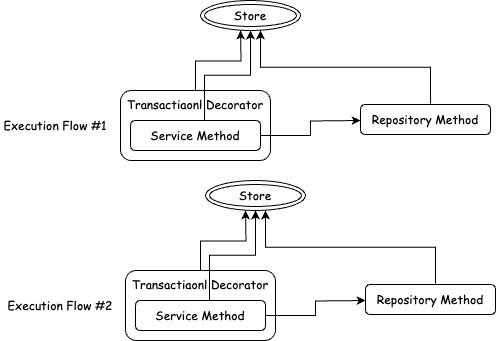

# MongoDB의 Mulit-document transaction과 선언적인 데코레이터

몽고디비는 NoSQL 데이터베이스이며, 요즘 시대에 제일 성공한 NoSQL 데이터베이스들 중 하나입니다.
특히 몽고디비(즉 document 기반 DB)는 다른 NoSQL 종류와는 다르게 관계형 데이터베이스와 비슷한 개념을 가지고 비슷하게 사용할 수 있습니다.
몽고디비를 관계형 데이터베이스처럼 데이터 모델링을 하는 것은 권장사항은 아니지만, 관계형이 세상을 지배하는 시대에 관계형처럼 쓰는 것을 막을 수는 없죠.
그렇지만 관계형 데이터베이스가 제공하는 것은 관계형 데이터 모델링 뿐만이 아닌, 데이터 정합성과 일관성을 위한 `ACID 트랜잭션` 기능도 있습니다.
동시에 여러 데이터 읽기/쓰기 요청을 처리하는 동시성 상황에서 데이터의 정합성을 지키는 것은 관계형DB의 큰 장점이죠.

몽고디비도 4.0(샤드 클러스터는 4.2)버전부터 multi-document `ACID 트랜잭션`을 지원합니다.
4.0버전 이전에도 single-document, 즉 단일 다큐먼트에 대한 연산은 원자적(Atomic)이었습니다.
하지만 여러 다큐먼트에 대한 연산도 하나의 트랜잭션으로 묶어서 실행하고, 롤백할 수 있습니다.
트랜잭션의 동작 원리나 트랜잭션에 대한 여러 개념은 이미 알고 있다고 가정하고, 이번 포스트에선 Nodejs와 Nestjs에서 몽고디비 트랜잭션을 선언적으로 관리하는 법을 알아보겠습니다.

## 프로그래밍 방식 트랜잭션 관리법

보통 트랜잭션의 관리법은 2가지로 나뉩니다.

1. 프로그래밍 방식 관리

   - 트랜잭션의 시작, 커밋, 롤백, 종료를 관리하는 코드가 트랜잭션이 적용될 코드에 직접 적용된다.
   - 트랜잭션이 적용될 부분의 코드에 트랜잭션 관리 코드를 삽입한다.

2. 선언적 방식 관리

   - 트랜잭션의 시작, 커밋, 롤백, 종료를 관리하는 코드를 데코레이터로 분리한다.
   - 트랜잭션이 적용될 함수에 데코레이터로 트랜잭션이 적용된다고 선언한다.

프로그래밍 방식의 관리법을 nodejs에서 흔히 쓰는 mongodb oject modeling tool인 `mongoose`를 이용하여 구현해보겠습니다.
`mongoose`는 스키마 기반 데이터 모델링과 타입 캐스팅, 유효성 검사, 쿼리 작성 등을 도와주는, nodejs에서 mongodb 쓸려면 mongoose랑 같이 쓰는게 거의 디폴트인 라이브러리입니다.
`mongoose`에서 트랜잭션을 구현하는 방법은 크게 2가지 입니다.

1. `session.withTransaction()` or `connection.transaction()` 함수를 쓰거나
2. `session.startTransaction()`, `session.commitTransaction()`, `session.abortTransaction()` 함수를 쓰는 것입니다.

첫번째 방식인 `session.withTransaction()` or `connection.transaction()`은 이 함수에 콜백 함수로 트랜잭션과 함께 실행되어야 하는 함수를 넘겨주면 되는데, 이 방식은 지금은 다루지 않겠습니다.
자세한 것은 [mongoose transaction docs](https://mongoosejs.com/docs/transactions.html)를 참고하세요.

두번째 방식은 아래처럼 활용하면 됩니다.

```ts
@Injectable()
export class TestService {
  constructor(
    @InjectConnection() private readonly conn: mongoose.Connection,
    @InjectModel(Test.name) private readonly testModel: mongoose.Model<Test>
  ) {}

  async test() {
    // 세션을 시작하고 세션 객체를 저장한다.
    const session = await this.conn.startSession();
    // 세션에서 트랜잭션을 시작한다.
    session.startTransaction();
    try {
      // -------------- 비즈니스 로직 시작 --------------
      // test collection에 test document를 저장한다.
      const test = new this.testModel({ name: 'test' });
      // 세션 객체를 전달하여 트랜잭션 내부의 연산으로 실행한다.
      await test.save({ session });

      const ret = await this.testModel
        .findOneAndUpdate({ _id: test._id }, { name: 'test2' })
        .session(session) // 세션 객체를 전달하여 트랜잭션 내부의 연산으로 실행한다.
        .exec();

      // -------------- 비즈니스 로직 종료 --------------

      // 세션에서 트랜잭션을 커밋한다.
      await session.commitTransaction();
      return ret;
    } catch (e) {
      // 에러 발생시 트랜잭션을 롤백한다.
      await session.abortTransaction();
      throw e;
    } finally {
      // 세션을 종료한다.
      session.endSession();
    }
  }
}
```

보통은 Repository 레이어를 두겠지만, 단순성과 설명의 명료함을 위해 생략하고 서비스 레이어에서 쿼리를 직접 날립니다.
여기서 포인트는, 트랜잭션 내부에서 실행되어야 할 모든 mongodb 쿼리는 트랜잭션을 시작한 `session` 객체를 설정해주어야 한다는 겁니다.

> mongodb는 트랜잭션을 관리할 때 항상 세션 객체를 통해서 관리합니다.
> 세션 객체는 mongodb 내부에서 트랜잭션을 구분하는 논리적 단위입니다.
> 몽고디비 3.6 버전 이전에는 트랜잭션 내부의 연산을 구분하고 연산의 진행상황을 추적할 수 있는 방법이 없었지만, 트랜잭션에 논리적 세션을 도입하여 가능하게 되었습니다.
> 즉, 세션은 트랜잭션에 포함된 연산들을 그룹화하고 리소스를 정리하는 단위입니다.

## 선언적 방식 트랜잭션 관리법

프로그래밍 방식 트랜잭션 관리법은 세션을 시작하고, 트랜잭션을 시작하고, 원래 실행되어야 할 로직을 실행하고, 에러 없이 끝나면 커밋하고, 에러가 생기면 롤백(abort)하고, 결국엔 세션을 종료하는 일련의 로직을 계속 반복적으로 적용해야 합니다.
이런 반복은 피곤하고 게다가 비즈니스 로직과 트랜잭션 관리가 한 곳에 섞이기 때문에, 트랜잭션 관리 로직을 데코레이터로 분리하고 선언적 방식으로 적용시켜 보겠습니다.

> 데코레이터로 분리하려면, 먼저 생각해봐야 할 것이 있습니다.
> 위 코드에서는 `@nestjs/mongoose` 패키지의 `MongooseModule`에서 지원하는 connection 객체를 주입받아서 활용하였습니다.
> 근데, 타입스크립트 데코레이터 내부에서 Nestjs 프로바이더를 주입받아서 쓰고싶을 땐, 데코레이터만 사용해서는 불가능합니다.
> 이 문제를 해결하려면, [nestjs-aop 패키지](https://github.com/toss/nestjs-aop)를 활용해서 데코레이터 내부에서 connection 객체를 주입 받아서 활용하면 됩니다.
> 이 포스트에선 문제를 단순하게 설명하기 위해 정적으로 connection을 생성하여 활용하겠습니다.

```ts
import * as mongoose from 'mongoose';

const connection = mongoose.createConnection('mongodb://localhost:27017/test');

// 데코레이터 함수
export function Transactional(
  target: any,
  propertyKey: string,
  descriptor: PropertyDescriptor
) {
  // 원본 함수를 따로 저장
  const originalFunction = descriptor.value;

  const wrapFunction = async function (this: any, ...args: any[]) {
    // 세션을 시작하고 세션 객체를 저장한다.
    const session = await connection.startSession();
    // 세션에서 트랜잭션을 시작한다.
    session.startTransaction();
    try {
      // 원본 함수를 실행한다.
      const ret = await originalFunction.apply(this, args);

      // 세션에서 트랜잭션을 커밋한다.
      await session.commitTransaction();
      return ret;
    } catch (e) {
      // 에러 발생시 트랜잭션을 롤백한다.
      await session.abortTransaction();
    } finally {
      // 세션을 종료한다.
      session.endSession();
    }
  };

  descriptor.value = wrapFunction;
}
```

> 설명을 위해 단순화했지만, 위처럼 함수 객체를 재할당하는 작업은 기존의 함수 객체에 설정된 프로퍼티에 접근할 수 없게 될 수 있습니다.
> 단순한 예제 코드로 봐주시길 바라며, 함수를 래핑하는 작업은 [js proxy](https://ko.javascript.info/proxy)나 `Object.setPrototypeOf()` 함수를 이용하여 기존 함수로의 접근을 연결해주세요.

위 코드에서 트랜잭션 관련 로직을 분리했으니 아래와 같이 적용할 수 있습니다.

```ts
@Injectable()
export class TestService {
  constructor(
    @InjectModel(Test.name) private readonly testModel: mongoose.Model<Test>
  ) {}

  @Transactional
  async test() {
    // test collection에 test document를 저장한다.
    const test = new this.testModel({ name: 'test' });
    // 세션 객체를 전달하여 트랜잭션 내부의 연산으로 실행한다.
    await test.save({ session });

    return await this.testModel
      .findOneAndUpdate({ _id: test._id }, { name: 'test2' })
      .session(session) // 세션 객체를 전달하여 트랜잭션 내부의 연산으로 실행한다.
      .exec();

    // compile error: Cannot find name 'session'
  }
}
```

이렇게 분리하니 훨씬 깔끔하지만, session 객체를 찾을 수 없다는 에러가 발생하네요.
크게 문제가 두 가지 있습니다.

1. `session` 객체는 `@Transactional` 데코레이터에서 관리하는데, 무슨 수로 서비스 레이어와 레포지토리 레이어에서 `session` 객체를 접근할 것인가?
2. MongoDB 쿼리를 모두 `session` 객체를 전달하여야 한다면, 서비스/레포지토리 레이어를 트랜잭션 관련 로직(`session`)과 완벽히 분리할 수 없는가?

문제를 하나하나 짚어보겠습니다.

## `session` 객체를 똑똑하게 전달하기

우선, `@Transactional` 데코레이터에서 만들어낸 `session` 객체를 레포지토리 레이어에서 사용할 수 있어야 합니다.
그래야 쿼리 함수를 작성할 때 세션 객체를 전달하여 해당 쿼리가 트랜잭션 내부에서 실행되게끔 할 수 있겠죠.
근데 `@Transactional` 데코레이터와 서비스 메소드는 서로 독립적으로 실행되기 때문에 함수 인자 같은 형태로 세션 객체를 넘겨줄 수는 없습니다.
그럼 `@Transactional` 데코레이터 함수는 세션 객체를 어디에다가 저장해야 레포지토리 레이어에서 그 세션 객체를 다시 받아올 수 있을까요?

제일 먼저 떠오르는 것은 mongoDB 세션 스토어를 전역으로 만들어 놓고, 데코레이터에서 세션을 전역 스토어에 저장하면 레포지토리 레이어에서 세션을 전역 스토어에서 받아오는 것입니다.
아마도.. 이렇게요?

```ts
const connection = mongoose.createConnection('mongodb://localhost:27017/test');
export const SessionStore = new Map<symbol, mongoose.ClientSession>();
export const TRANSACTION_SESSION = Symbol('TRANSACTION_SESSION');

export function Transactional(
  target: any,
  propertyKey: string,
  descriptor: PropertyDescriptor
) {
  // ... 생략 ...

  const wrapFunction = async function (this: any, ...args: any[]) {
    // 세션을 시작하고 세션 객체를 저장한다.
    const session = await connection.startSession();
    sessionStore.set(TRANSACTION_SESSION, session);
    // ... 생략 ...
  };
  // ... 생략 ...
}

export class TestRepository {
  // ... 생략 ...
  async test() {
    // 세션 스토어에서 세션을 받아온다.
    const session = SessionStore.get(TRANSACTION_SESSION);

    // 받아온 session으로 쿼리를 실행한다.
    // ... 생략 ...
  }
}
```

꽤 괜찮아 보이지만, 동시에 여러번 서비스 메소드를 호출 하는 경우 `TRANSACTION_SESSION`을 키로 공유하고 있으니 세션 객체가 계속 재할당되어 제대로 동작을 안할 겁니다.
그렇다고 세션을 저장할 키를 각 메소드 호출마다 따로 지정하면, 해당 키를 `@Transactional` 데코레이터 밖으로 전달해야 하는 문제가 `session` 때처럼 똑같이 발생합니다.

이 문제를 어떻게 해결해야 할까요?

상황을 살펴보면, 트랜잭션 데코레이터 - 서비스 메소드 - 레포지토리 메소드로 이어지는 일련의 실행 흐름 전체에서 데이터를 공유할 수 있는 스토어가 필요합니다.
그리고 그 스토어는 동시에 여러 실행 흐름이 있어도 각 실행 흐름에 대해 독립적이여야 합니다.
여러 실행 흐름이 스토어를 공유하지 않아야, 서로 간섭하지 않고, 같은 키(`TRANSACTION_SESSION`)를 통해 각각의 스토어에서 세션 객체를 할당하고 가져올 수 있죠.
<br/><br/>


이 실행 흐름의 메소드들은 모두 `async` 함수들인데, 이렇게 일련의 `async` 함수들의 실행 흐름에서 데이터를 공유할 수 있는 스토어를 제공해주는 기능이 Nodejs에 있습니다.
바로 `AsyncLocalStorage`입니다.

### `AsyncLocalStorage`에다가 session 저장하기

`AsyncLocalStorage`(줄여서 ALS)는 일련의 비동기 함수 호출 간에 데이터를 저장할 수 있는 스토어를 제공해줍니다.
다른 언어의 스레드 로컬 저장소와 비슷한 개념이죠.
ALS를 활용해서 아래와 같이 바꿔보겠습니다.

```ts
import { AsyncLocalStorage } from 'async_hooks';

const als = new AsyncLocalStorage();

// 데코레이터 함수
export function Transactional(
  target: any,
  propertyKey: string,
  descriptor: PropertyDescriptor
) {
  // ... 생략 ...

  const wrapFunction = async function (this: any, ...args: any[]) {
    // 스토어 초기화
    const store = {};

    // 스토어를 넣어서 실행한다.
    await als.run(store, async () => {
      // 세션을 시작하고 세션 객체를 저장한다.
      const session = await connection.startSession();
      // 세션 객체를 als store에 저장한다.
      als.getStore()[TRANSACTION_SESSION] = session;

      // 나머지 트랜잭션 로직 실행
      // ... 생략 ...
    });
  };

  descriptor.value = wrapFunction;
}

export class TestService {
  constructor(
    // ... 생략 ...
    private readonly als: AsyncLocalStorage<any>
  ) {}

  @Transactional
  async test() {
    // als store에서 세션을 받아온다.
    const session = this.als.getStore()[TRANSACTION_SESSION];

    // 받아온 session으로 쿼리를 실행한다.
    // ... 생략 ...
  }
}
```

> AsyncLocalStorage에 대해 자세한 내용은 [Node api docs](https://nodejs.org/api/async_context.html), [친절한 한국어 설명](https://gist.github.com/DublinCity/95df459847e743cc7071d929e5e29b1c)을 참고하세요.

위 코드를 통해서 session 객체를 `@Transactional` 데코레이터 외부의 레포지토리 레이어로 안전하게 전달하는 데에 성공했습니다.
이제 서비스 레이어는 세션 객체를 몰라도 되고, 동시성 상황에서 세션 객체가 각 비동기 요청 호출 체인마다 서로 간섭하지 않고 안전하게 전달되죠.
근데 아직 문제가 더 남아있습니다.
레포지토리 레이어가 여전히 세션 객체를 알아야 한다는 게 문제입니다.

## MongoDB 쿼리 쓰는데 세션까지 신경쓰고 싶지 않아

레포지토리 레이어가 세션 객체를 ALS로부터 받아오고 mongoDB 쿼리에 적용시키는 것까지 해야 할까요?
트랜잭션 로직이 서비스 레이어의 책임이냐, 레포지토리 레이어의 책임이냐를 따지는 것은 중요하지 않습니다.
트랜잭션 로직을 따로 데코레이터로 분리한 이상, 서비스 레이어와 레포지토리 레이어 모두 트랜잭션이 적용되고 말고를 신경쓰지 않는 편이 신상에 이롭습니다.
즉, 레포지토리 레이어는 `session` 객체에 대해 알아서는 안되는 것이죠.

근데, 모든 mongoDB command(query, aggregate 포함)은 트랜잭션 내에서 실행되려면 세션 객체를 전달해줘야 한다면서요? 이를 어찌 해결할 수 있을까요??

저의 해결책은 [Mongoose Middleware](https://mongoosejs.com/docs/middleware.html)입니다.

Mongoose 미들웨어는 Mongoose로 실행되는 Document, Query, Aggregate 함수들에 실행 **전** 혹은 **후**에 실행할 수 있는 함수입니다.
Mongoose Query, Document, Aggregate 함수들은 session을 지정할 수 있는 `session()` 혹은 `$session()` 함수를 지원합니다.
미들웨어에서 ALS에 접근하여 세션 객체를 받아오고, 세션 객체가 있다면 `session()` 혹은 `$session()` 함수를 호출하여 세션을 적용하면 됩니다.

```ts
@Injectable()
export class MongoService {
  constructor(private readonly als: AsyncLocalStorage) {}

  addSessionPlugin(schema: Schema, options: any) {
    const als = this.als;
    schema.pre(
      [
        'count',
        'estimatedDocumentCount',
        'countDocuments',
        'deleteMany',
        'distinct',
        'find',
        'findOne',
        'findOneAndDelete',
        'findOneAndRemove',
        'findOneAndReplace',
        'findOneAndUpdate',
        'replaceOne',
        'updateMany',
      ],
      async function () {
        // this binding은 이 미들웨어가 적용된 Query 객체를 가리킨다.
        this.session(als.getStore()[TRANSACTION_SESSION]);
      }
    );
    schema.pre(['updateOne', 'deleteOne'], async function () {
      // this binding은 이 미들웨어가 적용된 Query 객체를 가리킨다.
      this.session(als.getStore()[TRANSACTION_SESSION]);
    });
    schema.pre(['save', 'init', 'validate'], async function () {
      // this binding은 이 미들웨어가 적용된 Document 객체를 가리킨다.
      this.$session(als.getStore()[TRANSACTION_SESSION]);
    });
    schema.pre('aggregate', async function () {
      // this binding은 이 미들웨어가 적용된 Aggregate 객체를 가리킨다.
      this.session(als.getStore()[TRANSACTION_SESSION]);
    });
  }
}
```

위는 `pre` 미들웨어를 써서 Query와 Aggregate가 실행되기 전에 세션을 등록해주도록 하는 코드입니다.
`schema.pre()`에 넘겨주는 콜백 함수가 실제로 미들웨어로서 실행될 함수이고, 해당 함수의 this 바인딩은 미들웨어 함수가 적용되는 `Query` or `Aggregate` or `Document` 객체를 가리킵니다.
미들웨어 함수 내부에서 `Query.session()`, `Aggregate.session()`, `Document.$session()`을 활용해서 세션 객체를 설정해주고 있습니다.

### 세션 적용 미들웨어를 모든 스키마에 등록하기

모든 스키마에 모두 미들웨어가 등록되어야 하기 때문에, 플러그인 형태로 만들어서 MongooseModule 등록 시에 플러그인을 적용해주도록 하겠습니다.

```ts
@Module({
  imports: [
    MongooseModule.forRootAsync({
      useFactory: (
        mongoService: MongoService
      ) => ({
        uri: process.env.DATABASE_URI
        connectionFactory: (conn: Connection) => {
          conn.plugin(mongoService.addSessionPlugin.bind(mongoService));
          return conn;
        },
      }),
      inject: [MongoService],
    }),
  ],
  providers: [MongoService],
  exports: [MongoService],
})
export class MongoModule {}
```

> Nestjs MongooseModule에서 모든 스키마에 플러그인을 적용하는 법은 [nestjs docs](https://docs.nestjs.com/techniques/mongodb#plugins)를 참고하세요.

이렇게 하면 모든 스키마에 미들웨어가 적용되서, 레포지토리 레이어에 작성한 mongoose query, aggregate 함수들이 세션 객체를 지정하지 않아도 미들웨어 내에서 세션 객체를 설정하게 됩니다.
트랜잭션이 적용되지 않은 상태라면 ALS에서 가져온 세션 객체가 `undefined` or `null` 일 것이고, 이 경우엔 세션은 이미 있다면 제거되고 없다면 그냥 아무 세션도 연결되지 않습니다.

## 결론

지금까지 타입스크립트 데코레이터를 통해 선언적으로 트랜잭션을 관리하고, mongoDB가 트랜잭션 관리에 사용하는 session 객체를 전달하기 위한 `AsyncLocalStorage`의 활용과, `Mongoose Middleware`를 사용해서 레포지토리 레이어에서 트랜잭션 로직 분리까지 알아봤습니다.
지금까지 코드가 좀 많았는데, 대부분 비슷한 일을 하는 코드라 이해하기 어렵지 않을 것이라고 생각합니다.

이번 포스트에서는 타입스크립트 데코레이터를 활용했지만, 제가 쓰는 코드는 [nestjs-aop 패키지](https://github.com/toss/nestjs-aop)를 활용해서 데코레이터 내부에서 nestjs 프로바이더를 주입받아 활용할 수 있도록 하였습니다.
그리고 `AsyncLocalStorage`도 그냥 쓰지 않고, Nestjs와 쉽게 통합할 수 있는 기능과 모듈을 제공하는 [nestjs-cls 패키지](https://github.com/Papooch/nestjs-cls)를 통하여 네스트에서 프로바이더를 주입받아 활용하고 있습니다.
위 코드에서 전역에서 동작하는 객체들이 몇 개 있는데(connection, asyncLocalStorage 등등) 이들을 위의 패키지들을 써서 대부분 Nest IoC Container에 넣고 주입받아서 활용할 수 있습니다.

또, 선언적 트랜잭션 관리에는 트랜잭션 전파, Read-Only 트랜잭션 등의 이슈가 더 있습니다.
이런 주제들은 다른 잘 설명된 글들을 가지고 구현해볼 수 있습니다.
차후에 더 개선할 기능과 Mongoose Plugin, Nest Module 등을 지원하는 패키지를 만들려고 합니다.(언제할지는 모름)
하지만 MongoDB multi-document 트랜잭션을 사람들이 과연 많이 쓸까요?

이렇게 트랜잭션 데코레이터를 만든 저는 신나게 모든 서비스 메소드에 적용한 후 배포하고 잠자리에 들었습니다.
다음 날 서비스를 접속했던 저는 상상도 못한 에러를 마주하였습니다.
그것은 바로.. `MongoDB Write Conflict Error`..
다음에 할 포스팅의 주제는 MongoDB 트랜잭션 격리 레벨과, write conflict 에러에 대한 이야기입니다.

## Reference

- [MongoDB Manual - Trasactions](https://www.mongodb.com/docs/manual/core/transactions/)
- [Mongoose Docs - Transaction](https://mongoosejs.com/docs/transactions.html)
- [Mongoose Docs - Middleware](https://mongoosejs.com/docs/middleware.html)
- [Node API Docs - AsyncLocalStorage](https://nodejs.org/api/async_context.html)
- [AsycnLocalStorage에 대해 쉬운 한글 설명글](https://gist.github.com/DublinCity/95df459847e743cc7071d929e5e29b1c)
