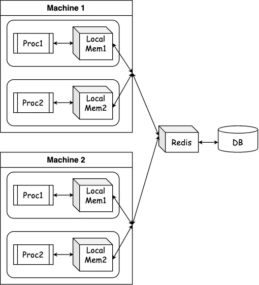

# Nestjs 멀티 캐싱 with AOP Decorator

Nestjs, 제가 참 좋아하는 NodeJS 프레임워크입니다.
특히 문서가 개념/철학을 이해하기 쉽게 설명하고 튜토리얼이 잘 되어있어서 좋아합니다.
게다가 개발하면서 마주치는 여러 요구사항에 대해 해결할 기술들이 왠만하면 공식 문서와 공식 패키지에서 지원해주고 있죠.
캐싱도 그 중 하나입니다.
`cache-manger`라는 [npm 패키지](https://www.npmjs.com/package/cache-manager)와 통합할 수 있는 Nestjs CacheModule을 [npm 패키지](https://www.npmjs.com/package/@nestjs/cache-manager)을 통해 지원합니다.
여기서 `cache-manager`는 여러 다른 캐시 스토어 간의 캐시 관리를 위한 추상화 계층을 제공하는 패키지입니다.
근데 `Nestjs Cache Module`에 조금 아쉬운 부분이 있습니다.

1. 캐시 모듈은 독립적인 캐시 스토어를 최대 한 개까지만 지원한다.
2. 캐시 모듈의 멀티 캐싱이 문서화/타입 작성이 미흡하고, 계층적인 캐시 활용성이 떨어진다.
3. AOP를 지원해주는 `CacheInterceptor`를 지원하지만, `Controller`에만 활용할 수 있어 `Provider`(e.g. Service, Repository, etc..)에는 활용할 수 없다.

이 문제들을 파헤쳐보고, custom caching provider와 [nestjs-aop 패키지](https://github.com/toss/nestjs-aop)를 활용해서 캐싱 로직을 선언적으로 적용하기 위한 Aop 데코레이터까지 만들어보겠습니다.

## Nestjs 캐시 모듈의 문제

### 독립적인 스토어가 한 개!

저는 로컬 메모리 캐시와 레디스를 활용한 분산 캐시를 모두 운영하고 싶었습니다.
로컬 메모리 캐시는 여러 단점도 있지만, 업데이트가 거의 일어나지 않는 데이터에 대해선 정말 좋습니다.
그리고 그런 데이터가 있었기 때문에, 분산 캐시의 부담을 줄이고자 도입했죠.

그러면, 아마 아래와 같이 다양한 캐시 스토어 서비스를 주입받아서 사용할 수 있어야 할 겁니다.

```ts
export class AppService {
  constructor(
    @Inject('MEMORY') private readonly memoryCacheManager: Cache,
    @Inject('REDIS') private readonly redistCacheManager: Cache
  ) {}
}
```

근데 NestJs 캐시 모듈의 문서와 소스코드를 싹 다 뒤져봐도, 여러 개의 캐시 스토어를 등록하는 기능은 존재하지 않았습니다.

```typescript
// NestJS CacheModule
@Module({
  providers: [createCacheManager()],
  exports: [CACHE_MANAGER],
})
export class CacheModule extends ConfigurableModuleClass {
  // ...생략...
}
```

위 코드는 Cache Module의 소스코드인데, 등록된 프로바이더(즉 `CacheManager`)가 하나밖에 없습니다.
그래서 네스트 캐시 모듈과 제공되는 캐시 프로바이더를 활용하면 캐시 프로바이더를 하나밖에 쓰질 못하죠.

### 멀티 캐싱 기능의 계층 캐시 활용성 따운!

네스트 캐시 모듈은 `cache-manager` 패키지에 대한 네스트 통합을 지원합니다.
그리고 `cache-manager` 패키지는 멀티 캐시에 대한 기능이 포함되어 있죠.
네스트 캐시 모듈도 `cache-manager` 패키지의 멀티 캐싱 스토어 기능을 제공<sup><a id="sup1" href="#footnote1">1</a></sup>
합니다.

아래는 멀티 캐시에 대한 소스코드입니다.

```ts
const get = async <T>(key: string) => {
  for (const cache of caches) {
    try {
      const val = await cache.get<T>(key);
      if (val !== undefined) return val;
    } catch (e) {}
  }
};
const set = async <T>(key: string, data: T, ttl?: Milliseconds | undefined) => {
  await Promise.all(caches.map((cache) => cache.set(key, data, ttl)));
};
```

`get`의 경우엔 등록되어 있는 캐시 스토어(`caches`)를 순회하며 캐시 키로 값을 찾아서 반환합니다.
`set`의 경우엔 등록되어 있는 캐시 스토어 모두에 캐시 키로 값을 저장합니다.

예를 들어, 아래와 같은 캐시의 계층 구조를 생각해봅시다.
<br/><br/>

<br/>

이런 구조에서 위 소스코드의 `get`을 할 경우 캐싱 전략을 `Look Aside` 패턴을 쓰게 됩니다. 어플리케이션이 데이터를 찾는 주체가 되어서 로컬에서 먼저 찾고, 없으면 레디스로 가서 찾고, 없으면 DB에서 데이터를 얻어오는 방식입니다.
`caches` 배열에 저장된 캐시 스토어의 순서가 Local - Redis 순서대로라면, `get`을 할 때 로컬 - 레디스 순서대로 찾을 것입니다.

그럼 캐시 미스 상황에서 데이터를 캐시에 쓰는 경우는 어떨까요? 만약 로컬 캐시와 레디스 캐시 모두 캐시 미스라면, DB에서 데이터를 조회 후 `set`함수를 호출하여 로컬과 레디스에 모두 캐시를 쓰면 될 겁니다.

문제는 로컬에선 캐시 미스, 레디스에선 캐시 히트하는 경우입니다. 위 코드의 `get` 함수로는 로컬에서 캐시 미스가 생겼다는 것을 알 수 없습니다. 레디스에서 캐시 히트했으므로 정상적으로 데이터를 가져왔기 때문이죠. 저는 로컬 캐시 미스 & 레디스 캐시 히트 상황에서 로컬 캐시를 채우고 싶기 때문에, 이렇게 로컬 캐시 미스를 알 수 없는 상황이 싫습니다!!

### CacheInterceptor의 아쉬움..

네스트 캐시 모듈에서 CacheInterceptor를 기본으로 지원해줍니다.
캐싱 로직은 대부분의 함수들이 공유하고 이 로직을 모든 메서드마다 재작성하는 건 꽤 피곤한 일이죠.
AOP 개념을 차용하는 Nest Interceptor를 통해 해결할 수 있는데, 기본으로 CacheInterceptor를 지원해주니 정말 좋습니다.
인터셉터는 컨트롤러에만 적용할 수 있다는 점만 빼면요.

인터셉터는 아쉽게 컨트롤러에서만 적용할 수 있습니다.
일반적인 프로바이더에서는 인터셉터를 적용할 수 없습니다.
프로바이더에서는 [TS Decorator](https://www.typescriptlang.org/docs/handbook/decorators.html)를 활용하여 함수가 실행될 로직을 바꿔치기해서 AOP의 개념을 적용할 수 있긴 하지만, 만약에 데코레이터 안에서 Nest의 DI 시스템을 활용하여 네스트에 등록된 프로바이더를 주입받고 사용하고 싶다면 아쉽게도 그렇게 할 수는 없습니다.
TS 데코레이터가 평가되는 시점은 해당 파일이 처음 실행되는 시점이므로, TS 데코레이터에 어떻게든 네스트 DI 시스템에서 의존성 객체를 빼내서 인자로 넘겨주고 싶어도, 데코레이터 평가 시점이 네스트 DI 시스템 초기화 시점보다 먼저입니다. 이 문제에 대해선 다른 포스팅에서 다루겠습니다.

어쨌든, 프로바이더에서 네스트 캐시 모듈의 CacheInterceptor를 못쓰니, 캐싱 로직을 선언적인 데코레이터를 써서 하고 싶어도 캐시 프로바이더를 데코레이터에서 못써서 꽝입니다.

## 커스텀 캐시 프로바이더 써보기

[1번](#독립적인-스토어가-한-개)과 [2번](#멀티-캐싱-기능의-계층-캐시-활용성-따운) 문제를 한 방에 해결해보겠습니다.
바로바로~ 커스텀 캐시 프로바이더를 선언하여 쓰는 것입니다.

1번 문제와 2번 문제 모두 문제의 핵심은 제가 캐시 프로바이더를 네스트 캐시 모듈이 제공해주는 것을 주입받아 써야 하기 때문에 발생합니다.
제공해주는 대로 써야 하기 때문에 문제죠.
먼저, 1번 문제부터 해결해보겠습니다.

네스트 캐시 모듈에서 제공하는 캐시 프로바이더는 타입을 보면 Cache이고, 이 타입은 `cache-manager` 패키지에서 가져온 것입니다.

```ts
import { Cache } from 'cache-manager';

// ...생략...
constructor(@Inject(CACHE_MANAGER) private cacheManager: Cache) {}
```

네스트에서 제공하는 캐시 프로바이더도 딱히 `cache-manager` 패키지에 대해 추상화를 제공하지 않네요.
그냥 커스텀 프로바이더를 만들어서 써도 좋아보입니다.

```ts
import { Provider } from '@nestjs/common';
import { caching } from 'cache-manager';
import { redisStore } from 'cache-manager-redis-yet';

const MemoryCacheProvider: Provider = {
  provide: 'MEMORY_CACHE',
  useFactory: () => {
    return await caching('memory', {
      ttl: parseInt(process.env.MEMORY_CACHE_DEFAULT_TTL),
      max: parseInt(process.env.MEMORY_CACHE_DEFAULT_MAX),
    });
  },
};

const RedisCacheProvider: Provider = {
  provide: 'REDIS_CACHE',
  useFactory: () => {
    return await caching(
      await redisStore({
        url: process.env.REDIS_URI,
        ttl: parseInt(process.env.REDIS_CACHE_DEFAULT_TTL),
        max: parseInt(process.env.REDIS_CACHE_DEFAULT_MAX),
      })
    );
  },
};
```

위처럼 커스텀 프로바이더를 만들어보겠습니다.
`caching()` 함수가 반환하는 객체가 `Cache` 타입이기 때문에 이 프로바이더를 등록하고 주입받아 사용하면, 네스트 캐시 모듈이 제공하는 캐시 프로바이더를 쓰는 것과 진배 없습니다.

아래처럼 주입받아서 사용할 수 있습니다.

```ts
class TestService {
  constructor(
    @Inject('MEMORY_CACHE') private readonly memoryCache: Cache,
    @Inject('REDIS_CACHE') private readonly redisCache: Cache
  ) {}
}
```

이러면 1번 문제는 해결했습니다.
이제 메모리 캐시, 레디스 캐시 등 여러 캐시 프로바이더를 만들어서 등록하고, 주입받아서 사용할 수 있습니다.

2번 문제는 어쩔까요?
아래 코드를 한번 봅시다.

```ts
class TestService {
  constructor(
    @Inject('MEMORY_CACHE') private readonly memoryCache: Cache,
    @Inject('REDIS_CACHE') private readonly redisCache: Cache,
    private readonly testRepository: TestRepository
  ) {}

  async getOrSetFromMemory(id: string, method: Function) {
    const cached = await this.memoryCache.get(id);
    if (cached) return cached;
    const ret = await method(id);
    await this.memoryCache.set(id, ret);
    return ret;
  }

  async getOrSetFromRedis(id: string, method: Function) {
    const cached = await this.redisCache.get(id);
    if (cached) return cached;
    const ret = await method(id);
    await this.redisCache.set(id, ret);
    return ret;
  }

  async getSomethingFromDB(id: string) {
    return await this.testRepository.findOne(id);
  }

  async getSomething(id: string) {
    return await this.getOrSetFromMemory(id, () =>
      this.getOrSetFromRedis(id, () => this.getSomethingFromDB(id))
    );
  }
}
```

위 코드를 보면 메모리, 레디스 각각 캐시를 확인하고 없으면 제공된 함수를 실행하여 그 결과를 캐시에 씁니다.
`getSomething` 함수<sup><a id="sup2" href="#footnote2">2</a></sup>는 메모리 캐시 - 레디스 캐시 순서대로 확인하고, 모두 없으면 DB까지 확인합니다.
위에서 예시로 들었던 메모리 캐시 미스 - 레디스 캐시 히트 상황에서, 이 코드는 레디스 캐시 히트로 반환된 값을 `getOrSetFromMemory()` 메서드에서 캐시에 쓰기 때문에, 메모리 캐시에 쓰지 못하는 상황을 방지할 수 있습니다.

근데 코드가 좀 더럽기도 하고, 이대로는 서비스 클래스에 함수가 한가득인데 일반화하기 어려울 것 같습니다.
캐시 키를 생성하는 로직도 커스텀 할 수 있어야 하고, ttl 같은 옵션도 커스텀하면 좋고, 이런 것들을 모두 제공하려면 코드가 더 길어지고 서비스 메서드에 캐시 관련한 로직이 굉장히 많을 것 같습니다.
공통 로직을 싹 분리하고, 선언적으로 관리하면 편할 것입니다.

## nestjs-aop 써서 캐시 데코레이터 만들기

[위](#cacheinterceptor의-아쉬움)에서 AOP를 지원하는 네스트 인터셉터는 프로바이더에는 사용하지 못한다고 언급했습니다.
TS 데코레이터는 내부에서 네스트 프로바이더를 일반적으로는 쓰기 어려우니, 캐시 프로바이더를 못써서 안됩니다.
이런 경우에 쓸 수 있는 좋은, [@toss/nestjs-aop 패키지](https://github.com/toss/nestjs-aop)를 써보겠습니다.

혹시 사용법을 잘 모르시거나 생소하신 분은 아래 자료를 참고해주세요.

- [toss 기술 블로그 Custom Decorator](https://toss.tech/article/nestjs-custom-decorator)
- [Nestjs meetup AOP](https://youtu.be/VH1GTGIMHQw?si=RngZ7sefDfFfx5xG&t=2971)

이 패키지를 이용해서 캐시 데코레이터와 캐시 서비스를 만들겠습니다.

```ts
/**
 * @ttl time to live in milliseconds
 */
export interface CacheOption {
  ttl?: number;
  keyGenerator: (...args: any[]) => string;
}

export const MemoryCacheable = (option: CacheOption) =>
  createDecorator(MEMORY_CACHE, option);

@Aspect(MEMORY_CACHE)
export class MemoryCacheService implements LazyDecorator<any, CacheOption> {
  constructor(@Inject(MEMORY_CACHE) private readonly cacheManager: Cache) {}

  wrap({ method, metadata }: WrapParams<any, CacheOption>) {
    return async (...args: any[]) => {
      const key = metadata.keyGenerator(...args);
      const cached = await this.cacheManager.get(key);
      if (cached) return cached;
      const ret = await method(...args);
      await this.cacheManager.set(key, ret, metadata.ttl);
      return ret;
    };
  }
}

class TestService {
  constructor(private readonly testRepository: TestRepository) {}

  @MemoryCacheable({
    ttl: 60 * 1000, // milliseconds
    keyGenerator: (id: string) => `test:${id}`,
  })
  async getSomething(id: string) {
    return await this.testRepository.findOne(id);
  }
}
```

위 코드는 메모리 캐시 서비스를 만들고 `MemoryCacheable` 데코레이터도 만드는 코드입니다.
`MemoryCacheService.wrap` 메서드가 중요한데, 이 함수가 AOP가 적용될 부분입니다.
`method`는 `MemoryCacheable` 데코레이터가 적용될 함수입니다.
옵션 인자로 넘겨준 `metadata` 객체에서 `keyGenerator`를 뽑아서 캐싱 키를 생성하고, `ttl`을 뽑아서 캐싱 시간을 설정하여 캐싱 로직을 구현합니다.

캐시 무효화 혹은 캐시를 쓰는 로직을 더 커스텀하고 싶다면, `CacheOption` 인터페이스에 `action` 같은 프로퍼티를 추가하고, `MemoryCacheService.wrap` 메서드에서 `action` 프로퍼티를 확인하여 더 작성하면 됩니다.

레디스 캐시도 같은 방식으로 만들면 됩니다. 그리고 레디스 캐시와 메모리 캐시를 계층적으로 활용하는 캐시 데코레이터를 만들어 보겠습니다.

```ts
export const RedisCacheable = (option: CacheOption) =>
  createDecorator(REDIS_CACHE, option);

@Aspect(REDIS_CACHE)
export class RedisCacheService implements LazyDecorator<any, CacheOption> {
  constructor(@Inject(REDIS_CACHE) private readonly cacheManager: Cache) {}

  wrap({ method, metadata }: WrapParams<any, CacheOption>) {
    // ...생략...
  }
}

export const Cacheable = (option: CacheOption) =>
  applyDecorators(RedisCacheable(option), MemoryCacheable(option));
```

위 코드는 레디스 캐시 서비스와 레디스 캐시 데코레이터를 만들고, 레디스 캐시와 메모리 캐시를 계층적으로 활용하는 캐시 데코레이터를 만듭니다.
이때 Nest에서 제공하는 `applyDecorators` 함수를 활용하여 데코레이터를 합성하는데, 이 함수는 `@nestjs/common` 패키지에 있습니다.
이때 계층적인 캐시 디자인을 구현하려면 `applyDecorators` 함수에 인자로 전달하는 데코레이터의 순서가 중요합니다.
우선 데코레이터들은 `applyDecorators`에 전달된 순서의 역순으로 데코레이터가 작성된다고 보면 됩니다.

```ts
@Cacheable()
async getSomething(id: string) {
  return await this.testRepository.findOne(id);
}


@MemoryCacheable()
@RedisCacheable()
async getSomething2(id: string) {
  return await this.testRepository.findOne(id);
}
```

위 코드에서, `getSomething`함수에 결과적으로 적용된 데코레이터는 `getSomething2` 함수에 적용된 데코레이터와 순서가 같습니다.
왜 계층적인 캐시 디자인을 위해 위와 같이 데코레이터를 적용해야 할까요?

이는 데코레이터가 여러 개 적용되었을 때 데코레이터를 코드에 작성하는 순서대로 합성되기 때문입니다.
데코레이터가 여러 개가 있다면, 수학의 함수가 합성되는 것처럼, (Memory ∘ Redis)(getSomething2))으로 합성됩니다.
즉, 위 코드에서 `getSomething2` 함수에 적용된 데코레이터는 `getSomething2(id)`를 실행할 때 `MemoryCacheable(RedisCacheable(getSomething2))(id)` 로 적용되어 실행됩니다. 이런 순서로 실행되어야, 메모리 - 레디스 - DB(원래 함수 로직) 순서로 실행되게 됩니다.

이는 [TS Decorator 합성 문서](https://www.typescriptlang.org/docs/handbook/decorators.html#decorator-composition)에 잘 설명되어 있으니 참고해보세요.

## Nodejs와 계층적 캐시의 궁합

계층적 캐시 디자인을 활용할 땐 각 계층 캐시의 데이터 정합성이 중요한 문제입니다.
아래와 같이 여러 대의 서버가 있는 상황을 가정하겠습니다.

<br/><br/>

<br/>

위 그림에서, 서버 1과 서버 2 모두의 로컬 캐시에 데이터가 있을 때, 서버 1에서 데이터를 업데이트하고, 서버 2에서 데이터를 조회하면 어떻게 될까요?
서버 1에서 데이터를 업데이트하면 서버 1의 로컬 캐시와 레디스 캐시는 모두 업데이트된 값으로 갱신됩니다.
하지만 서버 2에서는 로컬 캐시에 데이터가 있으므로, 레디스 캐시를 조회하지 않고 로컬 캐시에서 데이터를 가져올 것입니다.
그럼 서버 2에서는 업데이트된 데이터를 가져오지 못하고, 업데이트되기 전 데이터를 가져오게 됩니다.

이런 경우 데이터 정합성이 깨지게 됩니다.
이런 문제를 해결하기 위해선, 로컬 캐시의 ttl을 적절히 짧게 설정하고, 레디스 캐시의 캐시를 업데이트할 때 같은 키의 데이터를 가지고 있는 모든 로컬 캐시의 값을 업데이트해야 합니다.
레디스 캐시를 업데이트할 때 메세지 큐(혹은 Redis pub/sub) 같은 곳에 모든 로컬 캐시에 데이터를 업데이트/무효화 하는 메세지를 보내고, 메세지를 받은 서버들이 로컬 캐시를 업데이트하면 됩니다.

### Nodejs와 멀티 프로세스 클러스터링

**근데, 이렇게 하면 충분할까요?**

Nodejs는 싱글 스레드로 동작하고, 싱글 스레드로 동작하는 프로세스는 CPU 코어를 동시에 하나만 사용합니다.
그래서 많은 Nodejs 프로세스를 띄워서 CPU 코어를 모두 사용하는 방식으로 성능을 높이는데, 주로 Nodejs cluster 모듈이나 pm2 cluster 모드를 자주 활용합니다.
이런 방식을 활용하여 노드 서버를 여러 프로세스의 집합체로 굴린다면, 노드 서버 머신은 요청을 받으면 그 요청을 프로세스들에 분산시켜 처리하게 됩니다.
아래 그림을 봅시다.

<br/><br/>

<br/>

머신 1에서 요청이 들어오면, 머신 1의 프로세스 1, 2 중 하나가 요청을 받아서 처리합니다.
이때 요청을 분산하는 로직은 어떻게 프로세스를 클러스터링하는지에 따라 다릅니다.
어쨌든, 머신 1의 프로세스 1이 로컬 캐시 & 레디스 캐시에 데이터를 업데이트했다고 가정해봅시다.

1. 머신 1의 프로세스 2가 로컬 캐시에 데이터를 조회

   - 이 경우엔 프로세스 1이 업데이트한 데이터를 프로세스 2가 가져오지 못합니다.
   - 클러스터링 로직에 한 프로세스의 **로컬 캐시 업데이트가 다른 프로세스에도 전파**되도록 추가해야 합니다.

2. 데이터 업데이트 요청을 받은 레디스에서 머신 2로 로컬 캐시 업데이트 요청
   - 이 경우엔 별다른 설정 없이는 해당 요청이 머신 2의 프로세스 1, 2 중 하나에 전달될 겁니다.
   - 결국 머신 2의 프로세스 1, 2 중 하나만 로컬 캐시를 업데이트하게 되고, 나머지 하나는 업데이트하지 못합니다.
   - 클러스터링 로직에 로컬 캐시 업데이트 요청은 **모든 프로세스로 전달**되도록 추가해야 합니다.

두 상황 다 해결방법이 쉽지 않습니다;;
게다가 멀티 프로세스 클러스터링을 하면, 프로세스 간의 통신 비용이 발생하고, 프로세스 간의 메모리 공유도 어려우니 사실 각 프로세스마다 로컬 캐시를 두는 것은 메모리를 낭비하는 것이기도 합니다.
따라서 클러스터링 환경에서의 로컬 캐시 사용은 조심해야 하는 부분입니다.
저는 나름대로 아래 규칙을 세워서 로컬 캐시를 활용 중입니다.

1. 로컬 캐시에 저장할 데이터는 업데이트가 잦지 않은 데이터를 주로 저장
2. 로컬 캐시의 ttl을 짧게 설정하여 데이터 정합성을 유지
3. 로컬 캐시를 작게 유지하여 메모리 낭비 최소화

## 결론

이러이러한 과정을 거쳐서 커스텀 캐시 프로바이더를 등록하고, nestjs-aop를 써서 AOP 캐시 데코레이터를 만들고, 계층적 캐시 적용까지 진행해보았습니다.
네스트에서 캐시 잘 쓰려고 하다보니 커스텀 프로바이더와 커스텀 데코레이터와 커스텀해주는 패키지까지, 이젠 네스트도 커스텀해서 쓸 지경입니다..
그래도 많이 찾아보며 캐싱 기술과 네스트에 대해 더 자세히 알아보는 좋은 시간이 되었습니다.
모든 코드 예시는 이해를 돕기 위하여 제가 실제로 쓰는 코드에서 많이 생략하였습니다.
여러분도 NestJS와 행복 캐싱하세요!! 커스텀하는 법 어렵지 않습니다~~

## Reference

- [Nestjs caching 문서](https://docs.nestjs.com/techniques/caching)
- [cache-manager 패키지](https://www.npmjs.com/package/cache-manager)
- [nestjs-aop 패키지](https://github.com/toss/nestjs-aop)
- [TS Decorator 함수 합성](https://www.typescriptlang.org/docs/handbook/decorators.html#decorator-composition)
- [applyDecorators 소스 코드](https://github.com/nestjs/nest/blob/master/packages/common/decorators/core/apply-decorators.ts)

## Footnote

<a id="footnote1" href="#sup1">1</a>: 이 기능은 23.11월 기준 문서화되어 있지도 타입 정보에 명시되어 있지도 않습니다. [관련된 이슈](https://github.com/nestjs/cache-manager/issues/174)도 있는데, 멀티 캐시를 활용하는 사람이 적은지 고쳐지진 않고 있습니다. 저는 내부에서 사용하는 `cache-manager` multicaching의 로직이 마음에 안들어서 딱히 사용하지는 않습니다.

<a id="footnote2" href="#sup2">2</a>: 이 함수엔 캐시 미스 시에 실행되어 결과값을 얻을 함수를 콜백 인자로 넘겨줍니다. 이때 콜백 인자로 넘겨주는 함수를 `this.getOrSetFromRedis(id, this.getSomethingFromDB)` 처럼 함수 자체를 넘기지 않고 `this.getOrSetFromRedis(id, () => this.getSomethingFromDB(id))` 처럼 화살표 함수로 넘겨줍니다. 이것은 `this.getSomethingFromDB` 함수 내부에서 사용할 `this` 바인딩이 `TestService`이어야 하기 때문에 그렇습니다. 자세한 것은 [JS this 바인딩](https://ko.javascript.info/object-methods#ref-648)을 참고하세요.
