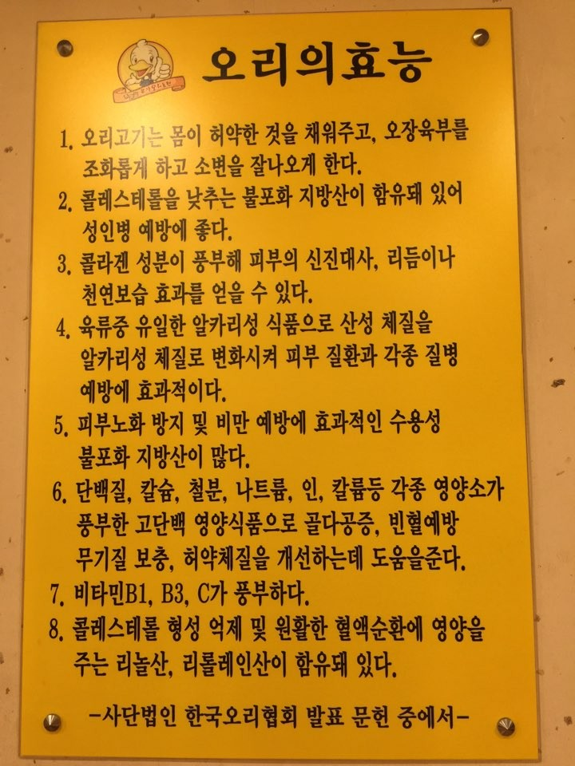
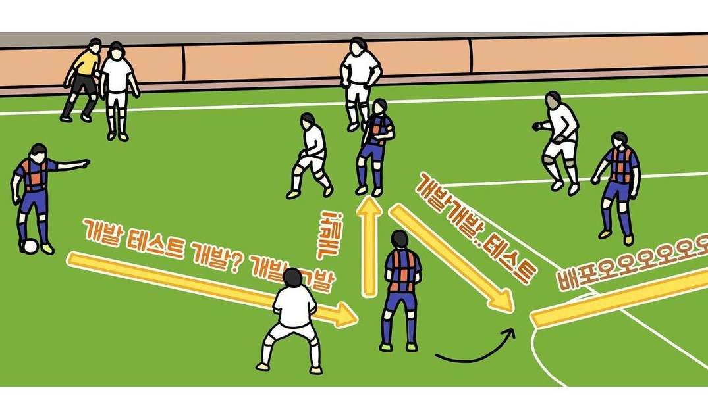

# 아마추어의 끝?

프로라는 말은 보통 "돈을 받고 하는~"이라는 뜻으로 쓰는 것 같다.
그럼 아마추어는 당연히 "돈을 안받고 하는~"이라는 뜻이다.

얼마 뒤면 대학 입학 후 지금까지 약 6년 간 이어온 프로그래머로서의 생활이 다른 국면에 접어든다.
지금까지 어떤 길을 걸어왔는지 사실 좀 기억이 안나는 부분도 있고 해서, 글로 남겨보려 한다.

> [이전 포스트](https://spongelog.netlify.app/start_of_amateur_programmer/)에서 이어지는 내용입니다.

## 웹개발 걸음마

웹개발을 시작하는 나

전역 및 복학과 함께 본격적으로 시작한 웹 개발은 처음엔 [책or강의 공부] -> [프로젝트 개발] -> [책or강의 공부] -> ... 의 사이클을 계속 돌려오다가, 요즘엔 병행하게 되었다.
처음에 시작한 웹개발 공부는 군대에서 [MDN WEB Docs](https://developer.mozilla.org/ko/docs/Web)를 프린트해서 읽는 것이었다.
그때 당시 HTML과 CSS, Javascript, HTTP에 대해 기본적인 내용만 공부했다.
Do it javascript 책이나 HTML 책도 사서 봤던 것 같다.

전역 후 React와 함께 Node.js 공부도 시작했다.
당시에 알아보기로는 웹 개발 분야가 크게 프론트엔드와 백엔드 두가지가 있다고 하여 두 분야 모두를 조금씩 경험해보고, 무엇을 중점적으로 해볼지 정하자는 의도였다.

근데 리액트는 공식 홈페이지에 있는 틱택토 게임 만들기까지 따라하고 그 후로는 더 큰 노력을 쏟지는 않았는데, 백엔드 분야로 점점 마음이 기울었기 때문이다.
그때 당시에 백엔드 분야에 대해 느낀 점은, 어떤 웹 서비스를 만들던 대부분 백엔드가 있고, 그 웹 서비스가 클라이언트를 어떤 형태로 가져가느냐(모바일, 웹, 네이티브 앱, 독립형 클라이언트, 등등)에 따라 필요로 하는 클라이언트 개발자가 다르지만, 백엔드는 대부분 동일하게 필요하다는 것이었다.
즉 나는 백엔드가 어느 웹 서비스를 개발하던 범용성 있게 참여하고 기여할 수 있다고 느꼈다.

이런 점이 백엔드를 하기로 한 이유였는데, 예를 들면 내가 네이버 개발자로 일하다가 일론 머스크가 테슬라에서 완전 자율주행을 만들겠다고 선언한 것을 보고 반했다고 해보자.
그래서 난 테슬라에 들어가서 완전 자율주행 만드는데 참여하고 싶다고 느꼈다고 해보자.
내가 프론트엔드 개발자라면, 아마도 당장 자율주행 핵심 기술을 만드는데에 기여할 수 있는 커리어를 제시하기 힘들수도 있다.
하지만 백엔드 개발자라면 커리어에 조금의 변주를 더할 수도 있고, 백엔드에서 하는 것의 범위가 많이 넓으니 그 안에서 내가 재밌어하고 해보고 싶은 것도 찾아 할 수 있는 가능성이 더 높은 것이다.
이제 와서 생각하면 그게 쉽지 않을 것 같다는 생각이 들지만, 그 당시엔 백엔드의 범위가 더 크고 넓고, 그 안에 내가 재밌어하고 좋아할 분야가 더 많다고 생각했다.

그리고 AI 진로를 바꿨을지언정 관심은 계속 가졌었다.
그렇다보니 백엔드 개발자를 하면 AI도 만져볼 수도 있는 거고, 여러 다양한 경험을 해볼 수 있을 것 같았다.

### 스터디 모으기

그 당시엔 스터디의 효능에 대해 과도한 맹신을 하고 있던 나는 여지없이 스터디를 만들었다.

한국스터디협회에서 만든 스터디의 효능은 없나요

#### (시스템 디자인을 하고싶은)웹 아키텍쳐 101 스터디

이것저것 주워들은 것 중에 요즘 실리콘밸리 회사들은 시스템 아키텍쳐 디자인 면접을 본다는 얘기가 있었는데, 그래서 알게 된 강의 코스가 바로 educative라는 사이트에서 하는 [시스템 디자인 코스](https://www.educative.io/path/scalability-system-design)였다.
그 코스는 5개의 독립형 모듈 강의로 구성되어 있었는데, 첫 번째 코스가 웹 개발 생태계에서 전반적으로 쓰이는 개념과 여러 내용들을 다뤄줘서 굉장히 알찼다.

스터디에서 첫 코스를 진행하고, 다음 코스로 넘어갔더니 이제 마이크로서비스에 대한 내용을 다루는데 그때부터는 이해도 안되고 어려워 스터디는 끝났다.
기초부터 차근차근하는 느낌보다는 한번에 어려운 시스템 디자인 스터디를 하려고 하다보니 웹 서버 하나 제대로 개발해본적 없는데 마이크로서비스 관련 내용을 공부하는 것은 무리였다.

#### JS 스터디

또 했던 스터디는 javascript 스터디였는데, 그때 당시 node.js로 개발 연습을 하던 나는 js의 함수형 기능들과 혼란한 타입 coercion 시스템에 혼절한 시기라, 스터디 제안이 들어왔을 때 덥석 물었다.
[You don't know JS](https://github.com/getify/You-Dont-Know-JS)라는 책으로 스터디를 진행했는데, 이 스터디를 진행하며 JS에 대해 정말 감탄을 한 적이 많았다.
아직도 기억나는 건 JS의 this 바인딩과 프로토타입 체이닝, 클로져, 뭐 그런 것들?
공부할 당시엔 이해도 잘 안되는 괴랄한 문법과 기능이라고 생각했는데, 사실 그전까지만 해도 프로그래밍 언어 하나를 깊게 공부해본 경험은 없었다.

그래도 JS 스터디를 진행한 후 JS에 대한 이해도가 꽤 높아져 코드 리딩이나 코드를 쓰는 것이 더 수월해지고, 다른 언어를 공부할 때도 더 쉽게 느껴졌다.
그리고 JS 스터디에서 느낀 프로그래밍 언어의 새로움과 신선함에 자극되어서인지 그 이후로 프로그래밍 언어 그 자체에 대해 관심이 늘었고, 추후에 프로그래밍 언어 이론에 대해서도 공부를 하게 되었다.

js특)

### 얼리 액세스 프로젝트

[주니어 개발자는 DDD의 꿈을 꾸는가? 포스트](https://spongelog.netlify.app/do_junior_sw_engineers_dream_of_dddd/)에서도 다룬 내용이지만, Node.js 개발 연습도 몇 번 해본 나는 당시 프로젝트를 두 개 진행했다.

1. 동아리 관리 서비스를 개발하는 창업팀
2. [공개소프트웨어개발자대회](https://www.oss.kr/dev_competition) 참가팀

이 두 프로젝트는 시간 순서상 1(시작)---(진행중)---2(시작->완료)---1(퇴각) 이런 식으로 진행되었다.
즉, 1번 프로젝트를 시작하여 진행 중에 2번 프로젝트를 시작하여 완료하고, 1번 프로젝트에서 나왔다.

#### 창업팀

먼저 1번 프로젝트는 이미 95%이상 개발된 서버와 아직 개발이 덜 된 클라이언트의 상태에서 다른 백엔드 개발자 한분과 같이 합류하게 되었다.
서버는 이미 다 개발되어 있으므로 백엔드팀(나+같이 조인한 동료)은 클라이언트 개발 상황에 맞춰서 유지보수를 하면 되었다.

내가 1번팀에서 원했던 경험은 사이즈 있는 서비스를 개발하고, 운영하는 경험이었다.
1번팀 합류하기 전 나눴던 미팅에서도 현재 클라이언트 개발중이며 클라 개발 완료되는대로 배포하고 운영에 들어간다고 하였고, 그래서 합류하고 나서 당장은 운영하지 못하더라도 운영 시작하는 시점까지 이미 있는 서버 코드 분석하고 자잘하게 유지보수하며 실력을 키워서 운영을 시작하면 더 경험해보자는 마인드였다.

내가 원하던 것(출처: <a href="https://www.instagram.com/waterglasstoon/" target="_blank">데브경수</a>)

근데 합류하고 서버 코드를 보니 아직 JS 초보였던 나에겐 꽤 난해했다.
게다가 서버 아키텍처에 대해 개념이 거의 안잡힌 상태였던지라 짜여져있는 서버 코드가 어떤 아키텍처를 따르고, 개선한다면 어떻게 개선해야할지 감이 안왔다.
그리고 난감했던 것은 아직 클라이언트가 개발중인데, API 문서가 없는 점과, 난해한 서버 코드를 개선/버그 픽스/추후에 기능 추가를 할 때 필요한 테스트 코드가 없다는 점이었다.

앞서 언급한 JS 스터디를 진행하며 서버 코드에 대한 이해도는 올라갔으나, 구조가 복잡하고 기능하는 역할별로 분리가 안되어있는 것은 같았다.
결국 1번팀에 있는 기간 동안 클라이언트 개발자들과 함께 볼 API 문서를 Swagger로 만드는 작업과 통합 테스트를 작성하는 데에 많이 할애했다.

서버 코드가 NestJS로 만들어진게 아니고(그때 당시엔 존재 자체를 모름) express 기반으로 만들어졌기 때문에 Swagger 자동화같은 것은 꿈도 못꾸고 한땀 한땀 yaml 형식으로 문서를 썻는데, 다시 돌아가서 하라고 하면 못할 것 같다.
한땀한땀 만들다보니 시간도 오래걸리고 굉장히 하기 싫었으며, 그래서 더 늘어지는 감이 있었다.
차라리 클라이언트 개발자가 리폿한 버그 디버깅이 더 재밌었다.

통합 테스트를 쓰는 것도 당시 테스트를 써본 경험도 없고 기능 개발을 하고 싶던 나에겐 재미없는 일이었다.
지금이야 테스트 쓰는게 그냥 당연히 하는 것이지만, 그때 당시엔 머리로는 테스트 무조건 써야지~ 무조건이지~ 하면서도 몸은 테스트 쓰기 싫어하는 상태였다.
테스트 작성도 꾸역꾸역 하다가 다 끝내지도 못한 것 같다..

그 외에도 팀 전체적으로 작업을 하는데 관리 체계가 없는 것 같아 작업 체계 개선 방안을 이야기하거나, 빠른 배포가 필요하다고 주장하는 등 팀에 필요하다고 생각하는 것은 목소리를 많이 내려고 노력했다.
그 중에서도 나는 내가 원하던 운영/기능 추가/개선 경험을 가지고 싶기도 했고, 팀 전체적으로도 빠르게 배포해야 사용자의 피드백도 받고 서비스를 개선하는 시작이 될 것 같아 배포를 빨리 하자고 많이 주장했는데, 서비스 배포는 이런 저런 사유 때문에 점점 늦춰졌다.

결국 나는 이 팀에서 내가 원하는 경험을 크게 못가져가는 상황과 팀이 상황을 개선하고자 하는 추진력이 적어보이는 시점에서 팀을 나오기로 결심했다.
같이 합류한 백엔드 동료 분께 좀 미안했지만, 그 당시 주간 작업량이 많지 않았기도 했고, 계속 남아있어도 내가 열심히 팀 작업을 할 수 있겠다는 확신도 없었다.
그 상태로 계속 남아있었어도 분위기를 해치지 않았을까 싶다.

#### 공모전 참가팀

이 팀은 프로젝트 하나 만들자고 하여 5명의 개발자가 모였다가, 이왕 하는 김에 공모전도 나가자고 하여 [공개소프트웨어개발자대회](https://www.oss.kr/dev_competition)를 나가게 되었다.

초반 몇번의 기획 회의에서 무슨 프로젝트를 만들 것인지에 대해 회의를 여러 번 하였으나 개발자들끼리 기획회의는 힘들기로 유명하다.
회의는 큰 소득이 없었고 팀 리더가 명확하게 설정된 것이 아니다보니 결정에 있어서 어려움이 많았다.
그래서 이렇게 가다간 프로젝트가 좀 힘들 것 같아, 고민 끝에 내가 팀 리더를 하고 기획에 대해 결정권을 가질테니, 기획 작업을 빠르게 하고 개발을 빨리 시작하자고 의견을 꺼냈다.

팀원들이 동의하고 디자이너도 합류해 다같이 기획을 만들었는데, 디자인 작업이 파바박 나오는게 아니다보니 개발과 기획/디자인이 병행하여 가게 되었다.
나는 초반에 창업팀 작업도 있고 기획안 만드느라 직접 프로그래밍을 하진 않고 개발 회의에 참여하여 의견 정도만 내다가 중반부터 개발에 참여했다.
여담으로 창업팀 작업과 기획안 만들기 모두 재미없고 하기 싫어서 당시 스트레스 만땅 상태였다..
이 프로젝트도 이전 플젝과 마찬가지로 협업 시스템을 만들고, 배포 파이프라인을 만들고 등등 팀 생산성에 대한 개발 50%와 나머지 50%는 기능 개발과 버그 픽스에 썼다.

결국 팀은 장려상을 수상하여 상금도 받아 6등분해서 나눠가졌지만, 내 개인적으로는 개발/기술적으로 성장한 것이 별로 안느껴졌다.
도커나 prisma ORM, Github의 협업 기능 등 내가 관여하고 참여한 것은 알아갔지만 전체적인 개발 사이클에 참여하진 못했고 기술적으로 도전적인 기능(etc. 채팅, 등등)도 참여하지 못했다.

그래서 나는 다음부터 하는 프로젝트는 혼자서 백엔드를 맡아서 혼자 다해보고 기술적 성장을 해봐야겠다고 다짐했다.

## 프로그래밍 내공 쌓기

창업팀과 공모전팀을 마무리하고 나는 프로젝트는 잠시 멈추고 하고 싶은 공부를 하기로 했다.
크게 4가지였는데, [UNIX 고급 프로그래밍](https://product.kyobobook.co.kr/detail/S000001868700), [컴퓨터 프로그램의 구조와 해석(SICP)](https://sourceacademy.org/sicpjs/index), 프로그래밍 언어 이론(Programming Language Theory, PLT), [NestJS](https://docs.nestjs.com/)였다.

#### UNIX 고급 프로그래밍

원서 이름이 Advanced Programming in th UNIX Environment(줄여서 APUE)인 이 책은 3판의 번역이 매우 훌륭하고, 책 내용 자체도 매우 훌륭한 책이다.
이 책을 처음 추천받았을 때는 뭐 이렇게 두꺼운 책이 다 있냐는 생각과 유닉스 환경을 잘 알아야 할 필요가 있을까 하는 생각이 공존했지만, 책을 추천한 사람이 세일즈를 너무 잘해서 홀랑 넘어가버렸다.

이 책을 도서관에서 빌려 초반을 어느 정도 읽은 후 한번 다 공부해봐야겠다고 생각이 들어 공부를 시작했는데, 내게는 컴퓨터 시스템의 핵심 중 하나인 OS와 프로그래밍의 관계에 대해 깨닫게 해준 좋은 책이다.

다만 내용이 너무 많고, 책을 단순 읽기만 하는게 아니고 책의 각 챕터마다 있는 연습문제를 하나하나 풀면서 하느라 시간이 오래 걸렸는데, 그래서 11챕터(거의 절반)까지 하고 중도 유기했다..
시간을 다시 내서 끝까지 완주하고 싶은 책이다.

연습문제 풀이는 [깃헙](https://github.com/Istiopaxx/apue-exercise)에 있다.

#### 컴퓨터 프로그램의 구조와 해석(SICP)

MIT 컴공 1학년 수업 책(지금은 아니다)으로도 유명한 SICP도 누군가에게 영업당한 책이다.
사실 이 책을 보기 전에는 프로그래밍을 그냥 했지 프로그래밍이 어떤 구성 요소로 이뤄져 있고 근본적으로 어떻게 하는 건지 고민해보지 않았다.

보통, 프로그래밍 공부를 시작할 때엔 파이썬이나 C 같은 언어 하나를 잡고 그 언어의 문법을 공부하는 경우가 많은 것 같다.
하지만 그렇게 문법만 공부하는 것이 정말로 프로그래밍을 공부하는 것일까?

내 생각엔 그렇게 언어를 공부하는 방법은 말 그대로 프로그래밍 "언어"의 문법을 공부하게 되지 프로그래밍 하는 법에 대해서는 얻는게 별로 없는 것 같다.
이건 내 경험적으로도 그랬다.
대학 수업에서도 내 독학에서도 프로그래밍 하는 법이 아닌 프로그래밍 언어 쓰는 법에 대해 배웠고, 난 프로그래밍 Equals 프로그래밍 언어라고 받아들여 왔었다.

이 책을 읽고 연습문제를 풀며 프로그래밍 하는 법에 대해 더 고민하는 계기가 되었다.
물론 언어를 아예 떼놓고 프로그래밍 자체만 생각하긴 힘들다는 것을 인정한다.
프로그래밍을 표현하는 수단이 언어이고, 언어의 특성에 따라 그 언어로 행하는 프로그래밍 또한 영향을 크게 받는다.
하지만 언어를 수단으로 보고 언어로 표현할 프로그래밍이라는 개념에 대해 더 집중하게 해준 이 책에 많은 놀라움과 신선함을 느꼈다.

하지만 이 책도 총 5챕터 중 2챕터까지만 다 읽고 연습문제를 푼 후 중도 유기되었다..
이 책의 4, 5챕터는 좀 악명이 높아 3챕터까지만이라도 완주하고 싶다.

연습문제 풀이는 [깃헙](https://github.com/Istiopaxx/sicp-exercise)에 있다.

#### 프로그래밍 언어 이론

프로그래밍 언어 이론(Programming Language Theory, 줄여서 PLT)은 JS 스터디에서 느낀 프로그래밍 언어의 놀라움에 대해 더 탐구해보고 싶어 찾아보게 되었다.
처음엔 취미삼아 핫한 프로그래밍 언어인 Rust를 [러스트 프로그래밍 가이드](https://doc.rust-kr.org/)를 통해 공부하게 되었다.
와.. 러스트는 결코 쉽지는 않았지만, 언어의 디자인과 그 생태계에서 이제껏 보지 못한 신선함을 많이 느낄 수 있었다.

특히 러스트가 공식적으로 패키지 매니저와 린터, 테스트 도구까지 다 지원해주는게 정말 인상깊었고, 언어의 디자인 또한 함수형 패러다임과 객체 지향 패러다임을 조화롭게 쓰까서 분명히 저수준 프로그래밍을 하는 언어인데도 프로그래밍 인터페이스는 고수준도 가능한 것이 놀라웠다.

그러다가 나는 결국 금단의 영역에 발을 들였는데, 흉기급 두께를 가진 [Programming Language Pragmatics 4/E](https://www.amazon.com/Programming-Language-Pragmatics-Michael-Scott/dp/0124104096)이었다.
이 책은 한마디로 말하자면 프로그래밍 언어를 구성하는 요소들과 설계 원칙, 디자인들에 대해 공부하는 책이다.

최신판은 4판이나 3판의 [번역본](https://m.yes24.com/Goods/Detail/3041653)도 있어 3판 번역본을 4판의 원문과 비교대조하며 읽었는데, 이 책 또한 연습문제가 있다.
그리고 여지없이 이 책도 중도유기 상태이다.
6챕터까지 읽고 유기중인데, 이걸 끝내는 날이 오긴 올까 싶은 책이다.

근성으로 책 3개 다 마스터한다(출처: <a href="https://www.instagram.com/waterglasstoon/" target="_blank">데브경수</a>)

연습문제 풀이는 [러스트북 깃헙](https://github.com/Istiopaxx/rust_book_exercise), [PLP 깃헙](https://github.com/Istiopaxx/PLP-exercise)에 있다.

#### NestJS

NestJS는 이전의 프로젝트에서 느꼈던 아쉬움을 충족시켜준 프레임워크였다.
프로젝트를 하며 어떤 설계가 좋을지, 반복되는 작업을 어떻게 줄일지, 뭐 기타 등등 많은 고민을 했었다.
NestJS를 알게 되어 공부해보니 내가 고민한 대부분의 것들이 이미 잘 짜여진 프레임워크 안에 녹아들어 있었고, 나는 그저 사용하기만 하면 되었다.

사실 웹 개발을 처음부터 NestJS나 Spring 프레임워크를 사용하여 시작한 사람들은 공감하지 못할 수 있다.
대한민국 국민들에겐 집에다 치킨 배달해먹고, 새벽에 길거리를 마구 쏘다니고, 카페에 노트북을 놓고 밖에 나갔다오는게 당연할지라도 다른 나라에선 아닐 수도 있다.
express랑 ORM, 날짜 라이브러리, 뭐 기타 등등만 가지고 개발하다가 NestJS를 만난 경험은 정말 신세계였다.

NestJS를 사용하며 좋았던 점을 몇 개 꼽자면 아래와 같다.

1. 웹 개발을 하며 공통적으로 만드는 기능들에 대한 추상화된 구현을 제공함
2. Layered Architecture를 지향하는 설계를 권장하며 이를 위한 구조를 제공함
3. 꽤 많은 유즈케이스에 대한 외부 라이브러리/기술 통합을 지원함(전부는 아님)
4. 문서가 정말 친절하고 자세하면서도 간단명료하게 잘 쓰여져 있음(다른 문서들에 비해)

이후 거의 모든 Node.js 프로젝트에 NestJS를 쓰고 있다.

> 이후 내용은 [다음 포스트](https://spongelog.netlify.app/end_of_amateur_programmer/)에서 다루겠습니다.
