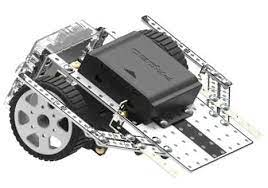

# 아마추어의 끝?

프로라는 말은 보통 "돈을 받고 하는~"이라는 뜻으로 쓰는 것 같다.
그럼 아마추어는 당연히 "돈을 안받고 하는~"이라는 뜻이다.

얼마 뒤면 대학 입학 후 지금까지 약 6년 간 이어온 프로그래머로서의 생활이 다른 국면에 접어든다.
지금까지 어떤 길을 걸어왔는지 사실 좀 기억이 안나는 부분도 있고 해서, 글로 남겨보려 한다.

## 프로그래밍과의 첫 접촉

프로그래밍에 대해 처음 접한 건 중학교였는지 초등학교였는지도 헷갈린다.
방과후 활동으로 로봇 교실을 갔는데, 대충 아래와 비슷하게 로봇을 조립해서 이리저리 노는 활동이었다.
그때 조립은 학생이 각자 하는 거고 조립까지 끝나면 방과후 교실 선생님이 cpu 보드와 노트북을 연결해서 무슨 프로그램을 주입하면 잘 동작하는 식이었다.

대충 인터넷 검색으로 찾은 로봇

그 후로 프로그래밍이란 것이랑은 전혀 관련이 없었는데, 고등학교 때 같은 반 친구가 네이버 그린팩토리에 있는 도서관을 간다고 해서 쫄래쫄래 따라갔다.
초중딩까지만 해도 취미를 적으라고 하면 독서를 적어서 낼 정도라서, 가서 책 좀 볼려고 했었다.
근데 막상 갔더니 정말 하나도 빠짐없이 다 모르는 분야의 책들이었던 기억이 난다.
아마 프로그래밍과 마케팅, 경영, 뭐 그런 분야가 아니었을까 싶다.

그래서 처음에 간다고 한 친구만 책을 좀 보고, 난 도서관의 모든 서가를 구경하면서 읽을 만한 책이 없나 둘러보고, 네이버 로비 구경을 좀 했었다.
그때만 해도 난 내가 나중에 프로그래밍이란 걸 할 줄 몰랐다;;

네이버 도서관 입구

## 이렇게 된 이상 컴퓨터공학과로 간다!

그러다 대학 입학을 할때쯤, 학과를 정해야 하는 때가 왔다.
본래 나는 뇌과학을 공부하고 싶어 뇌과학을 배우는 학과를 가고 싶었는데, 학부에서 뇌과학을 건드리는 학교는 정말 적었다.
그런데 수능이 망해서 목표로 하던 학교들은 물 건너가고, 재수는 죽어도 싫어서 성적에 맞춰서 학교를 가려고 했다.

그래서 전공을 뭘로 할지 고민했는데, 그때가 마침 일반인에게 인공지능이 널리 알려지던 시기였다.
2016년 알파고와 이세돌의 매치로도 그렇고, 2012년 딥러닝으로 이미지넷 이미지 인식 챌린지를 큰 점수차로 우승하는 등, 점점 일반인들에게 AI의 발전이 보여지고 있었다.

그래서 난 컴퓨터공학과에 가서 AI를 개발하자는 생각이 들었다.
딥러닝이 안을 들여다보면 인공"신경"망으로 구성되어 있는데, 이것은 생물의 대뇌(신경망)을 모방한 것이므로, 딥러닝을 공부하면 내가 하고 싶었던 뇌과학 공부도 같이 연결해 볼 수 있겠다는 생각이 들어서였다.

알파고 vs 이세돌

## 새내기 시절

그렇게 대학에 입학하기 전 2017년 말 겨울, 난 도서관에서 C언어 책과 파이썬 책을 빌려서 공부했다.
그 이전까지 한번도 안해본 공부를 대학 입학하면 하게 될 것이니 미리 체험을 해보자는 심산이었던 것 같다.
그리고 이래 저래 교양 컴퓨터 서적도 읽었다.
뭘 읽었는지는 기억이 안나지만..

### 백준 온라인 저지와 종만북 스터디

그리고 대학에 입학할 즈음 해서 이리 저리 서핑을 하다가 [백준 온라인 저지](https://www.acmicpc.net/)를 알게 되었다.
도서관에서 C언어 공부할 때도 문법만 배우고 실제로 프로그래밍을 할 일이 연습문제 풀 때 말고는 거의 없어 아쉬웠는데, BOJ는 프로그래밍을 연습할 수 있어 좋았다.
BOJ 관련해서 찾다가 우연히 BOJ를 푸는 사람들과 소통하며 배워가는 것도 많았다.

5번의 맞왜틀

사람들과 얘기하다가 알게 된 것 중 하나는 종만북이라고 많이 부르는 [알고리즘 문제 해결 전략](https://book.algospot.com/)이었다.
이 책이 BOJ와 같은 온라인 저지에서 프로그래밍 문제를 푸는(이 행동을 PS라고 많이 부른다) 사람들에게 인기라고 들은 나는 당시 알게된 동기에게 종만북 스터디를 제안했다.

그 친구는 당시 동기들 중에서 프로그래밍 고수(대충 그랬던 것 같다)로 유명했다.
그래서 잘하는 친구를 옆에 두고 나도 프로그래밍 고수가 되고 싶었다.
근데 2명은 너무 적으니까, 또 프로그래밍 잘한다는 동기 한명을 더 영입해서 셋이서 스터디를 진행했다.

셋이서 일주일에 한번씩 강의실(겸 동아리방)의 맨 뒤 자리를 차지하고, 화이트보드에 책에서 나온 알고리즘을 설명하고, 문제를 풀고, 문제를 설명하고.. 뭐 그랬던 기억이 난다.
알고리즘 문제풀이 자체도 재밌게 했지만, 친구들과 같은 주제를 가지고 머리를 맞대고 토론하고 얘기하는 과정이 재밌고 의미있게 느껴졌던 것 같다.
이전까지 해보지 못한 새로운 경험이었다.

화이트 보드 휘갈기기

### 머신러닝/딥러닝 공부와 Kaggle

알고리즘 스터디는 프로그래밍에 익숙해지고 능숙해지고자 시작한 것이었으나, 난 하고싶은게 따로 있었다.
바로 AI 공부..
특히 그 중에서도, 여러 작업과 고등적인 기능을 할 수 있는 범용 인공지능에 대한 관심이 컸다.
알고리즘 스터디와 병행하여 AI 공부도 혼자 진행했는데, 돌이켜보면 공부의 방향이 크게 두 방향이 있었다.

공부의 첫빠따는 역시 책과 강의였다.
그때 봤던 책이 [핸즈온 머신러닝 1판](https://m.yes24.com/Goods/Detail/59878826)이었는데, 이 책이 지금은 3판까지 나왔다.
어느 정도 인터넷 서핑(블로그와 위키백과 탐독)으로 배경지식을 쌓고 읽었는데, 그럼에도 쉽지 않았던 기억이 난다.
강의는 앤드류 응 교수의 [머신러닝 강의](https://youtube.com/playlist?list=PLkDaE6sCZn6FNC6YRfRQc_FbeQrF8BwGI&si=FMrfe-yglvOk3Lx_)였는데, 그때 당시엔 코세라에서 들었던 것 같다.
강의도 크게 어렵진 않았으나 사실 수식을 100% 풀어서 이해하진 못하고, 개념적으로 이해하고 넘어간 부분이 많았다.

책장에서 꺼낸 1판

둘빠따는 Kaggle(이하 캐글)이었다.
캐글은 BOJ때와 마찬가지로 책과 강의로만 배우니 좀 부족하다고 느낀 내가 찾은, 머신러닝/딥러닝을 실제로 해볼 수 있는 곳이었다.
캐글은 기업 or 단체들이 데이터셋과 목표를 지정하여 올려놓으면, 일반 참가자들이 각자 데이터셋을 가지고 머신러닝/딥러닝 모델을 학습하여 제출하고 점수를 올려가며 경쟁하는 대회를 주최하는 플랫폼이다.
대회 종료 시 점수가 가장 높은 참가자는 기업이 내건 상금이나 기타 포상을 얻게 되고, 그게 아니더라도 참가자들이 공개하는 모델과 코드, 글을 통해 어떻게 구조를 짜고 어떤 모델을 쓰는지 알아갈 수 있었다.

#### Two Sigma 주식 예측 대회

캐글을 하게 된 계기에는 사실 책과 강의로만 공부할 때의 막막함도 영향이 컸다.
힘들여 개념을 공부하고 나니, 어떻게 써먹을지, 그리고 현업에선 어떻게 써먹는지 궁금했다.

캐글에서 Getting Started로 주는 [타이타닉 생존자 예측](https://www.kaggle.com/c/titanic/overview)을 좀 뜯어보고 나서, 그때 당시 열려있던 컴피티션 중 하나를 골라 시작했다.
그 컴피티션이 Two sigma사에서 오픈한 [뉴스 정보로 주식 가격 예측](https://www.kaggle.com/competitions/two-sigma-financial-news) 대회였다.

투 시그마 뉴스로 주식 예측 대회

그때 당시엔 잘 몰라서 그런지 박치기식으로 했었다.
일단 참가자들이 올려놓은 탐색적 데이터 분석(Exploratory Data Analysis) 코드와 설명글들을 읽었다.
투 시그마에서 제공한 데이터는 주식 가격 데이터와 뉴스 데이터로 2종류였는데, 딱봐도 고득점을 하려면 두 데이터를 조화롭게 잘 써야하는게 명확했다.

근데 난 잘 몰라서(..) 참가자들이 공개해놓는 코드를 베낀 다음에 모델을 이리저리 바꿔보고, 하이퍼 파라미터 튜닝을 해보고 하는 식으로 했었다.
그때 알게 된 모델이 [LightGBM](https://github.com/microsoft/LightGBM), [XGBoost](https://github.com/dmlc/xgboost), [CatBoost](https://github.com/catboost/catboost)였는데, 시도해본건 LightGBM과 XGBoost였다.

keras 기반으로 뉴럴 네트워크 모델도 해봤는데, 그때 당시 내 노트북(내장 GPU)으로 학습시키는데 4\~5시간씩 걸려서 하이퍼 파라미터 튜닝하느라 고생했었다.
XGB, LGB 등 그래디언트 부스팅 결정 트리 모델은 10\~20분이면 끝나서 주로 이걸 많이 했다.

뉴럴넷 코드의 일부

코드 몽키마냥 다른 사람이 공개한 코드를 바꿔가며 한때나마 점수가 100위 안에 들었던 적도 있지만 사람들 생각이 다 똑같아서 순식간에 다시 내려갔다.
참가자 인원수 비례해서 골드, 실버, 브론즈 메달을 주는데, 브론즈 메달 점수권 안에라도 들고 싶었으나 결국 못 들은채 마무리해야 했다.

점수가 안나온 이유는 NLP쪽으론 참가자들이 공개한 코드가 별로 없기도 하고, 내가 잘 몰라서 뉴스 데이터를 거의 쓰지 않은 점이 컸다.
당시에 머리로는 좋은 모델보다 좋은 데이터가 중요하다, 데이터의 피쳐를 잘 잡아서 훈련 데이터 셋을 만들어야 한다고 알았지만, 적극적으로 뉴스 데이터를 활용하지 못하고 주식 차트 데이터만 쓰면서 모델만 가지고 놀았으니 결과가 안좋았던 것이다.

캐글 시작하는 내 상황

지금와서 생각하면 뉴스 데이터를 긍정/부정 분석이나 뉴스 데이터와 주식 가격 데이터간의 연관 관계를 추정하는 모델 등을 새로 훈련시켜 시도해볼 것 같다.
지금은 Transformer 기반의 pre-trained 모델이 많고, 특히 llm도 많이 발전했으니 많이 경량화 시킨 언어 모델을 써서 뉴스 데이터를 분석했으면 더 잘할 수 있을 것 같다.

#### 강화학습 알아가기

투 시그마 대회를 진행하는 동안 강화학습에 대한 공부도 했었다.
강화학습에 관심을 가진 것은, 범용 인공지능을 만드는데 가장 가까운 길이라고 생각했기 때문이었다.

[파이썬과 케라스로 배우는 강화학습 1판](https://m.yes24.com/Goods/Detail/44136413)을 보았지만, 실습은 해보지 않았다.
그때 당시에 왜 실습을 안했는지 기억은 안나지만, 아마 캐글과 이런저런 다른 것들을 하느라 별로 실습을 할 생각이 없었던 것 같다.

일단 책은 다 읽었어도 범용 인공지능을 만들기 위해 어떤 것이 더 필요할지, 뭐 그런것에 대해 더 고민해보고 찾아서 공부했으면 좋았겠으나 하지 않았다.
지금에서 생각하면 그때의 관심은 캐글에 너무 쏠려있지 않았나 싶다.

## 새내기의 끝과 앞으로의 고민

캐글, 알고리즘 스터디 등등이 마무리되고, 새내기 생활의 끝과 함께 군대를 가기로 하였다.
그때 당시 하던 고민은, 캐글을 마무리 짓고 나니 너무 부족하고 아는 것도 없는데 어떡하지 하는 생각이었다.

캐글 투시그마 대회를 하면서 온전히 내 혼자 힘으로, 혼자 생각대로 개선해본 경험은 없었고, 결과도 좋지 않았다.
게다가 데이터 전처리하고 모델 만들고 학습 돌리고 하는 코드들은 그냥 타다닥 치는 거였지 뭔가 코드에 큰 고민을 하지 않았다.
내가 느낀 가장 큰 문제는 내가 베껴서 만들어낸 코드가 어떻게 돌아가는지 잘 모르고, 내 혼자서 새로운 걸 생각하고 만들 수 없다는 것이었다.

그래서 근본을 쌓겠다고 생각하고, [패턴 인식과 머신 러닝](https://m.yes24.com/Goods/Detail/64189352)이라는 책을 공부해보겠다~ 다짐했다.
이 책은 추천 받았던 책인데, 딥러닝을 공부하기 전에 전통적인 머신러닝에 대해 잘 알아야 한다~ 라는 말을 듣고 근본부터 쌓겠다는 마인드였다.

강렬하게 생긴 표지

사실 이전부터 딥러닝/머신러닝을 하려면 수학적인 기초가 잘 쌓여있어야 한다고 해서 교양 수업으로 확률과통계, 선형대수를 들었다.
책과 강의에서도 수식은 주구장창 봤으니 꽤 공감하는 말이었다.
확통은 열심히 들었으나 선형대수는 겁나게 졸았던 기억이 난다..
결국 선형대수는 이해도 잘 못하고 종강해야 했다.

열심히 들은 수업과 드르렁한 수업의 학점 차이

어쨋든 내 다음 목표는 [패턴 인식과 머신 러닝](이하 PRML로 줄이겠다) 책을 독파하자! 그래서 머신러닝/딥러닝 기초를 잘 쌓고, 다시 캐글 등과 논문 스터디를 하며 최신 트렌드를 따라가자는 것이었다.
그렇게 군대를 가게 된다...

## 너무 어려운 책과 대학원에 대한 생각

군대에서 짬도 좀 차고 적응 좀 하자 공부를 해야겠다고 생각하고 PRML을 딱 폈다.
그리고 내 눈에 들어온 것은..

무수한 수식의 향연

PRML은 책 초반을 확률론에 할애하고 모델에 대한 내용으로 들어가는데, 확률론부터 어려웠다.
대학 수업에서 확통은 열심히 들었으나 선형대수는 날려버린게 컸는데, 확률분포 + 선형대수의 개념으로 나가니까 이해를 할 수가 없었다.
이후 모델에 대한 내용도 눈에 안들어오기는 마찬가지였다.

책이 이해가 안된다면 수학 공부도 더하고 내공을 더 쌓고 해도 되는 것이지만, 그때 내 또다른 고민은 대학원 진학에 대한 것이었다.
머신러닝/딥러닝으로 먹고 살고 내 자아실현도 하고 하려면 대학원 진학은 거의 필수였는데, 고민을 하던 당시에 대학원에 간다는 것은 지도교수에게 내 몸을 맡긴다는 것으로 받아들여져 많이 꺼려졌다.

그리고 AI 분야에 대한 회의도 조금 있었다.
난 동작하는 무언가를 만들고 그것으로 이렇게 저렇게 해보는 것이 좋았는데, 캐글을 (아주 서툴고 잘 모른 상태에서) 해본 경험으론 AI 개발은 데이터 만지작 거리다가 모델 만들고 학습 시키면서 계속 하이퍼 파라미터 만지는, 그런 경험으로 느껴졌다.
지금와서 생각하면 얕은 경험과 지식으로 판단한 것이지만, 그때 당시에 나에겐 내 고민을 털어놓고 물어보고 도와줄 선배나 멘토가 없었다.

### 내가 진짜 하고싶은 것?

결국 내가 처음 하고 싶었던 것이 뇌과학이고, 그게 AI가 되었다 한들, 그 기저에 깔린 내가 진짜 하고 싶은 게 무엇인가에 대해 고민했었다.
그렇게 생각하다 내린 결론은, 난 그냥 `사람들이 잘 쓰고, 널리 널리 가치를 만들 수 있는 것`을 하고 싶다는 것이었다.
인터넷이나 아이폰 같은 것을 만들던, 범용 인공지능을 만들던, 로켓 쏴서 화성을 가던 뭐 비슷한 맥락이면 되는 것이다.

사실 이렇게 내가 진짜로 하고 싶은게 무엇인가?에 대한 고민은 대학 입학할 때 컴공으로 바꾸고, AI 진로에 대해 고민할 때에도 답은 정해진 것일지도 모른다.
뇌과학이 정말로 좋아하고 하고싶어하는 것이라면, 시간이 걸려도 재수를 하던, 편입을 하던, 대학원을 그 분야로 가던 해서 할 수 있다.
AI가 정말 좋고 하고싶으면 프로그래밍보다 수학을 더 하고 데이터나 만지고 교수한테 내 몸을 맡기더라도 하면 된다.
내가 우직하게 밀고가기보다 계속 고민을 했던 것은 그 아래에 깔린 내 진짜 하고싶은 것에 대해 잘 몰랐고, 그것을 충족시킬 수 있는 방법을 계속 찾았기 때문이었다.

그렇게 나는 AI 리서처/엔지니어를 진로로 잡고 가는 것을 접고, 일반적인 SW 엔지니어를 하겠다는 생각을 하게 되었다.
그 이유는 간단한데, 나는 빠르게 해보고 피드백받고 성장하여 `사람들이 잘 쓰고, 널리 널리 가치를 만들 수 있는 것`을 만들고 싶었고, 그렇게 하기에 일반적인 SW 엔지니어가 정말 잘 맞는다고 생각이 들었기 때문이다.
2010년대에 들어서 세상을 바꾸는 기업 중 많은 기업이 SW 기업이었고, 그런 기업을 만든 사람들은 대부분 SW 엔지니어였다(나중엔 전문 경영인이 될지라도).

그렇게 전역을 하고 복학과 함께 웹 개발을 본격적으로 시작하게 된다.

> 이후 내용은 다음 포스트에서 다루겠습니다.
