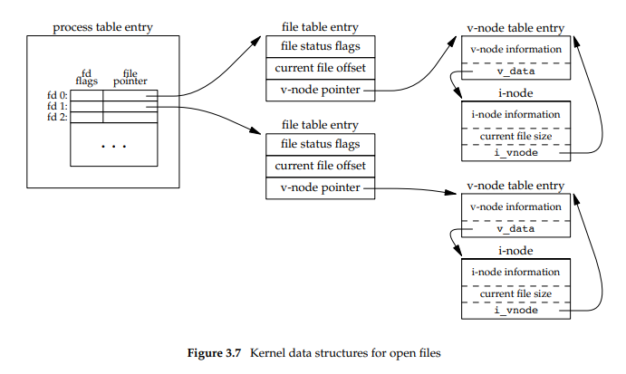
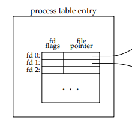
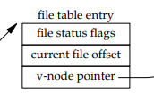
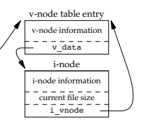
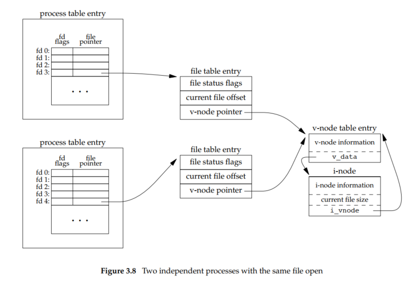
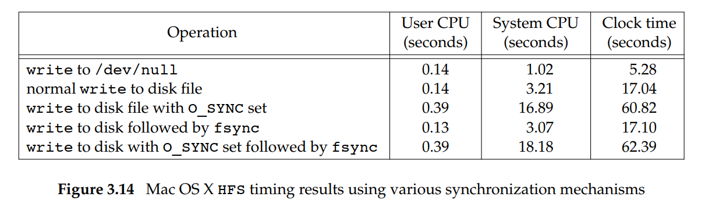

# FILE I/O in UNIX environment

[저번 포스트](https://spongelog.netlify.app/unix_file_io_basic/)에 이어서, 파일의 공유와 원자적 연산, `dup`, `sync`, `fsync`, `fdatasync`, `fcntl`, `ioctl` 함수에 대해 간략히 설명합니다.

동일한 파일에 대해 여러 프로세스가 입출력하는 상황에서는 **원자적(atomic)** 연산이라는 개념이 중요합니다.
파일 입출력과 관련해서 원자적 연산 개념을 살펴보고, 여러 프로세스가 파일을 공유하는 방식과 그에 연관되는 커널 자료구조도 살펴보겠습니다.

## File Sharing

UNIX 시스템은 여러 다른 프로세스가 같은 파일을 공유하는 것을 허용합니다.
이 공유 과정에 대해 알아보기 위해 커널이 모든 I/O에 대해 사용하는 데이터 구조에 대해 알아보겠습니다.

> 이제부터 설명할 내용은 유닉스 시스템의 여러 버전들과 구현이 일치할 수도 있고 아닐 수도 있습니다.
> 개념적으로만 이해해주세요.

### Three File data-structure

커널은 열린 파일을 세 가지 자료 구조를 사용해서 표현하고, 그 셋 사이의 관계가 파일 공유 과정에서 프로세스 간의 영향이 어떨지 결정합니다.


<p style="text-align: center">열린 파일에 대한 커널 자료구조 </p>

위 그림은 하나의 프로세스에 대한 세 자료구조를 도식화한 것입니다.
예시의 프로세스는 서로 다른 두 파일을 열어놓은 상태인데, 한 파일은 표준 입력(파일 디스크립터 **0**)에, 나머지 하나는 표준 출력(파일 디스크립터 **1**)에 열려있습니다. 그림의 세 가지 자료구조를 아래에서 각각 설명하겠습니다.

1. 커널은 모든 프로세스마다 열려있는 파일 디스크립터의 리스트를 가지고 있습니다. 리스트의 각 파일 디스크립터 항목은 다음 데이터를 가지고 있습니다.

   - 
     <p style="text-align: center">프로세스 테이블</p>
   - 파일 디스크립터 플래그들
   - 파일 테이블 항목을 가리키는 포인터

2. 커널은 모든 열린 파일에 대해 파일 테이블을 가지고 있습니다. 파일 테이블의 각 항목은 다음과 같습니다.
   - 
     <p style="text-align: center">파일 테이블</p>
   - 파일의 상태 플래그들(ex. read, write, append, sync, nonblocking 등등)
   - 현재 파일 오프셋
   - 파일의 **v-node** 테이블 항목을 가리키는 포인터
3. 각각의 열린 파일은 **v-node**라는 데이터 구조를 가지고 있습니다. 이 데이터 구조는 파일의 종류와, 그 파일에 대해 동작하는 함수들을 가리키는 포인터 정보가 담겨 있습니다. 대부분의 파일들은 **v-node**가 **i-node**도 가지고 있습니다. 이 정보들은 파일을 열 때 디스크에서 가져오므로, 파일이 잘 열렸으면 정보가 다 있는 상태입니다.
   - 
     <p style="text-align: center">v-node와 i-node</p>

> 몇가지 구현 세부사항은 생략되었습니다. 구현의 자세한 사항은 각 UNIX 구현체를 참고하세요.

---

#### what is i-node?

**i-node**란 UNIX 계통의 파일 시스템에서 사용하는 자료구조입니다.
**i-node**는 마지막 접근/변경/수정 시간(atime/mtime/ctime), 파일 소유자, 접근 권한 등의 파일에 대한 메타데이터와, 디스크에서 파일이 위치한 주소를 담고 있습니다.

---

#### what is v-node?

**v-node**의 V는 virtual(가상)의 V입니다.

**v-node**는 하나의 컴퓨터 시스템에서 여러 다른 파일 시스템 유형을 지원하기 위해 만들어졌습니다.
**v-node** 시스템은 벨 연구소와 Sun Microsystems에서 각자 독자적으로 진행되었는데, Sun 사에서는 이를 가상 파일 시스템(Virtual File System)이라고 불렀으며, **i-node**중에 파일 시스템에 독립적인 부분을 **v-node**라고 불렀습니다.

> Linux는 자료구조들을 **v-node**와 **i-node**로 나누는 대신 파일 시스템에 독립적인 **i-node**와 파일 시스템의 의존적인 **i-node**로 나눕니다.

> **i-node**와 **v-node**에 대해 **이 포스트** 에서 더 자세히 다루겠습니다.

### Example: Two process open same file

이제 두 프로세스가 동시에 한 파일을 열어둔 경우를 살펴보겠습니다.
아래는 첫 프로세스가 파일 디스크립터 **3**에 하나의 파일을 열고, 둘째 프로세스가 파일 디스크립터 **4**에 동일한 파일을 열어놓은 상태입니다.


<p style="text-align: center">두 프로세스가 똑같은 파일을 열어둔 상태</p>

두 프로세스는 각자 파일 테이블 항목을 가지고 있지만, **v-node** 테이블 항목은 하나를 같이 공유하고 있습니다.
각 프로세스가 각각 파일 테이블 항목을 가지고 있는 이유는, 두 프로세스가 각자 자신이 열어놓은 파일의 현재 파일 오프셋을 따로 관리할 수 있기 때문입니다.

현재 상태에서 지금까지 다루었던 파일 입출력 연산 중에 읽기 연산(`read`)은 아무 문제 없이 수행됩니다.
각 프로세스가 각자 파일 테이블 항목을 유지하기 때문에, 현재 파일 오프셋은 각 프로세스마다 관리할 수 있기 때문입니다.
하지만 여러 프로세스가 동시에 쓰기(`write`)연산을 하려고 할 때에는 일관성 없는 결과가 가능합니다.
이를 피하기 위해, 원자적 연산의 개념을 살펴봅시다.

## Atomic Operations

원자적 연산 개념을 설명하기 위해, 몇가지 상황을 가정해보겠습니다.

### Append to a File

하나의 프로세스가 파일 끝에 데이터를 추가하는 상황을 생각해봅시다.
UNIX의 예전 버전은 **O_APPEND** 옵션이 `open`에 없었으므로, 다음과 같이 두 개의 연산으로 구현하게 됩니다.

```C
if (lseek(fd, 0L, 2) < 0)       /* position to EOF */
    err_sys("lseek error");
if (write(fd, buf, 100) != 100) /* and write */
    err_sys("write error");
```

하나의 프로세스가 위처럼 추가할 때는 문제없지만, 여러 프로세스가 위처럼 추가하려 하면 문제가 있습니다.
독립된 두 프로세스 A와 B가 동일한 파일에 추가하는 상황을 가정합시다.
두 프로세스가 모두 위처럼 추가하고 그 파일의 크기가 **1500**이라고 할 때,

1. 먼저 프로세스 A가 `lseek`로 파일 오프셋을 파일 맨 끝, **1500** 으로 옮겼습니다.

2. 프로세스 제어가 전환되어, 프로세스 B가 `lseek`로 파일 오프셋을 맨 끝, **1500** 으로 옮깁니다.

3. 프로세스 B가 파일의 맨 끝에 **100** 바이트 만큼 `write` 연산을 합니다.

4. 프로세스 제어가 전환되어, 프로세스 A가 **150** 바이트 만큼 `write` 연산을 합니다.

위 4. 상황에서 프로세스 A는 프로세스 B가 추가한 데이터를 덮어씌우게 됩니다.

### Creating a File

파일을 생성할 때, 같은 이름의 파일이 이미 존재하면 오류를 내게끔 프로그래밍하고 싶을 때가 있습니다.
이 때 파일의 존재 여부 점검과 파일의 생성이 아래처럼 동작한다고 가정합시다.

```C
if ((fd = open(path, O_WRONLY)) < 0) {
    if (errno == ENOENT) {
        if ((fd = creat(path, mode)) < 0)
            err_sys("creat error");
        } else {
            err_sys("open error");
    }
}
```

위 코드에서, 프로세스는 먼저 `open`을 호출한 후 `errno`를 검사하여 파일의 존재 여부를 확인하고, 존재하지 않을 시에 `creat`를 호출하여 파일을 생성하게 됩니다.
이때 프로세스 A와 B가 다음과 같이 동작하는 상황을 봅시다.

1. 프로세스 A가 `open`을 호출하여 파일 이름의 파일 존재 여부를 검증합니다.

2. 프로세스 제어가 전환되어, 프로세스 B가 동일한 파일 이름으로 파일을 생성합니다.

3. 프로세스 B가 그 파일에 자료를 기록합니다.

4. 프로세스 제어가 전환되어, 프로세스 A가 `creat`를 호출하여 동일한 파일 이름으로 파일을 생성합니다.

위 4. 상황에서 프로세스 A는 프로세스 B가 기록한 파일 데이터를 삭제하게 됩니다.

### General concepts

위 두 상황에서, 문제가 일어난 원인은 어떤 연산을 수행할 때 여러 개의 분리된 연산으로 이루어져 있고, 각 연산이 다른 프로세스에 의해 방해받을 수 있기 때문입니다.
즉 이 문제를 해결하기 위해서는 다음과 같은 조건을 만족해야 합니다.

1. 모든 단계가 완료될 때까지 다른 어떤 방해도 받지 말아야 합니다.
2. 단계 중에 어느 하나라도 실패하면 연산 전체가 실패하고, 시스템 상태가 연산 시작 이전 상태로 복구되어야 합니다.

다시 말해서 위 두 조건을 만족하는 연산이 **원자적 연산**이 됩니다.

> 원자적 연산은 **이 포스트** 에서 또 다루겠습니다.

## `dup`, `dup2` Functions

`dup` 함수와 `dup2` 함수는 이미 있는 파일 서술자를 복제할 때 쓸 수 있습니다.

```C
#include <unistd.h>
int dup(int fd);
int dup2(int fd, int fd2);
// Both return: new file descriptor if OK, −1 on error
```

위는 함수 원형이고, [명세](https://man7.org/linux/man-pages/man3/dup.3p.html)입니다.

`dup` 함수가 리턴하는 파일 디스크립터는 가능한 가장 낮은 번호의 파일 디스크립터를 돌려줍니다.

`dup2` 함수는 복제할 새 서술자의 값을 `fd2` 인수로 지정하는데, 이미 열려있는 파일 디스크립터라면 먼저 닫은 후 복제가 일어납니다.
`dup2` 함수는 두 가지 단계(1. 파일 디스크립터를 닫고, 2. 복제하기)를 한 개의 연산으로 해결하는 점에서 원자적 연산이라고 할 수 있습니다.

## `sync`, `fsync`, `fdatasync` Functions

UNIX 시스템의 전통적인 구현은 커널 안에 버퍼 캐시를 가지고 있습니다.
대부분의 디스크 입출력은 버퍼 캐시를 거쳐가며, 파일에 어떤 자료를 기록할 때에는 일반적으로 커널은 그 자료를 버퍼에 복사해두고, 나중에 적당한 때에 디스크에 기록합니다.
이를 **지연된 쓰기(delayed write)** 라고 부릅니다.

결국에는 커널은 버퍼 캐시를 디스크에 기록하는데, 보통은 다른 디스크 블록을 위해 버퍼를 재사용해야 할 때 기록하게 됩니다.
디스크 상의 파일 내용과 버퍼 캐시의 내용의 일관성을 보장하기 위해, `sync`, `fsync`, `fdatasync` 함수를 쓰게 됩니다.

```C
#include <unistd.h>
int fsync(int fd);
int fdatasync(int fd);
// Returns: 0 if OK, −1 on error
void sync(void);
```

위는 함수 원형이고, [sync](https://man7.org/linux/man-pages/man3/sync.3p.html), [fsync](https://man7.org/linux/man-pages/man3/fsync.3p.html), [fdatasync](https://man7.org/linux/man-pages/man3/fdatasync.3p.html) 명세입니다.

`sync` 함수는 모든 버퍼들을 쓰기를 위한 대기열에 등록한 다음 디스크에 쓰기 연산을 실행할 때까지 기다리지 않고 리턴됩니다.
`sync` 함수는 보통 **system daemon**에 의해 30초 단위의 주기로 호출되는데, 이는 커널의 블록 버퍼를 주기적으로 방출시켜줍니다.

`fsync` 함수와 `fdatasync` 함수는 명확하게 파일을 지정하여 버퍼 캐시의 내용을 디스크에 기록하도록 합니다.
`fsync` 함수는 _fd_ 인수로 주어진 파일 디스크립터에 해당하는 파일에만 적용됩니다.
이 함수는 그 파일에 대한 디스크 쓰기 연산이 끝날 때까지 기다렸다가 리턴되는데, 보통 데이터베이스 같은 응용 프로그램에서 블록 버퍼가 디스크에 쓰기 연산이 완료되는 것을 보장해야 할 때 사용됩니다.

`fdatasync` 함수는 `fsync` 함수와 비슷하지만, 파일의 내용만 처리합니다. `fsync` 함수는 파일의 메타데이터(수정 시각, 접근 권한 등등..)가 바뀔 때도 sync 되지만, 이 함수는 내용이 바뀔 때만 처리합니다.

## `fcntl` Function

`fcntl` 함수는 이미 열린 파일 디스크립터의 속성을 변경할 수 있습니다.

```C
#include <fcntl.h>
int fcntl(int fd, int cmd, ... /* int arg */ );
// Returns: depends on cmd if OK (see following), −1 on error
```

위는 함수 원형이고, [명세](https://man7.org/linux/man-pages/man3/fcntl.3p.html)입니다.

이 함수는 다음과 같은 용도로 사용됩니다.

1. 기존 디스크립터를 복제합니다.
2. 파일 디스크립터 플래그를 조회하거나 설정합니다.
3. 파일 상태 플래그를 조회하거나 설정합니다.
4. 비동기 입출력 소유권을 조회하거나 설정합니다.
5. 레코드 락을 조회하거나 설정합니다.

### Example: Setting file status flag & I/O efficiency

`fcntl` 함수로 파일의 속성을 변경할 때, 파일 디스크립터 플래그나 파일 상태 플래그를 수정할 때가 있습니다.
이 때는 반드시 먼저 플래그의 기존 값을 얻어서 그것을 원하는 대로 수정한 후 수정한 값으로 설정해야 합니다.
왜냐하면, 원하는 값으로 수정해서 바로 넣는다면 이전에 설정한 플래그 비트가 꺼질 수 있기 때문입니다.

다음은 주어진 파일 디스크립터의 파일 상태 플래그를 재설정하는 함수입니다.

<details>
<summary>코드 예시</summary>

```C
#include "apue.h"
#include <fcntl.h>
void set_fl(int fd, int flags) /* flags are file status flags to turn on */
{
    int val;

    if ((val = fcntl(fd, F_GETFL, 0)) < 0)
        err_sys("fcntl F_GETFL error");

    val |= flags; /* turn on flags */

    if (fcntl(fd, F_SETFL, val) < 0)
        err_sys("fcntl F_SETFL error");
}

void clr_fl(int fd, int flags) /* flags are file status flags to turn off */
{
    int val;

    if ((val = fcntl(fd, F_GETFL, 0)) < 0)
        err_sys("fcntl F_GETFL error");

    val &= flags; /* turn off flags */

    if (fcntl(fd, F_SETFL, val) < 0)
        err_sys("fcntl F_SETFL error");
}

```

</details>

`set_fl` 함수는 두 번째 인수로 들어오는 플래그를 켜주고, `clr_fl` 함수는 두 번째 인수의 플래그를 켜줍니다.

이 함수들로 파일에 대해 플래그를 수정한 후 입출력 효율성을 확인해보겠습니다.
[이 프로그램](https://spongelog.netlify.app/unix_file_io_basic/#io-efficiency)에서 시작 부분에

```C
set_fl(STDOUT_FILENO, O_SYNC);
```

라는 줄을 추가하면 **동기적 쓰기(synchronous-write)** 플래그를 켜줍니다.
그럼 각 `write` 호출은 자료가 디스크에 쓰여질 때까지 기다린 후에 리턴됩니다.

> 보통의 경우 `write`는 기록할 자료를 버퍼에 저장하고 나중에 디스크에 기록합니다.
> **O_SYNC** 가 유용할 수 있는 상황은 데이터베이스 시스템이 있는데, `write`호출이 리턴되었다는 것이 디스크에 자료가 기록되었음을 의미한다면 시스템이 비정상 시스템 실패를 대비할 때 도움이 됩니다.

**O_SYNC** 플래그를 켜면 모든 `write` 연산이 디스크에 실제로 쓰일 때까지 기다리기 때문에 비동기적 디스크 읽기/쓰기의 장점을 얻을 수 없으므로, 프로그램 실행 시간이 늘어날 것이라고 생각할 수 있습니다.
이를 확인하기 위해, [위 프로그램](https://spongelog.netlify.app/unix_file_io_basic/#io-efficiency)으로 492.6MB의 자료를 복사하는데, 한번은 **O_SYNC** 플래그를 켜서, 한번은 꺼서 실험해보았습니다.


<p style="text-align: center">Mac OS X와 HFS 파일 시스템의 동기화 메커니즘 시간 측정</p>

위로부터 다음과 같은 사실을 얻을 수 있습니다.

1. 1번째 행은 디스크에서 파일을 읽어서 `/dev/null`에 쓰기 연산을 실행했으므로 실질적으로 디스크 출력은 하지 않은 상태입니다.

2. 2번째 행과 3번째 행을 비교하면, **O_SYNC** 플래그를 켜면 확실히 시스템 시간과 클락 시간이 늘어납니다. 즉, **동기적 쓰기(synchronous-write)** 가 **지연된 쓰기(delayed write)** 보다 더 오래 걸립니다.

3. 3번째 행과 5번째 행을 비교하면, **동기적 쓰기** 상태에서 쓰기 연산 후 `fsync` 호출은 큰 영향이 없습니다.

4. 2번째 행과 4번째 행을 비교하면, **지연된 쓰기** 상태에서 쓰기 연산 후 `fsync` 호출은 큰 영향이 없습니다. 이는 전체 쓰기 연산이 여러 번의 `write` 호출로 이루어지고, 각 `write` 연산에서 이전 버퍼를 디스크 기록 대기열로 보낸 후 현재 쓰기 내용을 버퍼에 채워넣기 때문에, `fsync`를 호출하는 시점에서는 버퍼에 남아있는 연산이 많지 않기 때문입니다.

위 프로그램에서 하나 더 알아갈 것은, `fcntl`의 필요성입니다.
프로그램은 파일 디스크립터(**STDOUT_FILENO**, 표준 출력)에 대해 실행되고, 해당 디스크립터가 열은 파일의 이름은 모릅니다.
이런 경우 셸에서 표준 입출력 리다이렉트를 통해 파일을 열기 때문에, 응용 프로그램은 해당 파일을 **O_SYNC** 플래그를 설정해서 열 수는(`open`을 활용해서) 없습니다.
하지만 `fcntl`을 이용하면 파일 이름을 몰라도 파일 디스크립터를 통해서 속성을 변경할 수 있습니다.

## `ioctl` Function

`ioctl` 함수는 모든 종류의 입출력 연산을 수행할 수 있는 함수입니다.
지금까지 다룬 함수들로 표현할 수 없는 종류의 입출력은 모두 `ioctl` 함수를 이용하게 됩니다.
이 함수의 가장 큰 용도는 터미널 입출력입니다.

```C
#include <unistd.h> /* System V */
#include <sys/ioctl.h> /* BSD and Linux */
int ioctl(int fd, int request, ...);
// Returns: −1 on error, something else if OK
```

위는 함수 원형이고, [명세](https://man7.org/linux/man-pages/man3/ioctl.3p.html)입니다.

UNIX 시스템은 다양한 입/출력 장치를 이용해서 입출력을 할 수 있는데, 이때 쓰는 함수가 `ioctl` 함수입니다.
`request` 인수는 보통 장치마다 다르며, 예를 들면 CD-ROM, Magnetic Tape, Socket, Terminal 등등이 있을 수 있습니다.
이런 여러 종류의 장치에서는 다른 입출력 함수(`read`, `write`, `lseek`)를 사용할 수 없으며, `ioctl` 함수를 이용해 장치마다 입출력 함수를 연결시켜서 사용하게 됩니다.

## Finish

[저번 포스트](https://spongelog.netlify.app/unix_file_io_basic/)에 이어서 이번 포스트까지, UNIX 시스템의 기본적인 입출력 함수를 설명하였습니다.
`read`와 `write`를 호출할 때 매번 커널의 시스템 콜을 호출하므로 이들을 버퍼링 없는 입출력으로 부릅니다.

여러 프로세스가 동일한 파일을 다룰 때 생기는 문제와 관련하여 원자적 연산의 개념을 살펴보고, 커널이 열린 파일들에 대한 정보를 관리하는 데에 쓰는 자료구조도 보았습니다.

다음 포스트 시리즈에서는 파일의 특성과 파일 시스템에 대해 다루겠습니다.

### References

1. [Advanced Programming in the UNIX environment. 3ed](https://www.amazon.com/Advanced-Programming-UNIX-Environment-3rd/dp/0321637739)

2. [**i-node** - wikipedia](https://en.wikipedia.org/wiki/Inode)

3. [원자 조작 - 위키백과](https://ko.wikipedia.org/wiki/%EC%9B%90%EC%9E%90_%EC%A1%B0%EC%9E%91)

4. [ioctl - wikipedia](https://en.wikipedia.org/wiki/Ioctl)
